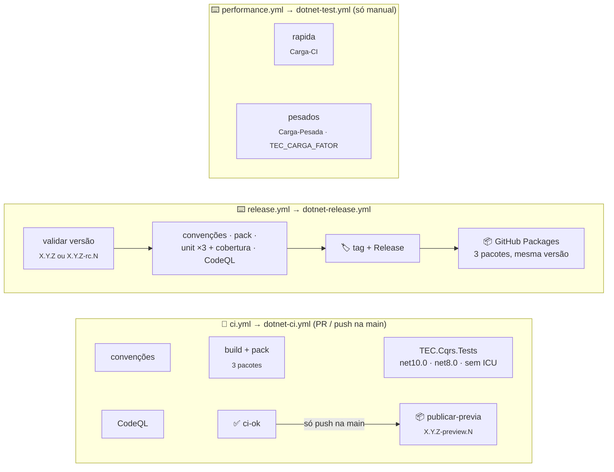

[🏠 TEC.Cqrs](../../README.md) › [📚 Documentação](../../docs/README.md) › ⚙️ CI/CD

# ⚙️ CI/CD e publicação

> Os três workflows do TEC.Cqrs são curtos: chamam os workflows reutilizáveis do
> [tec-workflows](https://github.com/tudoemcodigo/tec-workflows) e só declaram o que é deste repositório (solução e
> testes). Não há integração externa, Variables do Azure nem segredos.

## 📑 Sumário

- [🎯 Visão geral](#-visão-geral)
- [📂 Arquivos](#-arquivos)
- [🔀 ci.yml](#-ciyml)
- [📦 release.yml](#-releaseyml)
- [⏱️ performance.yml](#️-performanceyml)
- [🔑 Variables e Secrets](#-variables-e-secrets)
- [🚀 Como publicar](#-como-publicar)
- [🛡️ Segurança](#️-segurança)
- [❓ Solução de problemas](#-solução-de-problemas)

---

## 🎯 Visão geral

| Evento | Workflow | O que roda | Publica? |
|---|---|---|:---:|
| `pull_request` para a `main` / `merge_group` | `ci.yml` | Convenções, build + pack, `TEC.Cqrs.Tests` em matriz e CodeQL em paralelo → check `ci-ok` | ❌ |
| `push` na `main` (merge) | `ci.yml` | O mesmo e, com `ci-ok` verde, `publicar-previa` | ✅ `<Version>-preview.N` |
| `schedule` segunda 06:00 UTC / manual | `ci.yml` | O mesmo na `main`: CodeQL com consultas novas e auditoria com vulnerabilidades novas | ❌ |
| Manual (**Performance**) | `performance.yml` | Input `suite`: `pesadas` (padrão, `Carga-Pesada`), `rapida` (`Carga-CI`) ou `todas`; input `fator` | ❌ |
| Manual (**Publicar versão**) | `release.yml` | Convenções, pack, unitários ×3 + cobertura e CodeQL, depois tag, Release e push dos 3 pacotes | ✅ `X.Y.Z` ou `-rc.N` |

Os testes de carga não rodam no PR nem na publicação: tempo de parede em runner compartilhado é ruidoso e não pode
bloquear PR nem versão.

> [!NOTE]
> Os antigos `codeql.yml` e `resumo-testes.py` foram **removidos**: o CodeQL roda dentro do CI central (`dotnet-ci.yml`)
> e o resumo dos testes é feito pela action `test-summary` do tec-workflows.

---

## 📂 Arquivos

| Arquivo | Função |
|---|---|
| [`ci.yml`](ci.yml) | Validação de PR, do push na `main` (com publicação da prévia) e semanal na `main`, com `dotnet-ci.yml@v1` |
| [`release.yml`](release.yml) | Publicação de versão estável ou `-rc.N`, com `dotnet-release.yml@v1` |
| [`performance.yml`](performance.yml) | Testes de carga só sob demanda (manual), com `dotnet-test.yml@v1` |
| [`../dependabot.yml`](../dependabot.yml) · [`../zizmor.yml`](../zizmor.yml) | Canônicos do tec-workflows (não editar aqui) |

Não há `.github/scripts/`: o TEC.Cqrs não sobe containers nem cria segredos temporários para testar.

---

## 🔀 ci.yml

| Entrada | Valor |
|---|---|
| `solution` | `TEC.Cqrs.slnx` |
| `private-feed` | `true` (depende do `TEC.Core` do feed `tec-interno`) |
| `unit-tests` | `TEC.Cqrs.Tests` (o projeto inteiro, sem filtro: não há categoria `Integracao`) |

- Gatilhos: `pull_request` e `merge_group` para a `main`, `push` na `main`, `schedule` (segunda 06:00 UTC) e manual.
- Os unitários rodam em matriz: `net10.0` (com cobertura), `net8.0` e `net10.0` sem ICU.
- Sem `integration-tests`, `azure-client-id` nem `azure-env`: o job de integração não existe. Sem testes de carga:
  `Carga-CI` e `Carga-Pesada` ficam no `performance.yml`.
- Permissões: `contents: read` no topo; o job recebe também `pull-requests`, `actions`, `security-events` (leitura),
  `packages: write` (só o `publicar-previa` publica, no push na `main`) e `id-token: write` (exigido pelo workflow de
  testes reutilizável; aqui não há login no Azure).
- No push na `main`, depois do `ci-ok` verde, o job `publicar-previa` publica os 3 pacotes como
  `<Version do Directory.Build.props>-preview.N` (N sequencial por versão, reinicia a cada nova `<Version>`; ex.: `0.0.1-preview.3`). Se a tag `v<Version>` já existe,
  o CI não falha: valida tudo normalmente, o `build + pack` emite um `::notice::` e o `publicar-previa` é pulado (suba a
  `<Version>` para voltar a gerar prévias). Em PR nada é publicado.
- `concurrency` por ref no PR, cancelando execuções antigas do mesmo PR; fora de PR, um grupo por execução (nenhum push na `main` perde a prévia).
- PR só de documentação (docs, LICENSE, CHANGELOG, READMEs de `samples/` e `.github/`) pula os jobs pesados. Os READMEs
  das pastas dos pacotes vão no `.nupkg` e **não** contam como só documentação.

---

## 📦 release.yml

Disparo manual (**Actions → Publicar versão → Run workflow**) com a entrada `versao` (`X.Y.Z` ou `X.Y.Z-rc.N`; prévias
saem do `ci.yml` no push na `main`). Recebe as mesmas entradas do `ci.yml` e mais:

| Entrada | Valor |
|---|---|
| `version` | `${{ inputs.versao }}` |

Sequência: valida a versão (precisa ser disparado **da `main`**; a tag `vX.Y.Z` não pode existir) → convenções, pack,
unitários ×3 (com relatório de cobertura) e CodeQL em paralelo → só com **todos** verdes cria a tag e o Release e publica
os 3 pacotes no GitHub Packages. Sem testes de carga. `concurrency: publicar-versao`, sem cancelamento.

Permissões do job: `contents: write` (tag/Release), `packages: write` (push), `actions`/`security-events: read`
(CodeQL), `id-token: write` (exigido pelo workflow de testes).

---

## ⏱️ performance.yml

Só manual (`workflow_dispatch`): os testes de carga não rodam no PR nem na publicação, porque tempo de parede em runner
compartilhado é ruidoso e não pode bloquear PR nem versão.

| Entrada | Padrão | Efeito |
|---|---|---|
| `suite` | `pesadas` | `pesadas` (job `pesados`), `rapida` (job `rapida`) ou `todas` |
| `fator` | `1` | Repassado como `TEC_CARGA_FATOR` |

- Job `rapida`: `TEC.Cqrs.LoadTests /*/*/*/*[Category=Carga-CI]` (segundos), artefato `carga`.
- Job `pesados`: `TEC.Cqrs.LoadTests /*/*/*/*[Category=Carga-Pesada]` com `timeout-minutes: 120` e artefato `pesados`.
- Com fator 1, as 7 suítes pesadas levam cerca de 4–5 minutos; o fator multiplica durações e volumes (as variáveis
  `TEC_CARGA_*` específicas continuam como base).
- Os relatórios por suíte (`api.md`, `performance.md`, `soak.md`, `volume.md`, `security.md`) são gravados em
  `$TEC_CARGA_RELATORIOS` e publicados no resumo da execução.

> [!TIP]
> Medição de tempo em runner compartilhado tem ruído: compare **tendências** entre execuções, não números absolutos.

---

## 🔑 Variables e Secrets

| Nome | Tipo | Uso |
|---|---|---|
| `PACKAGES_READ_TOKEN` | Secret **do Dependabot** (organização) | PAT classic `read:packages` para o Dependabot restaurar o `TEC.Core` |

O repositório não precisa de nenhuma Variable nem Secret de Actions: o restore e a publicação usam o `GITHUB_TOKEN`
efêmero e não há testes contra serviços externos.

---

## 🚀 Como publicar

1. As dependências TEC.* (o `TEC.Core`) já estão no feed na versão referenciada.
2. Regenere e commite os locks em modo pacote:
   `dotnet restore TEC.Cqrs.slnx --force-evaluate`.
3. Atualize o [CHANGELOG](../../CHANGELOG.md) e confira a `Version` do `Directory.Build.props`.
4. PR → `ci / ci-ok` verde → merge. O CI do push na `main` publica a prévia `<Version>-preview.N`.
5. Versão estável ou rc: **Actions → Publicar versão → Run workflow** (da `main`) com a versão (ex.: `0.0.1` ou
   `0.0.1-rc.1`).
6. Primeira publicação: em *Package settings* de cada pacote, visibilidade **pública** e acesso dos repositórios da
   organização.
7. Para gerar novas prévias depois de publicar `X.Y.Z`, suba a `Version` do `Directory.Build.props` para a próxima
   (com a tag `v<Version>` existente, o CI da `main` valida tudo, mas não publica prévia até esse ajuste).

| Pacote publicado | Pasta |
|---|---|
| `TEC.Cqrs` | `TEC.Cqrs/` |
| `TEC.Cqrs.AspNetCore` | `TEC.Cqrs.AspNetCore/` |
| `TEC.Cqrs.FluentValidation` | `TEC.Cqrs.FluentValidation/` |

> [!IMPORTANT]
> Os três pacotes saem sempre juntos e com a **mesma versão**: os satélites usam internos do núcleo
> (`InternalsVisibleTo`) e só funcionam com o núcleo da mesma release. O GitHub Packages não permite sobrescrever: uma
> versão publicada não pode ser repetida.

---

## 🛡️ Segurança

| Controle | Como |
|---|---|
| Menor privilégio | `contents: read` no topo; escrita só no `release.yml` e no `publicar-previa` do `ci.yml` (`packages: write`, push na `main`); `id-token: write` só nos jobs de teste |
| Actions fixadas | Terceiros por SHA, tec-workflows por `v1`; `zizmor` audita; Dependabot com cooldown de 7 dias |
| Sem credencial no disco | `persist-credentials: false` em todo checkout (workflows centrais) |
| Sem pacote órfão | Tag + Release antes do push; release só com todos os portões verdes |
| Cadeia de suprimentos | `restore --locked-mode`, `NuGetAudit` como erro, `packageSourceMapping`, CodeQL `security-extended` |
| Sem segredos | Nenhum segredo de Actions; nada sensível nos testes |

---

## ❓ Solução de problemas

<code>NU1100</code>, <code>401</code> ou <code>403</code> ao restaurar o <code>TEC.Core</code>

Pacote ainda não publicado, privado ou sem acesso deste repositório. Publique o `TEC.Core` antes e libere o acesso em
*Package settings*.

<code>A tag vX.Y.Z já existe</code> / <code>Execute a partir da main</code>

Escolha outra versão ou dispare o **Publicar versão** selecionando a branch `main`.

Push na <code>main</code> não gerou prévia

A `Version` do `Directory.Build.props` já foi lançada (a tag `v<Version>` existe). O CI não falha: valida tudo
(convenções, build + pack, testes, CodeQL, `ci-ok`), o `build + pack` emite o aviso *"A versão X já foi publicada (tag
vX): nenhuma prévia gerada..."* e o `publicar-previa` é pulado. É o esperado quando o componente fica numa versão
publicada e recebe só correções. Para voltar a gerar prévias, abra um PR subindo a `Version` para a próxima.

Testes pesados falham por tempo ou vazão no runner

Runners compartilhados variam. Rode o `performance.yml` de novo para confirmar; se persistir, compare com o histórico dos
relatórios e investigue regressão no caminho quente.

Dependabot não abre PR do <code>TEC.Core</code>

Secret do Dependabot `PACKAGES_READ_TOKEN` ausente, expirado ou sem `read:packages`.

---
[🏠 TEC.Cqrs](../../README.md) · [📚 Documentação](../../docs/README.md) · [🧪 Testes](../../docs/testes.md)
