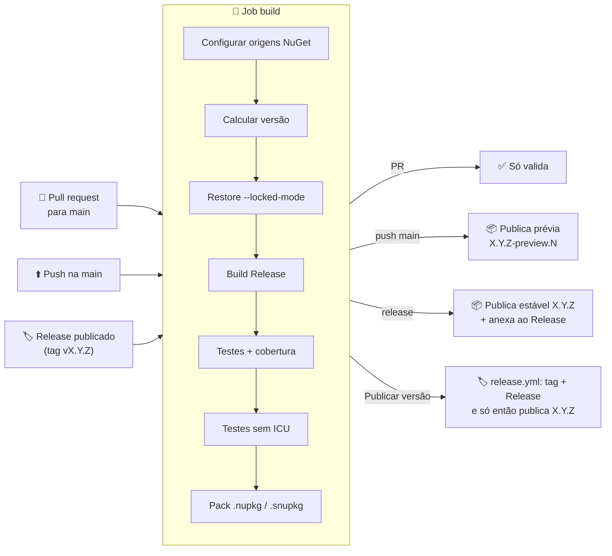
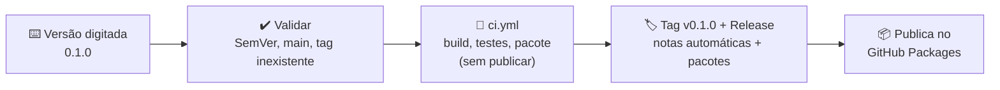

# ⚙️ CI/CD e publicação

[⬅ README](../../README.md)

Pipeline do GitHub Actions que compila, testa, mede a cobertura e publica os pacotes **TEC.Cqrs**, **TEC.Cqrs.FluentValidation** e **TEC.Cqrs.AspNetCore** (versionados juntos) no GitHub Packages (`https://nuget.pkg.github.com/tudoemcodigo/index.json`). É o mesmo pipeline do TEC.Core, com um passo a mais: configurar o acesso ao feed interno, de onde vem a dependência `TEC.Core`.

---

## 📑 Sumário

- [Arquivos](#-arquivos)
- [Pré-requisitos (uma única vez)](#-pré-requisitos-uma-única-vez)
- [Visão geral do fluxo](#-visão-geral-do-fluxo)
- [Gatilhos](#-gatilhos)
- [Versionamento automático](#-versionamento-automático)
- [Jobs e etapas](#-jobs-e-etapas)
- [Lançando uma versão](#-lançando-uma-versão)
- [Cobertura de testes](#-cobertura-de-testes)
- [Dependabot](#-dependabot)
- [Segurança do pipeline](#-segurança-do-pipeline)
- [Solução de problemas](#-solução-de-problemas)
- [Checklist de release](#-checklist-de-release)

---

## 📂 Arquivos

| Arquivo | Função |
|---|---|
| [`ci.yml`](ci.yml) | Build, testes, cobertura, pacote e publicação |
| [`release.yml`](release.yml) | **Publicar versão**: você digita a versão; ele testa, cria a tag e o Release e só então publica o pacote |
| [`../dependabot.yml`](../dependabot.yml) | Atualização semanal de pacotes NuGet (inclusive `TEC.*` do feed interno) e actions |
| [`../../nuget.config`](../../nuget.config) | `packageSourceMapping`: `TEC.*` só do feed interno, o resto do nuget.org |

---

## 🔑 Pré-requisitos (uma única vez)

| # | O quê | Onde | Por quê |
|:-:|---|---|---|
| 1 | Tornar o pacote `TEC.Core` **público** (uma vez, depois da primeira publicação dele) | Organização `tudoemcodigo` → *Packages* → `TEC.Core` → *Package settings* → *Change visibility* → **Public** | Um pacote nasce privado mesmo em repositório público. Público, o `GITHUB_TOKEN` do lib-tec-cqrs (com `packages: read`) consegue restaurá-lo; privado, seria preciso liberar o repositório em *Manage Actions access*, senão o restore recebe `401/403` |
| 2 | Criar o secret **`PACKAGES_READ_TOKEN`** (PAT *classic* com escopo `read:packages`) | Repositório → *Settings* → *Secrets and variables* → **Dependabot** | O Dependabot não usa o `GITHUB_TOKEN`, e o GitHub Packages exige autenticação mesmo para pacotes públicos |

> [!NOTE]
> O CI **não** precisa de PAT: o restore usa o `GITHUB_TOKEN` efêmero da execução (permissão `packages: read`), desde que o passo 1 tenha sido feito.

---

## 🗺️ Visão geral do fluxo



---

## 🎯 Gatilhos

| Evento | Build e testes | Publica? | Versão gerada |
|---|:---:|:---:|---|
| `pull_request` para `main` | ✅ | ❌ | `X.Y.Z-preview.N` (apenas interna, não publicada) |
| `push` na `main` | ✅ | ✅ prévia | `X.Y.(Z+1)-preview.N` |
| `release` publicado | ✅ | ✅ estável (só se o commit da tag estiver na `main`) | `X.Y.Z` (da tag) |
| `workflow_dispatch` (manual) | ✅ | ❌ | `X.Y.(Z+1)-preview.N` |
| **Publicar versão** (`release.yml`) | ✅ | ✅ estável | A versão digitada |

> [!NOTE]
> Pushes que alteram **apenas** `docs/**` ou `LICENSE` não disparam o pipeline. Alterações no `README.md` disparam, porque ele vai dentro do pacote.

Em pull requests, uma execução nova cancela a anterior do mesmo PR (`concurrency`). Na `main` e em releases nada é cancelado, para não interromper uma publicação.

---

## 🏷️ Versionamento automático

A versão **nunca** é editada à mão para publicar: ela vem das tags Git. O `<Version>` do `.csproj` (hoje `0.0.1`) serve só para builds locais e como base enquanto não existir nenhuma tag.

| Situação | Última tag estável | Execução nº | Versão |
|---|---|:---:|---|
| Release `v0.1.0` | — | — | `0.1.0` |
| Release `v0.2.0-rc.1` | — | — | `0.2.0-rc.1` |
| Push na `main` | `v0.1.0` | 57 | `0.1.1-preview.57` |
| Push na `main` | *(nenhuma)* | 3 | `0.0.1-preview.3` (base = `<Version>` do csproj) |

Regras:

- A tag do Release precisa seguir **`vX.Y.Z`** ou **`vX.Y.Z-sufixo`** (SemVer); caso contrário o job falha antes de compilar.
- A versão é validada (SemVer) em **todos** os casos, também nas prévias: a última tag estável é conferida (`vX.Y.Z` exato) antes de entrar no cálculo, e a versão final (inclusive a base vinda do `<Version>` do csproj) precisa passar na mesma expressão.
- Tags de pré-release (`v0.2.0-rc.1`) são **ignoradas** no cálculo das prévias da `main`.
- `N` é o `github.run_number`, sempre crescente; por isso uma prévia nova sempre é "maior" que a anterior.
- ⚠️ Uma prévia `0.0.1-preview.N` é **menor** que `0.0.1`. Depois de lançar `v0.0.1`, as prévias passam automaticamente para `0.0.2-preview.N`.

---

## 🧱 Jobs e etapas

### Job `build` (sempre executa)

| # | Etapa | Detalhe |
|:-:|---|---|
| 1 | Checkout | `fetch-depth: 0`: histórico, tags e `origin/main` completos (versão, SourceLink e conferência do commit do Release); `persist-credentials: false` (nenhum passo usa git autenticado) |
| 2 | Setup .NET | SDK definido no `global.json` (`10.0.100`+, `rollForward: latestFeature`) **e** o .NET 8 (`dotnet-version: 8.0.x`, para rodar os testes do alvo `net8.0`), com cache baseado nos `packages.lock.json` |
| 3 | Configurar origens NuGet | Copia o `nuget.config` do repositório (com o `packageSourceMapping`) para `$RUNNER_TEMP/nuget.config` e acrescenta nessa cópia as origens `nuget.org` e `tec-interno` (com o `GITHUB_TOKEN`). O token não fica no NuGet.Config do usuário nem na pasta do repositório; a pasta temporária é apagada ao fim do job |
| 3a | Conferir commit do Release | Só no evento `release`: falha se o commit da tag não estiver na `main` (`git merge-base --is-ancestor "$GITHUB_SHA" origin/main`) |
| 4 | Calcular versão | Regras da seção [Versionamento](#-versionamento-automático), com validação SemVer em todos os ramos; a versão vai para o resumo da execução |
| 5 | Restore | `--locked-mode --configfile "$RUNNER_TEMP/nuget.config"`: falha se o `packages.lock.json` estiver desatualizado. No runner não existe a pasta `..\TEC.Core`, então o `TEC.Core` vem sempre do pacote do feed interno (`UseLocalTecCore` desligado) |
| 6 | Build | `Release`, com `-p:Version=<versão>` (passada por variável de ambiente) e `ContinuousIntegrationBuild` (o Actions define `CI=true`) |
| 7 | Testes + cobertura | TUnit (Microsoft.Testing.Platform) em `net8.0` e `net10.0`, com cobertura Cobertura (`--coverage`) e resultados em `.trx` (nome padrão, um arquivo por TFM) |
| 8 | Testes sem ICU | `DOTNET_SYSTEM_GLOBALIZATION_INVARIANT=1`, simulando containers enxutos |
| 9 | Relatório de cobertura | ReportGenerator gera HTML e o resumo em Markdown |
| 10 | Pack | Pack da solução: `.nupkg` + `.snupkg` dos três pacotes (`lib/net8.0` e `lib/net10.0`) em `./artifacts`, com *package validation* entre os TFMs |
| 11 | Upload | Artifacts `cobertura` e `nuget` (retidos por 14 dias) |

### Job `publish` (só em push na `main` e em release; nunca quando chamado pelo `release.yml`, que publica depois de criar a tag)

| # | Etapa | Detalhe |
|:-:|---|---|
| 1 | Download | Baixa o artifact `nuget` gerado pelo job `build` (o pacote publicado é exatamente o que foi testado) |
| 2 | Setup .NET | `dotnet-version: 10.0.x` (só para o `dotnet nuget push`) |
| 3 | Push | `dotnet nuget push` com `GITHUB_TOKEN` (via variável de ambiente `NUGET_API_KEY`), `--skip-duplicate` e `--no-symbols` |
| 4 | Anexar ao Release | Só em release: `.nupkg` e `.snupkg` anexados via `gh release upload` |
| 5 | Resumo | Versão e feed no resumo da execução |

> [!IMPORTANT]
> O GitHub Packages **não aceita** pacotes de símbolos (`.snupkg`). Por isso eles são publicados apenas como anexo do Release.

---

## 🚀 Lançando uma versão

### Versão estável (recomendado)

Use o workflow [`release.yml`](release.yml): basta digitar a versão.

1. GitHub → **Actions** → **Publicar versão** → **Run workflow**;
2. Mantenha a branch `main` e digite a versão (ex.: `0.1.0`);
3. **Run workflow**.



Se algum teste falhar, **nada** é criado: nem tag, nem Release, nem pacote.

O pacote só é publicado **depois** que a tag e o Release existem, para nunca haver no feed uma versão sem tag correspondente (pacote órfão; o GitHub Packages não permite sobrescrever nem reaproveitar a versão). Se a publicação falhar (ex.: indisponibilidade do feed), a tag e o Release já existem com o pacote anexado: use **Re-run failed jobs**, que publica o mesmo artefato testado (`--skip-duplicate`).

**Com a GitHub CLI:**

```bash
gh workflow run release.yml -f versao=0.1.0
```

> [!NOTE]
> Um Release criado pelo `GITHUB_TOKEN` não dispara outros workflows. Por isso o `release.yml` chama o `ci.yml` diretamente (`workflow_call`) e o pacote não é publicado em duplicidade.

### Release manual (alternativa)

Criar o Release com a sua própria conta, pela interface ou pela CLI, também publica, pelo evento `release`:

```bash
gh release create v0.1.0 --target main --generate-notes
```

O commit da tag precisa estar na `main`: um Release criado a partir de outra branch falha antes de compilar e nada é publicado.

### Release candidate

Digite a versão com sufixo (ex.: `0.2.0-rc.1`) no workflow **Publicar versão**; o Release é marcado como *pre-release* automaticamente.

### Prévia

Não exige nenhuma ação: todo merge ou push na `main` publica uma prévia.

```bash
dotnet add package TEC.Cqrs --prerelease   # consome a prévia mais recente
```

### Qual parte da versão incrementar

| Mudança | Exemplo | Incremento |
|---|---|---|
| Quebra de API pública ou de comportamento do pipeline | Novo método em `IPublisher`, mudança na ordem dos behaviors, nova exigência que falha por padrão (ex.: validator obrigatório) | **MAJOR** → `v1.0.0` (enquanto em `0.x`, **MINOR**) |
| Funcionalidade nova compatível | Novo diagnóstico, nova opção desligada por padrão | **MINOR** → `v0.2.0` |
| Correção | Bug no rollback, mensagem de erro | **PATCH** → `v0.1.1` |

> [!TIP]
> Ao atualizar o `TEC.Core`, altere a versão no `TEC.Cqrs.csproj`, rode `dotnet restore TEC.Cqrs.slnx --force-evaluate -p:UseLocalTecCore=false` (com a pasta `..\TEC.Core` presente, sem a propriedade só o `packages.local.lock.json`, ignorado pelo git, seria atualizado) e faça commit dos `packages.lock.json` (os quatro projetos dependem dele, direta ou indiretamente); sem isso o restore `--locked-mode` do CI falha.

---

## 📊 Cobertura de testes

| Onde | O que aparece |
|---|---|
| **Resumo da execução** (aba *Summary* do workflow) | Tabela com cobertura de linhas e branches por classe |
| **Artifact `cobertura`** | Relatório HTML completo (`coverage-report/index.html`) e os arquivos `.trx` |

Para gerar o mesmo relatório localmente:

```bash
dotnet test -c Release --coverage --coverage-output-format cobertura --results-directory ./coverage
dotnet tool install -g dotnet-reportgenerator-globaltool
reportgenerator -reports:"coverage/*.cobertura.xml" -targetdir:coverage-report -reporttypes:HtmlInline
```

---

## 🤖 Dependabot

| Ecossistema | Frequência | Agrupamento | Prefixo do commit |
|---|---|---|---|
| NuGet (nuget.org + feed interno) | Semanal (segunda) | `TEC.*` · `FluentValidation*` · testes (`TUnit*`) | `deps` |
| GitHub Actions | Semanal (segunda) | Todas as actions em um único PR | `ci` |

Cada PR do Dependabot passa pelo pipeline completo (build, testes e restore `--locked-mode`) antes do merge. No máximo 5 PRs de NuGet ficam abertos ao mesmo tempo. Para enxergar novas versões do `TEC.Core`, o Dependabot usa o secret `PACKAGES_READ_TOKEN` (ver [Pré-requisitos](#-pré-requisitos-uma-única-vez)).

---

## 🛡️ Segurança do pipeline

| Controle | Como é aplicado |
|---|---|
| Menor privilégio | Permissão padrão `contents: read`; o job `build` recebe só `packages: read` e o job `publish` recebe `packages: write` e `contents: write` |
| Sem segredos manuais no CI | Restore e publicação com o `GITHUB_TOKEN` efêmero da execução; o único PAT (`read:packages`) é exclusivo do Dependabot |
| Dependency confusion | `packageSourceMapping` no `nuget.config`: `TEC.*` **nunca** vem do nuget.org |
| PRs não publicam | O job `publish` só roda em `push` na `main` e em `release` |
| Só código da `main` vira versão estável | O `release.yml` exige execução a partir da `main`; no evento `release` (Release manual), o `ci.yml` confere que o commit da tag é ancestral de `origin/main` |
| Sem injeção de script | Inputs, outputs de passos e secrets nunca são interpolados dentro de `run:`: entram por `env:` e são usados como variáveis (`"$VERSION"`, `"$NUGET_API_KEY"`). A versão é validada por expressão regular (SemVer) em todos os ramos antes de ser usada |
| Credenciais com vida curta | `actions/checkout` com `persist-credentials: false` (o token não fica no `.git/config`); o token do feed fica só em `$RUNNER_TEMP/nuget.config`, usado pelo restore e apagado ao fim do job |
| Dependências travadas | `restore --locked-mode` impede troca silenciosa de pacotes; há `packages.lock.json` para **todos** os projetos (inclusive testes) |
| Auditoria de vulnerabilidades | `NuGetAudit` (inclusive transitivas, todos os projetos) roda no restore; `NU1901`–`NU1904` quebram o build |
| Actions fixadas por SHA | Toda action usa o SHA do commit, com a tag em comentário (`@<sha> # v7.0.1`): uma tag movida ou um repositório comprometido não troca o código executado. O Dependabot atualiza SHA e comentário juntos |
| SDK fixado | `global.json` (`10.0.100`, `rollForward: latestFeature`): mesma faixa de SDK local e no CI |
| Sem pacote órfão | No `release.yml`, a publicação só acontece depois da criação da tag e do Release |
| Artefato imutável | O pacote publicado é o mesmo gerado e testado no job `build` |
| Build rastreável | `Deterministic` + `ContinuousIntegrationBuild` + SourceLink |

> [!TIP]
> Para exigir aprovação manual antes de publicar versões estáveis, crie um *Environment* (ex.: `producao`) com *required reviewers* e adicione `environment: producao` ao job `publish`.

---

## 🩺 Solução de problemas

| Sintoma | Causa provável | Solução |
|---|---|---|
| `401`/`403` ao restaurar `TEC.Core` | O pacote `TEC.Core` ainda está privado | Faça o [pré-requisito 1](#-pré-requisitos-uma-única-vez) |
| `NU1100 Unable to resolve 'TEC.Core'` | Origem `tec-interno` ausente ou com outro nome | O nome precisa ser exatamente `tec-interno` (o mesmo do `packageSourceMapping`) |
| `A versão 'x', calculada a partir de a tag 'y' ..., não segue o padrão X.Y.Z` | Tag sem `v` ou fora do SemVer | Apague o Release e a tag e recrie como `vX.Y.Z` |
| `A última tag estável 'x' não segue o padrão vX.Y.Z` | Tag parecida com versão, mas inválida (ex.: `v1.2.3abc`) | Corrija ou apague a tag |
| `O commit ... da tag 'x' não está na main` | Release manual criado a partir de outra branch | Faça o merge na `main` e recrie o Release a partir dela |
| `NU1004` no restore | `packages.lock.json` desatualizado | Rode `dotnet restore TEC.Cqrs.slnx --force-evaluate -p:UseLocalTecCore=false` localmente e faça commit dos `packages.lock.json` |
| `NU1901`–`NU1904` | Vulnerabilidade conhecida em dependência | Atualize o pacote (ou aguarde o PR do Dependabot) |
| `403 Forbidden` no push | Workflow sem permissão de escrita em pacotes | Confira `permissions: packages: write` e, em *Package settings*, se o repositório tem acesso *Write* aos pacotes `TEC.Cqrs`, `TEC.Cqrs.FluentValidation` e `TEC.Cqrs.AspNetCore` |
| Push "ignorado" sem erro | Versão já existente (`--skip-duplicate`) | Gere uma nova versão; o GitHub Packages não permite sobrescrever |
| **Publicar versão** falhou no job *Publicar no GitHub Packages* | Tag e Release criados, pacote ainda não publicado | **Re-run failed jobs** (publica o mesmo artefato; os artifacts ficam 14 dias) |
| Dependabot não abre PR do `TEC.Core` | Secret `PACKAGES_READ_TOKEN` ausente, expirado ou sem `read:packages` | Faça o [pré-requisito 2](#-pré-requisitos-uma-única-vez) |

---

## ✅ Checklist de release

- [ ] O pipeline da `main` está verde.
- [ ] A versão do `TEC.Core` referenciada é a desejada e o `packages.lock.json` está atualizado.
- [ ] As notas do Release descrevem as mudanças, destacando quebras de comportamento do pipeline.
- [ ] O incremento de versão respeita o [SemVer](#qual-parte-da-versão-incrementar).
- [ ] O `README.md` foi atualizado.
- [ ] O workflow **Publicar versão** foi executado com a versão `X.Y.Z`.
- [ ] Os três pacotes aparecem em *Packages* com a versão correta e os anexos estão no Release.

---

Dúvidas sobre o pipeline: **Roberto Oliveira**, [roberto@roberto.inf.br](mailto:roberto@roberto.inf.br).
