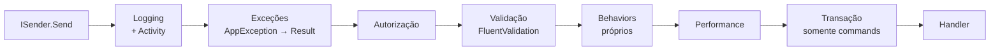

<div align="center">

# 🧭 TEC.Cqrs

**CQRS para .NET 8 e .NET 10 sobre o [TEC.Core](https://github.com/tudoemcodigo/lib-tec-core): você escreve o command e o handler; log, autorização, validação, transação e resposta HTTP vêm prontos**

Mediator próprio (sem MediatR) · `Result` · FluentValidation · Notificações pós-commit · ASP.NET Core · OpenTelemetry · Native AOT

[](https://dotnet.microsoft.com/)
[](#)
[](LICENSE)

</div>

---

## ✨ Por que usar

| | |
|---|---|
| 🧩 **Transparente** | O desenvolvedor escreve só o command/query, o handler e (se quiser) o validator. Log, validação, exceções, transação e resposta HTTP já vêm prontos. |
| 📦 **Padronizado** | Todo handler retorna `Result`/`Result<T>` do TEC.Core, e toda resposta HTTP usa o mesmo `ApiResponse`, com status pelo `ErrorType`. |
| 🔓 **Sem licença comercial** | Mediator próprio, com API parecida com a do MediatR (`ISender`, `IPipelineBehavior`) e sem as restrições de licença do MediatR 13+. |
| 🔐 **Seguro** | Autorização no pipeline, antes da validação. Validator obrigatório em commands. O conteúdo das requisições nunca é logado. Erros 500/502 não expõem detalhes. Mesmas regras de supply chain do TEC.Core (analyzers, audit, lock file, source mapping). |
| 🚦 **Falha cedo** | Handler duplicado, marcações contraditórias, `Roles`/`Policy` em branco, authorizer ou validador que nunca seria executado e requisição sem autorização declarada quebram na inicialização. Command sem validator falha em vez de rodar sem validar. Há helpers para testes de arquitetura. |
| ⚡ **Native AOT** | Registro explícito sem reflexão (`AddCommandHandler`, `AddQueryHandler`...), compatível com trimming e Native AOT. A varredura de assemblies continua disponível para apps com JIT. |
| 🧱 **Modular** | O núcleo não depende de ASP.NET Core nem de FluentValidation: serve também a workers, jobs e mensageria. |

## 📦 Pacotes

| Pacote | Conteúdo | Depende de |
|---|---|---|
| **`TEC.Cqrs`** | Abstrações (`ICommand`, `IQuery`, handlers, `IPipelineBehavior`), mediator, behaviors (logging, exceções, autorização, validação, performance, transação), notificações, `IUnitOfWork`, métricas e rastreamento, diagnósticos | `TEC.Core`, `Microsoft.Extensions.DependencyInjection.Abstractions`, `Microsoft.Extensions.Logging.Abstractions` |
| **`TEC.Cqrs.FluentValidation`** | `.AddFluentValidation()`: executa os `AbstractValidator<T>`, converte as falhas em erros por campo (camelCase) e trata a `ValidationException` | `TEC.Cqrs`, `FluentValidation` |
| **`TEC.Cqrs.AspNetCore`** | `.AddAspNetCore()`: `Result` → `ApiResponse` (Minimal APIs e Controllers, com metadados OpenAPI), `UseTecExceptionHandler`, usuário do `HttpContext` e policies do `IAuthorizationService` | `TEC.Cqrs`, framework `Microsoft.AspNetCore.App` |

Os três pacotes têm `lib/net8.0` e `lib/net10.0`, são compatíveis com trimming/Native AOT (`IsAotCompatible`) e são versionados juntos: use sempre a mesma versão dos três.

## 🗺️ Pipeline



| Behavior | O que faz |
|---|---|
| **Logging** | Log (nome, tipo, duração, códigos de erro) e `Activity` para OpenTelemetry. Não registra o conteúdo da requisição. Cada falha gera **um** registro (a exceção interna convertida em `Result` vai anexada; exceção não tratada não é registrada de novo pelas requisições externas nem pelo `UseTecExceptionHandler`). Cancelamento pelo token da requisição: log em Debug e `cqrs.canceled = true`. |
| **Exceções** | `AppException` do TEC.Core (`NotFoundException`, `BusinessException`...) e as exceções reconhecidas por um `IExceptionErrorMapper` (ex.: `FluentValidation.ValidationException`, com o `.AddFluentValidation()`) viram `Result` de falha. Outras exceções sobem para o `UseTecExceptionHandler`. |
| **Autorização** | `[AuthorizeRequest]` (autenticação, papéis, policies) e `IRequestAuthorizer<T>` (regras sobre o recurso). Negado, nem a validação roda: quem não tem acesso não recebe detalhes das regras. |
| **Validação** | Executa os validadores da requisição (`IRequestValidator<T>`; com `TEC.Cqrs.FluentValidation`, os `AbstractValidator<T>`). Havendo erro, o handler **não** é chamado e a resposta é HTTP 400 com um erro por campo (em camelCase). Command sem validator falha, mesmo sem pacote de validação registrado (ver [Validação obrigatória](#-validação-obrigatória)). |
| **Performance** | Aviso em log quando a execução passa de 500 ms (configurável). Mede o que vem depois dele: abertura da transação, handler e commit/rollback, inclusive quando termina com exceção. Não inclui autorização, validação, behaviors próprios nem as notificações pós-commit (a duração total está no log do **Logging**). |
| **Transação** | Somente para commands, se houver `IUnitOfWork` registrado. Commit em sucesso, rollback em falha ou exceção. Um command dentro de outro participa da mesma transação; se o interno falhar, **toda** a transação é desfeita (ver [Transação](#-transação-iunitofwork)). As notificações de `PublishAfterCommit` são publicadas após o commit. |

## 📥 Instalação

```bash
# API ASP.NET Core com FluentValidation (o mais comum)
dotnet add package TEC.Cqrs.AspNetCore
dotnet add package TEC.Cqrs.FluentValidation

# Worker, job ou mensageria (sem ASP.NET Core)
dotnet add package TEC.Cqrs
dotnet add package TEC.Cqrs.FluentValidation
```

`TEC.Cqrs.AspNetCore` e `TEC.Cqrs.FluentValidation` trazem o `TEC.Cqrs` como dependência.

## 🚀 Início rápido

### 1. Registro (`Program.cs`)

```csharp
using TEC.Cqrs.AspNetCore;
using TEC.Cqrs.DependencyInjection;

builder.Services
    .AddTecCqrs(options => options.RegisterServicesFromAssemblyContaining<Program>()) // handlers, authorizers, notificações
    .AddFluentValidation()                                                             // validators dos mesmos assemblies
    .AddAspNetCore();                                                                  // HttpContext.User, policies, JSON
builder.Services.AddScoped<IUnitOfWork, EfUnitOfWork>(); // opcional: habilita transação nos commands
builder.Services.AddAuthorization(o => o.AddPolicy("ClientesEscrita", p => p.RequireRole("Admin")));

var app = builder.Build();
app.UseTecExceptionHandler(); // exceções → ApiResponse (400/413 para erros do cliente, 500 sem detalhes para o resto)
```

Para Native AOT/trimming, troque a varredura pelo [registro explícito](#-native-aot-e-trimming).

### 2. Command + validator + handler

Toda requisição declara como é autorizada (`[AuthorizeRequest]`, um `IRequestAuthorizer` ou `[AllowAnonymousRequest]`); sem isso, o `AddTecCqrs` falha na inicialização (ver [Autorização](#-autorização)).

```csharp
[AuthorizeRequest(Policy = "ClientesEscrita")]
public sealed record CriarClienteCommand(string Nome, string Cpf) : ICommand<Guid>;

internal sealed class CriarClienteValidator : AbstractValidator<CriarClienteCommand>
{
    public CriarClienteValidator()
    {
        RuleFor(c => c.Nome).NotEmpty().WithErrorCode("NOME_OBRIGATORIO").WithMessage("Nome é obrigatório.");
        RuleFor(c => c.Cpf).Must(DocumentValidator.IsValidCpf).WithErrorCode("CPF_INVALIDO").WithMessage("CPF inválido.");
    }
}

internal sealed class CriarClienteHandler(IClienteRepository repositorio) : ICommandHandler<CriarClienteCommand, Guid>
{
    public async Task<Result<Guid>> Handle(CriarClienteCommand command, CancellationToken cancellationToken)
    {
        if (await repositorio.ExisteCpfAsync(command.Cpf, cancellationToken))
            return Error.Conflict("CLIENTE_DUPLICADO", "Já existe um cliente com este CPF.");

        var cliente = new Cliente(command.Nome, command.Cpf);
        await repositorio.AdicionarAsync(cliente, cancellationToken);
        return cliente.Id; // conversão implícita para Result<Guid>
    }
}
```

### 3. Query

```csharp
[AuthorizeRequest]
public sealed record ObterClienteQuery(Guid Id) : IQuery<ClienteDto>;

internal sealed class ObterClienteHandler(IClienteRepository repositorio) : IQueryHandler<ObterClienteQuery, ClienteDto>
{
    public async Task<Result<ClienteDto>> Handle(ObterClienteQuery query, CancellationToken cancellationToken) =>
        await repositorio.ObterAsync(query.Id, cancellationToken) is { } cliente
            ? new ClienteDto(cliente.Id, cliente.Nome)
            : Error.NotFound("CLIENTE_NAO_ENCONTRADO", "Cliente não encontrado.");
}
```

### 4. Endpoints

```csharp
// Minimal API
app.MapPost("/clientes", (CriarClienteCommand command, ISender sender, CancellationToken ct) =>
    sender.Send(command, ct).ToCreatedHttpResult(id => $"/clientes/{id}"));        // 201 + Location

app.MapGet("/clientes/{id:guid}", (Guid id, ISender sender, CancellationToken ct) =>
    sender.Send(new ObterClienteQuery(id), ct).ToHttpResult());                     // 200 ou 404

// Controller
[HttpGet("{id:guid}")]
public async Task<IActionResult> Obter(Guid id, CancellationToken ct) =>
    await sender.Send(new ObterClienteQuery(id), ct).ToHttpResult();
```

| Retorno do handler | Resposta |
|---|---|
| `Result` sucesso | 200, `ApiResponse` sem dados |
| `Result<T>` sucesso | 200, `ApiResponse<T>` com `data` |
| `Result<PagedResult<T>>` sucesso | 200, `data` + `pagination` |
| `.ToCreatedHttpResult(...)` sucesso | 201 + cabeçalho `Location` (somente caminho relativo, ex.: `/clientes/123`). Espaços e acentos são escapados por segmento (`/clientes/João Silva` → `/clientes/Jo%C3%A3o%20Silva`). URL absoluta, `//host`, barra invertida ou caracteres de controle (redirecionamento aberto, injeção de cabeçalho) **não** geram o cabeçalho: a resposta continua 201, sem `Location`, com aviso no log (o command já foi confirmado, então não há exceção). |
| Falha | Status pelo `ErrorType` (400, 401, 403, 404, 409, 422, 429, 500, 502) com `errors` e `traceId`. 500/502 sem detalhes (basta **um** erro interno na lista para ocultar todos). |

Os tipos de retorno (`ApiResponseHttpResult<T>`, `ApiResponseCreatedHttpResult<T>`) implementam `IEndpointMetadataProvider`: o OpenAPI do endpoint descreve o status de sucesso (200 ou 201) com o envelope tipado (`ApiResponse<ClienteDto>`, `PagedResponse<ClienteDto>`) e os status de falha com `ApiResponse`, sem precisar de `.Produces<...>()`.

### Exceções no `UseTecExceptionHandler`

| Exceção | Resposta | Log de erro |
|---|---|---|
| `AppException` (TEC.Core) | Status do `ErrorType` (inclusive 404) | Só para 500/502 |
| `FluentValidation.ValidationException` (com `.AddFluentValidation()`) | 400 com um erro por campo | Não |
| `BadHttpRequestException` (JSON malformado, corpo grande demais…) | Próprio status 4xx, mensagem genérica | Não |
| Qualquer outra | 500, mensagem genérica | Sim |

## 🔑 Autorização

A autorização roda **antes da validação**, em qualquer ponto de entrada (API, jobs, mensageria). Continue usando `.RequireAuthorization()` nos endpoints; o pipeline é a segunda camada, que protege a requisição onde quer que ela seja enviada.

```csharp
// Autenticação, papéis e policies do ASP.NET Core (a policy recebe a própria requisição como recurso)
[AuthorizeRequest(Policy = "ClientesEscrita")]
public sealed record CriarClienteCommand(string Nome, string Cpf) : ICommand<Guid>;

[AuthorizeRequest(Roles = "Admin,Financeiro")]
public sealed record EstornarPagamentoCommand(Guid PagamentoId) : ICommand;

// Regra sobre o recurso: registrada automaticamente, como os validators
internal sealed class CancelarPedidoAuthorizer(IPrincipalAccessor usuario, IPedidoRepository pedidos)
    : IRequestAuthorizer<CancelarPedidoCommand>
{
    public async Task<Result> AuthorizeAsync(CancelarPedidoCommand command, CancellationToken ct) =>
        await pedidos.PertenceAoClienteAsync(command.PedidoId, usuario.Principal?.FindFirst("cliente_id")?.Value, ct)
            ? Result.Success()
            : Error.NotFound("PEDIDO_NAO_ENCONTRADO", "Pedido não encontrado."); // 404 não revela que o pedido existe
}

// Uma regra para várias requisições: authorizer de interface (ou de classe base)
public interface IPedidoDoCliente : IBaseRequest { Guid PedidoId { get; } }

public sealed record CancelarPedidoCommand(Guid PedidoId) : ICommand, IPedidoDoCliente;
public sealed record ObterPedidoQuery(Guid PedidoId) : IQuery<PedidoDto>, IPedidoDoCliente;

internal sealed class PedidoDoClienteAuthorizer(IPrincipalAccessor usuario, IPedidoRepository pedidos)
    : IRequestAuthorizer<IPedidoDoCliente> { /* vale para as duas requisições acima */ }

// Requisição pública: precisa ser declarada
[AllowAnonymousRequest]
public sealed record ListarPlanosQuery : IQuery<IReadOnlyList<PlanoDto>>;
```

| Situação | Resultado |
|---|---|
| `[AuthorizeRequest]` sem usuário autenticado | 401 |
| Sem o papel ou reprovado na policy | 403 |
| `IRequestAuthorizer` com falha | O erro retornado (403, 404…) |
| Requisição sem `[AuthorizeRequest]`, sem `IRequestAuthorizer` e sem `[AllowAnonymousRequest]` | O `AddTecCqrs` lança `InvalidOperationException` **na inicialização**, listando as requisições (varridas ou registradas explicitamente). Requisições cujo handler foi registrado direto no container falham ao executar (fail closed) |
| `[AllowAnonymousRequest]` | Requisição pública declarada |
| `[AuthorizeRequest]` com `Roles` sem nenhum papel (`","`, `" , "`) ou `Policy` em branco | `InvalidOperationException` **na inicialização** (ou ao executar, se o handler foi registrado direto no container), em vez de a regra virar "qualquer usuário autenticado" |
| `IRequestAuthorizer<T>` de tipo base/interface registrado direto no container | O `AddTecCqrs` lança `InvalidOperationException` (o authorizer nunca seria executado) |

- `CqrsOptions.RequireAuthorization` é `true` por padrão. Desative (`false`) apenas em aplicações sem requisições protegidas.
- Authorizers do tipo exato, das classes base e das interfaces da requisição (que herdem `IBaseRequest`) são **todos** executados, nessa ordem; o primeiro que negar interrompe.
- Authorizers de **tipo base ou interface** precisam ser registrados pelo `AddTecCqrs`: pela varredura ou por `options.AddRequestAuthorizer<IPedidoDoCliente, PedidoDoClienteAuthorizer>()`. Registrado direto no container (`services.AddScoped<IRequestAuthorizer<IPedidoDoCliente>, ...>()`), ele contaria como autorização declarada mas nunca seria executado; por isso o `AddTecCqrs` **falha na inicialização** quando encontra no container um authorizer cujo tipo não foi registrado por ele e não é o tipo exato de uma requisição conhecida (com handler registrado). Registre os authorizers **antes** do `AddTecCqrs` ou, de preferência, dentro dele: registros feitos no container depois dele não são verificados.
- O usuário vem do `IPrincipalAccessor` (com `.AddAspNetCore()`: `HttpContext.User`; sem nenhum registrado, não há usuário e `[AuthorizeRequest]` retorna 401). Em jobs e mensageria, registre a sua implementação (ver [Jobs e BackgroundService](#️-jobs-e-backgroundservice)).
- Policies são avaliadas pelo `IRequestPolicyEvaluator`. Com `.AddAspNetCore()`, ele usa o `IAuthorizationService` e as policies de `services.AddAuthorization(...)`. Sem avaliador registrado, a requisição com policy lança `InvalidOperationException` (fail closed). Em workers sem ASP.NET Core, implemente a interface (ex.: com o pacote NuGet avulso `Microsoft.AspNetCore.Authorization`):

```csharp
internal sealed class PolicyEvaluator(IAuthorizationService authorization) : IRequestPolicyEvaluator
{
    public async Task<bool> AuthorizeAsync(ClaimsPrincipal user, object request, string policy, CancellationToken ct) =>
        (await authorization.AuthorizeAsync(user, request, policy)).Succeeded;
}

services.AddAuthorizationCore(o => o.AddPolicy("ClientesEscrita", p => p.RequireRole("Admin")));
services.AddScoped<IRequestPolicyEvaluator, PolicyEvaluator>();
```
- Authorizers rodam antes da validação: trate valores nulos ou inválidos na requisição.

## ✅ Validação obrigatória

Com `RequireValidatorForCommands` (padrão `true`), todo command precisa de um validator (`AbstractValidator<T>` com `TEC.Cqrs.FluentValidation`, ou um `IRequestValidator<T>` próprio). Sem ele, o `Send` lança `InvalidOperationException` em vez de executar sem validar a entrada; isso vale também se o `.AddFluentValidation()` for esquecido. Para commands que não recebem dados do usuário:

```csharp
[SkipValidation]
public sealed record ProcessarFilaCommand : ICommand;
```

Queries não são obrigadas a ter validator.

Validators de tipo base ou interface (`AbstractValidator<IPossuiCpf>`) **não** são executados pelo pipeline: o validator precisa ser do tipo exato da requisição. Para não deixar a requisição sem validação por engano, o `AddFluentValidation` **falha na inicialização** se uma requisição sem validator próprio tiver apenas um validator de tipo base/interface. Reaproveite as regras com `Include`:

```csharp
internal sealed class CpfValidator : AbstractValidator<IPossuiCpf> { /* regras do CPF */ }

// CriarClienteCommand : ICommand<Guid>, IPossuiCpf

internal sealed class CriarClienteValidator : AbstractValidator<CriarClienteCommand>
{
    public CriarClienteValidator() => Include(new CpfValidator());
}
```

Com validadores próprios (`IRequestValidator<T>`, sem FluentValidation) a regra é a mesma, e não há `Include`: o `T` precisa ser o tipo exato de uma requisição com handler registrado. Um `IRequestValidator<T>` de tipo base, interface ou de requisição desconhecida (registrado por `options.AddRequestValidator`, pela varredura ou direto no container antes do `AddTecCqrs`) nunca seria executado, e o `AddTecCqrs` **falha na inicialização**.

Toda requisição deve implementar `ICommand`, `ICommand<T>` ou `IQuery<T>`. Implementar `IRequest<T>` diretamente é rejeitado na inicialização, pois a requisição escaparia da transação e da validação obrigatória. As mesmas verificações de marcações (command/query, `[AllowAnonymousRequest]` com `[AuthorizeRequest]`, `Roles`/`Policy` em branco) valem para requisições cujo handler foi registrado direto no container: nesse caso, o `Send` lança `InvalidOperationException`.

## 📣 Notificações (domain events)

```csharp
public sealed record ClienteCriadoEvent(Guid ClienteId) : INotification;

internal sealed class EnviarBoasVindasHandler(IEmailService email) : INotificationHandler<ClienteCriadoEvent>
{
    public Task Handle(ClienteCriadoEvent evento, CancellationToken cancellationToken) =>
        email.EnviarBoasVindasAsync(evento.ClienteId, cancellationToken);
}
```

Há duas formas de publicar:

| | `Publish` | `PublishAfterCommit` |
|---|---|---|
| Quando roda | Na hora, **dentro** da transação do command | Somente **após o commit** |
| Command falha ou faz rollback | Efeito já aconteceu (se for externo) | Notificação descartada |
| Exceção em um handler | Interrompe e desfaz o command | Registrada em log; os demais handlers continuam e o resultado não muda |
| Use para | Efeitos atômicos com o command, como gravar em uma **tabela de outbox** | Efeitos externos: e-mail, integração, cache |

```csharp
// No handler do command
await repositorio.AdicionarAsync(cliente, cancellationToken);
publisher.PublishAfterCommit(new ClienteCriadoEvent(cliente.Id));
return cliente.Id;
```

- `PublishAfterCommit` é de melhor esforço (se o processo cair logo após o commit, a notificação se perde). Para entrega garantida, grave no outbox com `Publish` e processe-o em background.
- Em command aninhado, as notificações sobem para o command externo e são publicadas após o commit dele. Se um command interno falhar, a transação inteira é desfeita e **todas** as notificações pendentes (do interno e do externo) são descartadas.
- Sem transação (query, `[SkipTransaction]` ou sem `IUnitOfWork`), a publicação ocorre quando a requisição mais externa termina com sucesso; se uma requisição interna falhar, só as notificações dela são descartadas.
- **Command externo com `[SkipTransaction]`** (ou query) que envia commands com transação: cada command interno abre e confirma a **própria** transação e publica as notificações dele logo após o próprio commit, mesmo que o externo falhe depois (o que já foi confirmado não é desfeito).
- Pode ser chamado em qualquer ponto do `Send`: handler, behavior, authorizer ou validator. Fora do pipeline lança `InvalidOperationException` (use `Publish`).
- `Send`s em paralelo no mesmo escopo (`Task.WhenAll`) não misturam notificações: cada fluxo publica ou descarta apenas as suas.
- Falha ao criar um handler pós-commit (dependência ausente, erro no construtor) é registrada em log e não chega ao chamador, como a falha na execução.

Ordem dos handlers (determinística): primeiro os do tipo exato da notificação, depois os das classes base e das interfaces. Dentro de cada tipo, assemblies na ordem informada ao `AddTecCqrs` e handlers em ordem alfabética do nome completo (namespace + classe). Um handler de interface (ex.: `INotificationHandler<IEventoDeCliente>`) recebe todas as notificações concretas que a implementam; uma classe que trata o tipo concreto e a interface roda uma única vez, pelo tipo concreto.

## 💾 Transação (`IUnitOfWork`)

Implemente na infraestrutura e registre como `Scoped`. Exemplo com EF Core:

```csharp
internal sealed class EfUnitOfWork(AppDbContext db) : IUnitOfWork
{
    public bool HasActiveTransaction => db.Database.CurrentTransaction is not null;
    public Task BeginTransactionAsync(CancellationToken ct) => db.Database.BeginTransactionAsync(ct);
    public async Task CommitAsync(CancellationToken ct)
    {
        await db.SaveChangesAsync(ct);
        await db.Database.CommitTransactionAsync(ct);
    }
    public Task RollbackAsync(CancellationToken ct) => db.Database.RollbackTransactionAsync(ct);
}
```

- Sem `IUnitOfWork` registrado, os commands rodam sem transação.
- Queries **nunca** abrem transação.
- Para um command específico não abrir transação, use `[SkipTransaction]`.
- O commit **não** é cancelado se o cliente desconectar (evita resultado ambíguo); o rollback também não.
- Handler que retorna `null` (em vez de um `Result`) desfaz a transação e lança `InvalidOperationException`.

**Commands aninhados** (command enviado de dentro de outro): o interno participa da transação do externo. Se o interno falhar (`Result` de falha, inclusive validação/autorização, ou exceção), a transação fica marcada para rollback: mesmo que o handler externo trate a falha e retorne sucesso, o command externo **desfaz toda a transação** e retorna falha, com os erros do interno (ou `TRANSACAO_DESFEITA`, HTTP 500, se o interno lançou exceção). Assim nunca se confirma pela metade o que o interno gravou. A regra vale também para commands internos com `[SkipTransaction]`: o atributo só impede o command de abrir a **própria** transação; se ele falhar dentro da transação de outro command, essa transação é desfeita. Falhas de **queries** internas (ex.: 404) não desfazem a transação.

```csharp
var resultado = await sender.Send(new ReservarEstoqueCommand(pedido.Id), ct);
if (resultado.IsFailure)
    return resultado; // retornar sucesso aqui não evitaria o rollback
```

- O pipeline usa uma transação por escopo. Commands com transação enviados **em paralelo** no mesmo escopo (`Task.WhenAll`) são rejeitados com `InvalidOperationException` (o `DbContext` não suporta operações simultâneas): aguarde cada `Send` ou crie um escopo por operação.

## ⏱️ Jobs e BackgroundService

O mediator, os handlers e o `IUnitOfWork` são `Scoped`. Fora de uma requisição HTTP não existe escopo: crie **um escopo por execução** (por mensagem, por item do lote) com `IServiceScopeFactory`, para que cada execução tenha o próprio `DbContext`, a própria transação e as próprias notificações pendentes.

```csharp
internal sealed class ProcessarFilaJob(IServiceScopeFactory scopeFactory, ILogger<ProcessarFilaJob> logger) : BackgroundService
{
    protected override async Task ExecuteAsync(CancellationToken stoppingToken)
    {
        using var timer = new PeriodicTimer(TimeSpan.FromMinutes(1));
        while (await timer.WaitForNextTickAsync(stoppingToken))
        {
            await using var scope = scopeFactory.CreateAsyncScope();
            var sender = scope.ServiceProvider.GetRequiredService<ISender>();

            var resultado = await sender.Send(new ProcessarFilaCommand(), stoppingToken);
            if (resultado.IsFailure)
                logger.LogWarning("Falha ao processar a fila: {Codigos}", string.Join(", ", resultado.Errors.Select(e => e.Code)));
        }
    }
}
```

- Nunca injete `ISender`/`IMediator` direto no construtor de um `BackgroundService` (singleton): ele capturaria um escopo único para sempre.
- Não há `HttpContext.User`: requisições com `[AuthorizeRequest]` retornam 401. Registre um `IPrincipalAccessor` com a identidade do job (ex.: `ClaimsPrincipal` de sistema) ou marque com `[AllowAnonymousRequest]` as requisições que só o job dispara.
- Para processar itens em paralelo, crie um escopo por item; `Send`s com transação em paralelo no mesmo escopo são rejeitados.

## ⚙️ Opções

```csharp
builder.Services
    .AddTecCqrs(options =>
    {
        options.RegisterServicesFromAssemblyContaining<Program>()          // handlers, authorizers e notification handlers
               .RegisterServicesFromAssemblyContaining<CriarClienteCommand>()
               .AddBehavior(typeof(AuditoriaBehavior<,>));                 // behavior próprio (após autorização e validação)

        options.SlowRequestThreshold = TimeSpan.FromSeconds(1);            // null desativa
        options.RequireValidatorForCommands = true;                        // padrão: command sem validator falha
        options.RequireAuthorization = true;                               // padrão: toda requisição declara autorização
        options.RecordExceptionDetailsInTraces = false;                    // padrão: traces só com o tipo da exceção
    })
    .AddFluentValidation(fv =>
    {
        fv.RegisterValidatorsFromAssemblyContaining<Program>();            // ou .AddFluentValidation() sem argumentos
        fv.CamelCaseValidationFields = true;                               // "Endereco.Cep" → "endereco.cep"
    })
    .AddAspNetCore(http => http.JsonTypeInfoResolver = AppJsonContext.Default); // opcional (obrigatório em AOT)
```

Tudo é registrado como `Scoped`. Handlers e validators podem ser `internal`. `AddTecCqrs`, `AddFluentValidation` e `AddAspNetCore` devem ser chamados **uma única vez**. As opções do `AddTecCqrs` e do `AddFluentValidation` são congeladas ao final de cada um: alterá-las depois (por exemplo, na instância de `CqrsOptions` obtida do container) lança `InvalidOperationException`. As do `AddAspNetCore` são lidas na própria chamada (alterá-las depois não tem efeito).

## ⚡ Native AOT e trimming

Os três pacotes são compatíveis com trimming e Native AOT. A varredura de assemblies (`RegisterServicesFromAssembly`, `AddFluentValidation()` sem argumentos, `RegisterValidatorsFromAssembly`) usa reflexão e gera os avisos IL2026/IL3050 no app; o **registro explícito** não usa reflexão:

```csharp
builder.Services
    .AddTecCqrs(options => options
        .AddCommandHandler<CriarClienteCommand, Guid, CriarClienteHandler>()    // command com valor
        .AddCommandHandler<InativarClienteCommand, InativarClienteHandler>()    // command sem valor
        .AddQueryHandler<ObterClienteQuery, ClienteDto, ObterClienteHandler>()
        .AddRequestAuthorizer<IPedidoDoCliente, PedidoDoClienteAuthorizer>()   // tipo exato, base ou interface
        .AddNotificationHandler<ClienteCriadoEvent, EnviarBoasVindasHandler>() // tipo exato, base ou interface
        .AddBehavior(typeof(AuditoriaBehavior<,>)))
    .AddFluentValidation(fv => fv.AddValidator<CriarClienteCommand, CriarClienteValidator>())
    .AddAspNetCore(http => http.JsonTypeInfoResolver = AppJsonContext.Default);

[JsonSerializable(typeof(ApiResponse<Guid>))]
[JsonSerializable(typeof(ApiResponse<ClienteDto>))]
[JsonSerializable(typeof(PagedResponse<ClienteDto>))]
internal sealed partial class AppJsonContext : JsonSerializerContext;
```

- As verificações de inicialização (handler duplicado, autorização declarada, `Roles`/`Policy` em branco, authorizer ou validador que nunca seria executado, validator só de interface) valem também no registro explícito.
- Com trimming/AOT a reflexão do System.Text.Json fica desligada: informe em `JsonTypeInfoResolver` todos os envelopes retornados pelos endpoints (o `ApiResponse` sem dados já vem incluído). Sem o tipo, a resposta lança `InvalidOperationException` explicando o que registrar.
- Requisições devem ser classes/records (os behaviors são genéricos abertos fechados pelo container; `struct` não é suportado em AOT).
- Handlers registrados direto no container (`services.AddScoped<IRequestHandler<...>>`) funcionam em JIT, mas em AOT precisam passar pelo `AddTecCqrs`. Authorizers de tipo base ou interface só são encontrados se registrados pelo `AddTecCqrs` (em JIT e em AOT); registrados direto no container, fazem o `AddTecCqrs` falhar na inicialização.
- Próximo passo planejado: um *source generator* que gere o registro explícito a partir dos tipos do projeto.

## 🔭 Observabilidade

Com o **TEC.Observability** não há nada a configurar: o `AddEnterpriseObservability` exporta as fontes `TEC.*` (o `ActivitySource` e o `Meter` `TEC.Cqrs`) para o provedor de `Observability:Provider` (OTLP, console, Azure Monitor), e os logs do pipeline seguem pelo OpenTelemetry Logging com o escopo `correlation.id` do `UseEnterpriseObservability`.

```csharp
builder.Services.AddEnterpriseObservability(builder.Configuration);
builder.Services.AddTecCqrs(o => o.RegisterServicesFromAssemblyContaining<Program>());
```

Sem o TEC.Observability, registre as fontes no OpenTelemetry:

```csharp
builder.Services.AddOpenTelemetry()
    .WithTracing(t => t.AddSource(CqrsDiagnostics.ActivitySourceName))
    .WithMetrics(m => m.AddMeter(CqrsDiagnostics.MeterName));
```

Cada requisição gera uma `Activity` com as tags `cqrs.request`, `cqrs.kind`, `cqrs.outcome`, `cqrs.success`, `cqrs.error_code`, `error.type` (em falha ou exceção, o mesmo valor da métrica) e, em cancelamento, `cqrs.canceled`. Cada publicação de notificação (`Publish` ou pós-commit) gera uma `Activity` com o nome do tipo e as tags `cqrs.notification`, `cqrs.kind` = `notification`, `cqrs.after_commit`, `cqrs.outcome` e, se algum handler lançou, `error.type` e o evento `exception`. Os logs usam a categoria `TEC.Cqrs.Internal.Mediator`. O conteúdo de requisições e notificações nunca é registrado.

**Exceções nos traces:** por padrão, o evento `exception` da `Activity` leva apenas `exception.type`. Mensagens e stack traces (de drivers de banco, HTTP, serialização) podem conter dados pessoais, connection strings ou tokens, e o backend de traces costuma ter acesso mais amplo que o de logs. O **log** continua recebendo a exceção completa. Para incluir `exception.message` e `exception.stacktrace` no evento (só se o backend de traces tiver o mesmo controle de acesso dos logs):

```csharp
builder.Services.AddTecCqrs(options =>
{
    options.RegisterServicesFromAssemblyContaining<Program>();
    options.RecordExceptionDetailsInTraces = true; // padrão: false
});
```

Métricas (Meter `TEC.Cqrs`, convenções do OpenTelemetry):

| Instrumento | Tipo | Unidade | Atributos |
|---|---|---|---|
| `tec.cqrs.requests` | Contador | `{request}` | `cqrs.request` (nome completo do tipo), `cqrs.kind` (`command`/`query`), `cqrs.outcome` (`success`, `failure`, `exception`, `canceled`) e, em falha ou exceção, `error.type` (`ErrorType` ou tipo da exceção) |
| `tec.cqrs.request.duration` | Histograma | `s` | Os mesmos do contador |
| `tec.cqrs.notifications` | Contador | `{notification}` | `cqrs.notification` (nome completo do tipo), `cqrs.outcome` (`success`, `exception`, `canceled`) e, em exceção, `error.type` (tipo da primeira exceção) |
| `tec.cqrs.notification.duration` | Histograma | `s` | Os mesmos do contador (todos os handlers da publicação) |

O Meter é criado pelo `IMeterFactory` do container (registrado pelo ASP.NET Core ou por `services.AddMetrics()`); sem ele, é usado um Meter compartilhado.

- Cada falha gera um único log: a `AppException` interna convertida em `Result` vai anexada ao log da falha, e uma exceção não tratada é registrada uma vez, na requisição mais interna (o `UseTecExceptionHandler` não a registra de novo). A exceção só é considerada registrada (`CqrsDiagnostics.IsExceptionLogged`) se o log foi de fato escrito: com o nível `Error` desabilitado para a categoria do pipeline, o `UseTecExceptionHandler` a registra.
- Cancelamento pedido pelo token da requisição (cliente desconectou) é registrado em Debug, sem marcar a `Activity` como erro. Um `OperationCanceledException` que não veio desse token (ex.: timeout do `HttpClient`) é tratado como exceção não tratada.

## 🧪 Testes de arquitetura recomendados

Detectam no CI o que falharia em produção:

```csharp
[Fact]
public void Requisicoes_estao_completas()
{
    var services = new ServiceCollection();
    services.AddTecCqrs(o => o.RegisterServicesFromAssemblyContaining<Program>()).AddFluentValidation();
    var assembly = typeof(Program).Assembly;

    Assert.Empty(CqrsDiagnostics.FindRequestsWithoutHandler(services, assembly));
    Assert.Empty(CqrsDiagnostics.FindCommandsWithoutValidator(services, assembly));
    Assert.Empty(CqrsDiagnostics.FindRequestsWithoutAuthorization(services, assembly)); // já garantido pelo AddTecCqrs com RequireAuthorization
}
```

## 🌐 Mensagens de validação em português

As mensagens padrão do FluentValidation seguem a `CurrentUICulture`. Em containers com `InvariantGlobalization`, elas saem em inglês. Por isso, **defina `.WithMessage(...)` e `.WithErrorCode(...)` nas regras**, que é também o que deixa os códigos de erro estáveis para o front-end.

> [!WARNING]
> **Campos sensíveis:** a mensagem de cada falha é devolvida ao cliente (HTTP 400) como veio do FluentValidation. Os placeholders `{PropertyValue}` e `{ComparisonValue}` dos templates ecoam o valor recebido (ou o valor com que ele foi comparado). Em campos como senha, token ou documento, use `.WithMessage("...")` com texto fixo, **sem** placeholders de valor:
>
> ```csharp
> RuleFor(c => c.Senha).MinimumLength(12).WithErrorCode("SENHA_CURTA").WithMessage("A senha deve ter ao menos 12 caracteres.");
> RuleFor(c => c.ConfirmacaoSenha).Equal(c => c.Senha).WithErrorCode("SENHA_DIFERENTE").WithMessage("As senhas não conferem."); // sem {ComparisonValue}
> ```

## 🛠️ Build e testes

```bash
dotnet build TEC.Cqrs.slnx
dotnet test --solution TEC.Cqrs.slnx          # net8.0 e net10.0 (exige os runtimes 8 e 10)
dotnet pack TEC.Cqrs.slnx -c Release          # os três pacotes
```

## 🔄 Migração (versões anteriores da 0.0.1)

O pacote único foi dividido em três. Em uma API ASP.NET Core:

1. Referencie `TEC.Cqrs.AspNetCore` e `TEC.Cqrs.FluentValidation` (o `TEC.Cqrs` vem junto).
2. Encadeie as extensões no registro:

   ```csharp
   // Antes
   builder.Services.AddTecCqrs(o => o.RegisterServicesFromAssemblyContaining<Program>());
   // Depois
   builder.Services.AddTecCqrs(o => o.RegisterServicesFromAssemblyContaining<Program>())
       .AddFluentValidation()
       .AddAspNetCore();
   ```

3. `options.CamelCaseValidationFields` passou para `.AddFluentValidation(fv => fv.CamelCaseValidationFields = ...)`.
4. `AddTecCqrs` retorna `ICqrsBuilder` (use `.Services` se precisar continuar no `IServiceCollection`).
5. `ToCreatedHttpResult` retorna `ApiResponseCreatedHttpResult<T>` e o `ToHttpResult` de `Result<PagedResult<T>>` retorna `ApiResponseHttpResult<PagedResponse<T>>`; quem declara o tipo de retorno explicitamente precisa ajustá-lo (`var`, `IResult` e `IActionResult` não mudam).

Sem `.AddFluentValidation()`, os commands sem `[SkipValidation]` falham ao executar (nenhum validator encontrado); sem `.AddAspNetCore()`, não há usuário (`[AuthorizeRequest]` retorna 401) e policies lançam exceção. Os detalhes estão no [CHANGELOG](CHANGELOG.md).

**CI/CD:** build, testes, cobertura e publicação no GitHub Packages pelo GitHub Actions. Veja [.github/workflows/README.md](.github/workflows/README.md).

**Mudanças entre versões:** [CHANGELOG.md](CHANGELOG.md).

**Dependência do TEC.Core:** por enquanto, se o repositório do TEC.Core estiver na pasta vizinha (`..\TEC.Core`), o build usa o código-fonte local (referência de projeto; o lock file vai para `packages.local.lock.json`, ignorado pelo git); sem a pasta (ex.: CI), usa o pacote `TEC.Core` do feed interno. Para forçar o pacote localmente: `-p:UseLocalTecCore=false` (regra no `Directory.Build.props`). Nos dois casos o `.nupkg` depende do pacote `TEC.Core`. O `nuget.config` do repositório usa `packageSourceMapping` para garantir que pacotes `TEC.*` **nunca** sejam baixados do nuget.org (proteção contra *dependency confusion*). As origens `nuget.org` e `tec-interno` (URL e credenciais) devem estar definidas no `NuGet.Config` do usuário ou do CI, com exatamente esses nomes. As versões exatas ficam travadas em `packages.lock.json` (um por projeto); ao atualizar o TEC.Core, altere a versão no `TEC.Cqrs.csproj` e rode `dotnet restore TEC.Cqrs.slnx --force-evaluate -p:UseLocalTecCore=false` (sem a propriedade, com a pasta vizinha presente, só o `packages.local.lock.json` é atualizado).

## 📄 Licença

[MIT](LICENSE)
