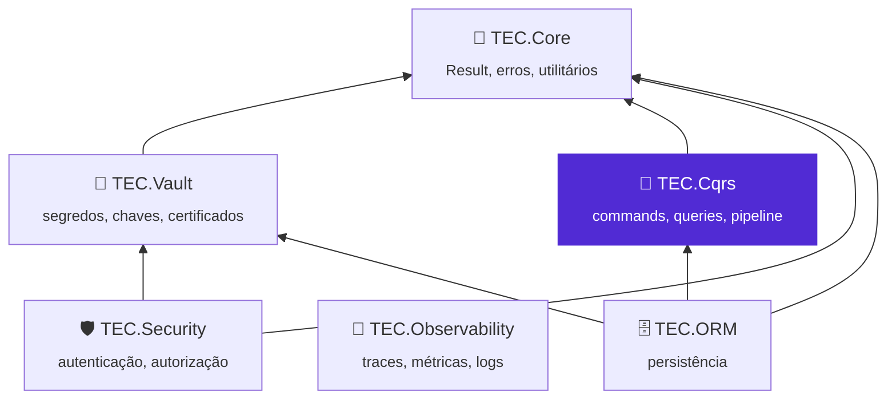
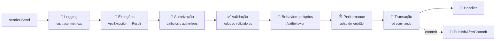

<div align="center">


# 🧭 TEC.Cqrs

**Commands, queries e notificações com um pipeline seguro por padrão: autorização, validação, transação, log e telemetria aplicados a cada requisição, em qualquer ponto de entrada (API, job ou mensageria).**

Mediator próprio · `Result` em vez de exceção · Autorização e validação obrigatórias · Transação por command · Eventos após o commit · .NET 8 e 10 · Native AOT

[](https://github.com/tudoemcodigo/lib-tec-cqrs/actions/workflows/ci.yml)
[](#-compatibilidade)
[](#-compatibilidade)
[](CHANGELOG.md)
[](LICENSE)

[📥 Instalação](#-instalação) · [🚀 Início rápido](#-início-rápido) · [📚 Documentação](docs/README.md) · [📝 Changelog](CHANGELOG.md) · [⚙️ CI/CD](.github/workflows/README.md)

</div>

---

## 📑 Sumário

- [✨ Por que usar](#-por-que-usar)
- [📦 Pacotes](#-pacotes)
- [🧬 Ecossistema TEC](#-ecossistema-tec)
- [📥 Instalação](#-instalação)
- [🚀 Início rápido](#-início-rápido)
- [🧱 O pipeline](#-o-pipeline)
- [📚 Documentação](#-documentação)
- [⚡ Compatibilidade](#-compatibilidade)
- [🛡️ Segurança](#️-segurança)
- [🧪 Testes](#-testes)
- [🤝 Contribuição](#-contribuição)
- [🏷️ Versionamento](#️-versionamento)
- [📄 Licença](#-licença)

---

## ✨ Por que usar

| Sem o TEC.Cqrs | Com o TEC.Cqrs |
|---|---|
| Autorização só no endpoint: o mesmo caso de uso chamado por um job ou por uma fila roda sem verificação | `[AuthorizeRequest]` e `IRequestAuthorizer<T>` verificados **no pipeline**, em qualquer ponto de entrada |
| Requisição nova sem regra de acesso passa despercebida | `RequireAuthorization` (padrão) derruba a **subida** listando as requisições sem autorização declarada |
| Command sem validação de entrada vai para produção | `RequireValidatorForCommands` (padrão): command sem validador lança exceção em vez de rodar sem validar |
| `try/catch` e `BeginTransaction` repetidos em cada handler | Um command = uma transação do `IUnitOfWork`; command interno que falha desfaz o externo inteiro |
| E-mail enviado e depois a transação desfeita | `PublishAfterCommit`: o evento só sai depois do commit e é descartado em falha |
| Exceções viram 500 com stack trace ou cada API responde num formato | `Result`/`Error` do TEC.Core → `ApiResponse` com o status certo; 500/502 sem detalhes internos |
| Log com o corpo da requisição (dados pessoais, senhas) | Só o tipo da requisição, a duração e os códigos de erro: o conteúdo **nunca** vai para o log |

- ✅ **Fail closed:** na dúvida, nega. Marcações contraditórias, `Roles`/`Policy` em branco, handler duplicado, authorizer ou validador que nunca seria executado: tudo falha na inicialização, não na primeira requisição.
- ✅ **Rápido:** handlers em `FrozenDictionary`, executores montados no registro (sem reflexão por chamada), behaviors sem cópia por `Send` e validação sem alocação quando a requisição é válida.
- ✅ **Observável sem dependência:** `ActivitySource` e `Meter` `TEC.Cqrs` da BCL; o TEC.Observability (ou qualquer OpenTelemetry) apenas os assina.
- ✅ **Native AOT:** registro explícito (`AddCommandHandler`, `AddQueryHandler`...) e JSON com metadados gerados em compilação.

## 📦 Pacotes

| Pacote | Para que serve | Quando instalar | Depende de |
|---|---|---|---|
| [`TEC.Cqrs`](TEC.Cqrs/README.md) | Mediator, commands/queries, pipeline (log, exceções, autorização, validação, performance, transação), notificações, telemetria | Sempre; sozinho em workers, jobs e consumidores de fila | `TEC.Core`, `Microsoft.Extensions.Logging.Abstractions` |
| [`TEC.Cqrs.AspNetCore`](TEC.Cqrs.AspNetCore/README.md) | Usuário do `HttpContext`, policies do `IAuthorizationService`, `Result` → resposta HTTP, tratamento global de exceções | APIs ASP.NET Core (Minimal APIs ou Controllers) | `TEC.Cqrs`, `Microsoft.AspNetCore.App` |
| [`TEC.Cqrs.FluentValidation`](TEC.Cqrs.FluentValidation/README.md) | `AbstractValidator<T>` executados no pipeline, um erro por campo | Quando a validação de entrada usa FluentValidation | `TEC.Cqrs`, `FluentValidation` 12 |

> [!IMPORTANT]
> **Use todos os pacotes `TEC.Cqrs.*` na mesma versão.** Os pacotes satélite (`AspNetCore` e `FluentValidation`) usam
> tipos internos do núcleo (`InternalsVisibleTo`) e são publicados juntos, a cada release, com a mesma versão. Misturar
> versões (ex.: `TEC.Cqrs` 0.0.2 com `TEC.Cqrs.AspNetCore` 0.0.1) pode falhar em execução com `MissingMethodException` ou
> `TypeLoadException`.

## 🧬 Ecossistema TEC



O TEC.Cqrs depende **só do TEC.Core** e não conhece Security nem Observability: a integração acontece por abstrações
(`IPrincipalAccessor`, `IUnitOfWork`) e por nomes de telemetria da BCL.

| Componente | Relação com o TEC.Cqrs |
|---|---|
| 🧰 [TEC.Core](https://github.com/tudoemcodigo/lib-tec-core) | Dependência: `Result`/`Error`/`ErrorType`, `AppException` e derivadas, `ApiResponse`, `PagedResult`/`PagedResponse` |
| 🗄️ [TEC.ORM](https://github.com/tudoemcodigo/lib-tec-orm) | Consumidor: implementa o `IUnitOfWork` que o pipeline usa para a transação de cada command |
| 🛡️ [TEC.Security](https://github.com/tudoemcodigo/lib-tec-security) | Independente: o `ClaimsPrincipal` normalizado chega ao pipeline pelo `IPrincipalAccessor` ([receita](docs/autorizacao.md#integração-com-o-tecsecurity)) |
| 📡 [TEC.Observability](https://github.com/tudoemcodigo/lib-tec-observability) | Sem dependência de pacote: assina o `ActivitySource` e o `Meter` `TEC.Cqrs` (prefixo `TEC.*`) |
| 🔐 [TEC.Vault](https://github.com/tudoemcodigo/lib-tec-vault) | Independente; handlers podem injetar `ISecretReader` e propagar o `Result` |

## 📥 Instalação

Os pacotes estão no **GitHub Packages** da organização `tudoemcodigo`, que sempre exige autenticação (mesmo para leitura).
Crie um PAT *classic* com o escopo `read:packages`, registre a origem com o nome `tec-interno` e instale o que a aplicação
usa (os satélites trazem o `TEC.Cqrs` junto):

```bash
dotnet nuget add source https://nuget.pkg.github.com/tudoemcodigo/index.json -n tec-interno -u <usuario> -p <PAT>

# API ASP.NET Core com FluentValidation (o mais comum)
dotnet add package TEC.Cqrs.AspNetCore --version 0.0.1
dotnet add package TEC.Cqrs.FluentValidation --version 0.0.1

# Worker, job ou consumidor de fila (sem ASP.NET Core)
dotnet add package TEC.Cqrs --version 0.0.1
```

> [!IMPORTANT]
> Versão atual: **0.0.1** (ainda não publicada). Instale **a mesma versão** em todos os `TEC.Cqrs.*`; com Central Package
> Management, declare-os juntos no `Directory.Packages.props`. Para evitar *dependency confusion*, mapeie `TEC.*` só para a
> origem `tec-interno` no `nuget.config` da aplicação (`packageSourceMapping`).

## 🚀 Início rápido

**1. Defina a requisição, o validador e o handler** (o handler retorna `Result`, não lança exceção para fluxo esperado):

```csharp
using FluentValidation;
using TEC.Core.Common.Results;
using TEC.Cqrs.Abstractions;
using TEC.Cqrs.Authorization;

[AuthorizeRequest(Policy = "CustomersWrite")]
public sealed record CreateCustomerCommand(string Name, string Document) : ICommand<Guid>;

public sealed record CustomerCreatedEvent(Guid CustomerId) : INotification;

internal sealed class CreateCustomerValidator : AbstractValidator<CreateCustomerCommand>
{
    public CreateCustomerValidator()
    {
        RuleFor(c => c.Name).NotEmpty().MaximumLength(100);
        RuleFor(c => c.Document).NotEmpty().Length(11).WithMessage("Documento inválido."); // texto fixo: não ecoa o valor
    }
}

internal sealed class CreateCustomerHandler(ICustomerRepository customers, IPublisher publisher)
    : ICommandHandler<CreateCustomerCommand, Guid>
{
    public async Task<Result<Guid>> Handle(CreateCustomerCommand command, CancellationToken cancellationToken)
    {
        if (await customers.DocumentExistsAsync(command.Document, cancellationToken))
            return Error.Conflict("CLIENTE_DUPLICADO", "Já existe um cliente com este documento.");

        var id = await customers.AddAsync(command.Name, command.Document, cancellationToken);
        publisher.PublishAfterCommit(new CustomerCreatedEvent(id)); // só sai depois do commit
        return id;
    }
}
```

**2. Registre e exponha:**

```csharp
using TEC.Cqrs.Abstractions;
using TEC.Cqrs.AspNetCore;
using TEC.Cqrs.DependencyInjection;
using TEC.Cqrs.Persistence;

var builder = WebApplication.CreateBuilder(args);

builder.Services.AddTecCqrs(options => options.RegisterServicesFromAssemblyContaining<Program>())
    .AddFluentValidation()
    .AddAspNetCore();
builder.Services.AddAuthorization(o => o.AddPolicy("CustomersWrite", p => p.RequireRole("Admin")));
builder.Services.AddScoped<IUnitOfWork, EfUnitOfWork>(); // opcional: liga a transação por command

var app = builder.Build();
app.UseTecExceptionHandler();   // primeiro middleware: exceções viram ApiResponse sem detalhes internos

app.MapPost("/clientes", (CreateCustomerCommand command, ISender sender, CancellationToken ct) =>
    sender.Send(command, ct).ToCreatedHttpResult(id => $"/clientes/{id}"));

app.Run();
```

Resultado: sem usuário → **401**; sem o papel → **403**; nome vazio → **400** com um erro por campo (o handler nem roda);
documento repetido → **409**; sucesso → **201** com `Location`, a transação confirmada e o evento publicado. Esqueceu o
`[AuthorizeRequest]` ou o validador? A aplicação **não sobe** (ou o command falha), em vez de rodar desprotegida.

> [!TIP]
> Worker sem ASP.NET Core: instale só o `TEC.Cqrs`, registre um `IPrincipalAccessor` com a identidade do processo e crie
> um escopo por mensagem. Receita completa em [📮 Mediator](docs/mediator.md#jobs-e-backgroundservice).

## 🧱 O pipeline



Autorização vem **antes** da validação (quem não tem acesso não descobre as regras de validação) e a transação fica por
último (só o handler e o commit ficam dentro dela). Detalhes de cada etapa: [🧱 Pipeline e behaviors](docs/pipeline-behaviors.md).

## 📚 Documentação

| Arquivo | O que responde |
|---|---|
| [📨 Commands e queries](docs/commands-e-queries.md) | Como declarar requisições e handlers, e como registrá-los (varredura ou registro explícito) |
| [📮 Mediator](docs/mediator.md) | Como enviar e publicar (`ISender`, `IPublisher`, `IMediator`); escopos em jobs e `BackgroundService` |
| [🧱 Pipeline e behaviors](docs/pipeline-behaviors.md) | O que cada etapa faz, como escrever um behavior e um `IExceptionErrorMapper` |
| [🔑 Autorização](docs/autorizacao.md) | `[AuthorizeRequest]`, `[AllowAnonymousRequest]`, `IRequestAuthorizer<T>`, `IPrincipalAccessor`, policies, TEC.Security |
| [✅ Validação](docs/validacao.md) | Validação obrigatória, `IRequestValidator<T>`, `[SkipValidation]` e FluentValidation |
| [📣 Notificações](docs/notificacoes.md) | `Publish` × `PublishAfterCommit`, ordem e polimorfismo dos handlers |
| [💾 Transação](docs/transacao.md) | `IUnitOfWork`, `[SkipTransaction]`, commands aninhados e concorrência no escopo |
| [🌐 ASP.NET Core](docs/aspnetcore.md) | `AddAspNetCore`, `ToHttpResult`/`ToCreatedHttpResult`, `UseTecExceptionHandler`, OpenAPI |
| [📈 Observabilidade](docs/observabilidade.md) | Traces, métricas, eventos de log e as verificações de `CqrsDiagnostics` |
| [⚙️ Opções e registro](docs/opcoes.md) | `AddTecCqrs`, `CqrsOptions`, `ICqrsBuilder` e as opções dos satélites |
| [⚡ Native AOT](docs/aot.md) | Registro explícito, JSON com *source generator* e limitações |
| [🛡️ Segurança](docs/seguranca.md) | Modelo de ameaças, garantias do pipeline, responsabilidades da aplicação e checklist |
| [🧪 Testes](docs/testes.md) | Suítes, categorias, como rodar local, variáveis `TEC_CARGA_*` e testes de arquitetura na aplicação |
| [💻 Desenvolvimento local](docs/desenvolvimento.md) | Como compilar (feed `tec-interno` por padrão, repositórios vizinhos sob demanda) e regenerar lock files |
| [🧰 Samples](samples/README.md) | API de pedidos de exemplo e gerador de carga HTTP |
| [⚙️ CI/CD](.github/workflows/README.md) | Workflows, gatilhos e como publicar |

## ⚡ Compatibilidade

| Item | Suporte |
|---|---|
| .NET | `net8.0` e `net10.0` (LTS), mesma API e mesmo comportamento nos dois alvos |
| Native AOT / trimming | ✅ `IsAotCompatible` nos três pacotes; registro explícito e `JsonTypeInfoResolver` ([⚡ AOT](docs/aot.md)). A varredura de assemblies usa reflexão (avisos IL2026/IL3050) |
| Sem ICU (`InvariantGlobalization`) | ✅ testado no CI |
| Pontos de entrada | ASP.NET Core (Minimal APIs e Controllers), workers, `BackgroundService`, consumidores de fila, testes |
| Containers de DI | `Microsoft.Extensions.DependencyInjection` (recomendado); outros funcionam sem as otimizações de `IServiceProviderIsService` |
| Sistemas | Windows, Linux e macOS |

## 🛡️ Segurança

Seguro por padrão: autorização e validação obrigatórias e verificadas na subida, autorização antes da validação,
erros internos ocultos do cliente (resposta 500/502 genérica com `traceId`), `Location` restrito a caminhos relativos,
conteúdo de requisição nunca em log e traces só com o tipo da exceção (`RecordExceptionDetailsInTraces` desligado).

> [!CAUTION]
> As mensagens do FluentValidation vão para o cliente: em campos sensíveis (senha, token, documento), use `WithMessage`
> com texto fixo, sem `{PropertyValue}`. Modelo de ameaças e checklist: [docs/seguranca.md](docs/seguranca.md).
> Vulnerabilidades: não abra *issue* pública; escreva para [roberto@roberto.inf.br](mailto:roberto@roberto.inf.br).

## 🧪 Testes

```bash
dotnet test --project TEC.Cqrs.Tests -c Release                                                       # unitários
dotnet test --project TEC.Cqrs.LoadTests -c Release --treenode-filter "/*/*/*/*[Category=Carga-CI]"   # carga rápida
```

209 testes por execução em `net10.0` e 216 em `net8.0` no `TEC.Cqrs.Tests` (TUnit: pipeline, regressão, segurança,
robustez, HTTP e divisão dos pacotes) a cada PR, 13 de carga rápida (`Carga-CI`) e 7 pesados (`Carga-Pesada`: vazão,
volume, soak e carga sustentada na API de exemplo, ~4–5 min com `TEC_CARGA_FATOR=1`), estes de carga só sob demanda no
`performance.yml` manual. Não há testes de integração externa: o TEC.Cqrs não acessa rede nem banco. Detalhes em
[docs/testes.md](docs/testes.md).

## 🤝 Contribuição

Branch a partir da `main` → código **e** testes (inclusive o caminho negado e o inválido) → `dotnet test` nos dois alvos
→ CHANGELOG e `docs/` atualizados → pull request com o check `ci / ci-ok` verde. Como compilar (credencial do feed
`tec-interno`, modo local com `-p:TecUseLocalProjects=true`): [docs/desenvolvimento.md](docs/desenvolvimento.md).

## 🏷️ Versionamento

[SemVer](https://semver.org/lang/pt-BR/), **uma versão para os três pacotes** (`Directory.Build.props`), sempre publicados
juntos. Enquanto for `0.x`, mudanças incompatíveis podem ocorrer em versões MINOR; um membro novo em interface pública
conta como incompatível. Cada merge na `main` publica a prévia `<Version>-preview.N`; versões estáveis e `-rc.N` saem só
pelo workflow **Publicar versão** ([CI/CD](.github/workflows/README.md)).

## 📄 Licença

[MIT](LICENSE) · Criado e mantido por **Roberto Oliveira**, equipe **Tudo em Código** · [github.com/tudoemcodigo](https://github.com/tudoemcodigo)
