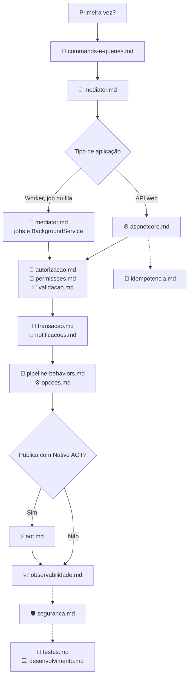

[🏠 TEC.Cqrs](../README.md) › 📚 Documentação

# 📚 Documentação do TEC.Cqrs

> Referência completa dos três pacotes (`TEC.Cqrs`, `TEC.Cqrs.AspNetCore` e `TEC.Cqrs.FluentValidation`): como usar,
> opções, erros e cuidados de segurança, conferidos com o código.

## 📑 Sumário

- [🗂️ Temas](#️-temas)
- [🗺️ Mapa dos temas](#️-mapa-dos-temas)
- [📐 Convenções desta documentação](#-convenções-desta-documentação)

---

## 🗂️ Temas

| # | Tema | O que responde |
|:-:|---|---|
| 1 | [📨 Commands e queries](commands-e-queries.md) | Como declarar requisições (`ICommand`, `ICommand<T>`, `IQuery<T>`) e handlers, e como registrá-los (varredura ou registro explícito) |
| 2 | [📮 Mediator](mediator.md) | Como enviar e publicar (`ISender`, `IPublisher`, `IMediator`), escopos e uso em jobs e `BackgroundService` |
| 3 | [🧱 Pipeline e behaviors](pipeline-behaviors.md) | O que cada etapa faz, em que ordem, como escrever um `IPipelineBehavior` e um `IExceptionErrorMapper` |
| 4 | [🔑 Autorização](autorizacao.md) | `[AuthorizeRequest]`, `[AllowAnonymousRequest]`, `IRequestAuthorizer<T>`, `IPrincipalAccessor`, `IRequestPolicyEvaluator`, TEC.Security |
| 5 | [🎫 Permissões](permissoes.md) | `[RequirePermission]` (todas ou qualquer uma), `IPermissionChecker`, claim `tec_perm`, teste de arquitetura |
| 6 | [✅ Validação](validacao.md) | Validação obrigatória de commands, `IRequestValidator<T>`, `[SkipValidation]` e o pacote FluentValidation |
| 7 | [📣 Notificações](notificacoes.md) | `Publish` × `PublishAfterCommit`, ordem e polimorfismo dos handlers, falhas |
| 8 | [💾 Transação](transacao.md) | `IUnitOfWork`, `[SkipTransaction]`, commands aninhados (rollback do pai) e concorrência no escopo |
| 9 | [🌐 ASP.NET Core](aspnetcore.md) | `AddAspNetCore`, `ToHttpResult`, `ToCreatedHttpResult`, `UseTecExceptionHandler`, OpenAPI, JSON |
| 10 | [🔁 Idempotência](idempotencia.md) | `Idempotency-Key` com reserva (sem execução dupla), `UseTecIdempotency`, `.WithIdempotency()`, stores |
| 11 | [📈 Observabilidade](observabilidade.md) | `ActivitySource`/`Meter` `TEC.Cqrs`, eventos de log e verificações de `CqrsDiagnostics` |
| 12 | [⚙️ Opções e registro](opcoes.md) | `AddTecCqrs`, `CqrsOptions`, `ICqrsBuilder`, `CqrsAspNetCoreOptions`, `CqrsFluentValidationOptions` |
| 13 | [⚡ Native AOT e trimming](aot.md) | Registro explícito, JSON com metadados gerados e limitações |
| 14 | [🛡️ Segurança](seguranca.md) | Modelo de ameaças, garantias do pipeline, responsabilidades da aplicação e checklist |
| 15 | [🧪 Testes](testes.md) | Suítes, categorias, como rodar local e no CI, variáveis `TEC_CARGA_*`, testes de arquitetura na aplicação |
| 16 | [💻 Desenvolvimento local](desenvolvimento.md) | Como compilar (feed `tec-interno` por padrão, repositórios vizinhos sob demanda), lock files e arquivos canônicos |

Fora de `docs/`: [🧰 Samples](../samples/README.md) · [⚙️ CI/CD](../.github/workflows/README.md) · [📝 Changelog](../CHANGELOG.md) · READMEs dos pacotes ([TEC.Cqrs](../TEC.Cqrs/README.md), [AspNetCore](../TEC.Cqrs.AspNetCore/README.md), [FluentValidation](../TEC.Cqrs.FluentValidation/README.md)).

---

## 🗺️ Mapa dos temas

---

## 📐 Convenções desta documentação

| Convenção | Significado |
|---|---|
| Fonte da verdade | O código atual: nomes, assinaturas, padrões e mensagens foram conferidos nele |
| Estrutura | Cada tema tem breadcrumb, 📑 Sumário, 🎯 Visão geral, 🚀 Uso, ⚙️ Opções, ❌ Erros, 🛡️ Segurança, ❓ Perguntas frequentes e rodapé de navegação |
| Exemplos | Domínio fictício de clientes e pedidos (`CreateCustomerCommand`, `GetCustomerQuery`, `ICustomerRepository`, `AppDbContext`): esses tipos são da aplicação, não da biblioteca. Identificadores em inglês, comentários e mensagens em português |
| `Result`, `Error`, `ErrorType`, `ApiResponse`, `PagedResult` | Vêm do [TEC.Core](https://github.com/tudoemcodigo/lib-tec-core) (`TEC.Core.Common.Results`, `TEC.Core.Responses`, `TEC.Core.Responses.Pagination`) |
| Status HTTP por `ErrorType` | `Validation` 400 · `Unauthorized` 401 · `Forbidden` 403 · `NotFound` 404 · `Conflict` 409 · `BusinessRule` 422 · `TooManyRequests` 429 · `Failure` 500 · `ExternalService` 502 |
| Configuração inválida | Falha na **inicialização** (`AddTecCqrs`, `AddFluentValidation`, `AddAspNetCore`) com `InvalidOperationException`, não na primeira requisição |
| `CancellationToken` | Cancelamento pedido pelo chamador propaga `OperationCanceledException`; commit, rollback e handlers pós-commit não são cancelados |
| Alertas | `[!NOTE]` comportamento · `[!TIP]` boa prática · `[!IMPORTANT]` requisito · `[!WARNING]` armadilha · `[!CAUTION]` risco de segurança ou perda de dados |

---
[🏠 README](../README.md) · [📨 Commands e queries](commands-e-queries.md) ➡️
