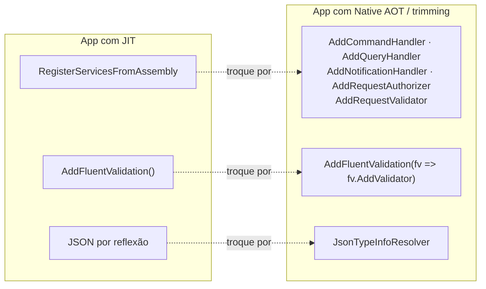

[🏠 TEC.Cqrs](../README.md) › [📚 Documentação](README.md) › ⚡ Native AOT e trimming

# ⚡ Native AOT e trimming

> Como publicar a aplicação com Native AOT ou trimming: registro explícito sem reflexão, respostas JSON com metadados
> gerados em compilação e as limitações conhecidas.

## 📑 Sumário

- [🎯 Visão geral](#-visão-geral)
- [🚀 Uso](#-uso)
  - [Registro explícito](#registro-explícito)
  - [JSON das respostas](#json-das-respostas)
  - [Projeto da aplicação](#projeto-da-aplicação)
- [⚙️ Opções](#️-opções)
- [❌ Erros](#-erros)
- [🛡️ Segurança](#️-segurança)
- [❓ Perguntas frequentes](#-perguntas-frequentes)

---

## 🎯 Visão geral



Os três pacotes têm `IsAotCompatible` e são compilados com os avisos de trimming/AOT (IL2xxx/IL3xxx) como erro. Os
executores de cada requisição, as fábricas de `Result` e a entrega a handlers/authorizers de tipo base ou interface são
montados **no registro**: em execução não há `MakeGenericType`, `Activator` nem reflexão por chamada.

| API | Usa reflexão | Em AOT |
|---|:---:|:---:|
| `CqrsOptions.RegisterServicesFromAssembly(...)` / `...Containing<T>()` | Sim | ❌ (IL2026/IL3050) |
| `AddFluentValidation()` sem argumentos | Sim | ❌ |
| `CqrsFluentValidationOptions.RegisterValidatorsFromAssembly(...)` | Sim | ❌ |
| `CqrsDiagnostics.Find*` | Sim | Só em testes |
| `AddCommandHandler`, `AddQueryHandler`, `AddNotificationHandler`, `AddRequestAuthorizer`, `AddRequestValidator`, `AddBehavior` | Não | ✅ |
| `AddFluentValidation(fv => fv.AddValidator<,>())` | Não | ✅ |
| `AddAspNetCore(http => http.JsonTypeInfoResolver = ...)` | Não | ✅ |

---

## 🚀 Uso

### Registro explícito

```csharp
using TEC.Cqrs.DependencyInjection;

builder.Services
    .AddTecCqrs(options => options
        .AddCommandHandler<CreateCustomerCommand, Guid, CreateCustomerHandler>()        // command com valor
        .AddCommandHandler<DeactivateCustomerCommand, DeactivateCustomerHandler>()      // command sem valor
        .AddQueryHandler<GetCustomerQuery, CustomerDto, GetCustomerHandler>()
        .AddRequestAuthorizer<ICustomerOrderRequest, CustomerOrderAuthorizer>()        // tipo exato, base ou interface
        .AddRequestValidator<DeactivateCustomerCommand, DeactivateCustomerValidator>()  // validador próprio
        .AddNotificationHandler<CustomerCreatedEvent, SendWelcomeEmailHandler>()        // tipo exato, base ou interface
        .AddBehavior(typeof(AuditBehavior<,>)))
    .AddFluentValidation(fv => fv.AddValidator<CreateCustomerCommand, CreateCustomerValidator>())
    .AddAspNetCore(http => http.JsonTypeInfoResolver = AppJsonContext.Default);
```

As verificações de inicialização (handler duplicado, autorização declarada, `Roles`/`Policy` em branco, authorizer ou
validador que nunca seria executado, validator só de interface) valem também no registro explícito.

### JSON das respostas

Com trimming/AOT, a reflexão do System.Text.Json fica desligada: informe em `JsonTypeInfoResolver` **todos** os envelopes
retornados pelos endpoints (o `ApiResponse` sem dados, usado nas falhas e no tratamento de exceções, já vem incluído).

```csharp
using System.Text.Json.Serialization;
using TEC.Core.Responses;

[JsonSerializable(typeof(ApiResponse<Guid>))]              // ToCreatedHttpResult de ICommand<Guid>
[JsonSerializable(typeof(ApiResponse<CustomerDto>))]       // ToHttpResult de IQuery<CustomerDto>
[JsonSerializable(typeof(PagedResponse<CustomerDto>))]     // ToHttpResult de IQuery<PagedResult<CustomerDto>>
[JsonSerializable(typeof(CreateCustomerCommand))]          // corpo da requisição (Minimal APIs)
[JsonSourceGenerationOptions(UseStringEnumConverter = true)]
internal sealed partial class AppJsonContext : JsonSerializerContext;
```

| Retorno do endpoint | Tipo a registrar |
|---|---|
| `Result.ToHttpResult()` | Nenhum (já incluído) |
| `Result<T>.ToHttpResult()` | `ApiResponse<T>` |
| `Result<T>.ToCreatedHttpResult(...)` | `ApiResponse<T>` |
| `Result<PagedResult<T>>.ToHttpResult()` | `PagedResponse<T>` |

As respostas seguem as mesmas convenções do `JsonDefaults` do TEC.Core (camelCase, ignora nulos, acentos sem escape).
Para os corpos de requisição das Minimal APIs, registre o contexto também no ASP.NET Core
(`builder.Services.ConfigureHttpJsonOptions(o => o.SerializerOptions.TypeInfoResolverChain.Insert(0, AppJsonContext.Default))`).

### Projeto da aplicação

```xml
<PropertyGroup>
  <PublishAot>true</PublishAot>
  <InvariantGlobalization>true</InvariantGlobalization>
</PropertyGroup>
```

> [!TIP]
> Com `InvariantGlobalization`, as mensagens padrão do FluentValidation saem em inglês: defina `.WithMessage(...)` em todas
> as regras.

---

## ⚙️ Opções

| Opção | Padrão | Descrição |
|---|---|---|
| `CqrsAspNetCoreOptions.JsonTypeInfoResolver` | `null` | Obrigatório com trimming/AOT; sem ele, as respostas usam reflexão |

---

## ❌ Erros

| Exceção / aviso | Quando | O que fazer |
|---|---|---|
| Avisos IL2026/IL3050 no build da aplicação | Varredura usada com trimming/AOT | Troque pelo registro explícito |
| `InvalidOperationException` "Nenhum handler registrado para '...'. Em Native AOT, registre o handler pelo AddTecCqrs (AddCommandHandler/AddQueryHandler)." | Handler registrado direto no container | Registre pelo `AddTecCqrs` |
| `InvalidOperationException` "A resposta '...' não foi registrada. Em Native AOT..." | Idem | Idem |
| `InvalidOperationException` "Sem metadados JSON para '...'" | Envelope fora do contexto JSON | `[JsonSerializable(typeof(...))]` no `AppJsonContext` |

---

## 🛡️ Segurança

> [!NOTE]
> O registro explícito também é uma lista auditável do que a aplicação expõe: cada handler, authorizer e validador aparece
> no `Program.cs`, sem depender do que a varredura encontra.

---

## ❓ Perguntas frequentes

<details>
<summary>Requisições <code>struct</code> funcionam em AOT?</summary>

Não com behaviors genéricos (inclusive os padrão): o container fecha os genéricos abertos só para tipos por referência em
AOT. Use `class`/`record`.

</details>

<details>
<summary>Handlers registrados direto no container funcionam?</summary>

Em JIT, sim (o executor é criado por reflexão na primeira chamada). Em AOT, não: registre pelo `AddTecCqrs`. Authorizers e
notification handlers de tipo base ou interface só são encontrados pelo `AddTecCqrs`, em JIT e em AOT.

</details>

---
⬅️ [⚙️ Opções e registro](opcoes.md) · [📚 Índice](README.md) · [🛡️ Segurança](seguranca.md) ➡️
