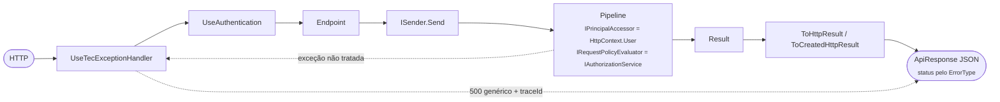

[🏠 TEC.Cqrs](../README.md) › [📚 Documentação](README.md) › 🌐 ASP.NET Core

# 🌐 ASP.NET Core

> Como ligar o pipeline a uma API ASP.NET Core com o pacote `TEC.Cqrs.AspNetCore`: usuário e policies da requisição,
> `Result` convertido na resposta HTTP padronizada e exceções tratadas sem expor detalhes.

## 📑 Sumário

- [🎯 Visão geral](#-visão-geral)
- [🚀 Uso](#-uso)
  - [Registrar](#registrar)
  - [Minimal APIs](#minimal-apis)
  - [Controllers](#controllers)
  - [Formato das respostas](#formato-das-respostas)
  - [Paginação](#paginação)
  - [Recurso criado e Location](#recurso-criado-e-location)
  - [Tratamento global de exceções](#tratamento-global-de-exceções)
  - [OpenAPI](#openapi)
- [⚙️ Opções](#️-opções)
- [❌ Erros](#-erros)
- [🛡️ Segurança](#️-segurança)
- [❓ Perguntas frequentes](#-perguntas-frequentes)

---

## 🎯 Visão geral



| Tipo | Namespace | Papel |
|---|---|---|
| `CqrsBuilderAspNetCoreExtensions.AddAspNetCore` | `TEC.Cqrs.DependencyInjection` | Registra a integração (encadeado no `AddTecCqrs`) |
| `CqrsAspNetCoreOptions` | `TEC.Cqrs.AspNetCore` | `JsonTypeInfoResolver`, `ReplaceExistingPrincipalAccessor` |
| `ResultHttpExtensions` | `TEC.Cqrs.AspNetCore` | `ToHttpResult` e `ToCreatedHttpResult` |
| `ApiResponseHttpResult<TResponse>` / `ApiResponseCreatedHttpResult<T>` | `TEC.Cqrs.AspNetCore` | Resultados HTTP (`IResult` e `IActionResult`) com metadados OpenAPI |
| `ApplicationBuilderExtensions.UseTecExceptionHandler` | `TEC.Cqrs.AspNetCore` | Tratamento global de exceções |

> [!IMPORTANT]
> Use o `TEC.Cqrs.AspNetCore` **na mesma versão** do `TEC.Cqrs` (e do `TEC.Cqrs.FluentValidation`): ele usa tipos
> internos do núcleo e é publicado junto com ele.

---

## 🚀 Uso

### Registrar

```csharp
using TEC.Cqrs.AspNetCore;
using TEC.Cqrs.DependencyInjection;

builder.Services.AddAuthentication().AddJwtBearer();
builder.Services.AddAuthorization(o => o.AddPolicy("CustomersWrite", p => p.RequireRole("Admin")));

builder.Services.AddTecCqrs(options => options.RegisterServicesFromAssemblyContaining<Program>())
    .AddFluentValidation()
    .AddAspNetCore();

var app = builder.Build();
app.UseTecExceptionHandler();   // antes dos demais middlewares
app.UseAuthentication();
app.UseAuthorization();
```

O `.AddAspNetCore()`:

- registra o `IHttpContextAccessor` e um `IPrincipalAccessor` que lê o `HttpContext.User`;
- registra (se não houver outro) um `IRequestPolicyEvaluator` que avalia as policies de `[AuthorizeRequest(Policy = ...)]`
  pelo `IAuthorizationService`, passando a requisição como recurso;
- com `JsonTypeInfoResolver`, passa a serializar as respostas com os metadados informados.

### Minimal APIs

```csharp
app.MapPost("/clientes", (CreateCustomerCommand command, ISender sender, CancellationToken ct) =>
    sender.Send(command, ct).ToCreatedHttpResult(id => $"/clientes/{id}"));

app.MapGet("/clientes/{id:guid}", (Guid id, ISender sender, CancellationToken ct) =>
    sender.Send(new GetCustomerQuery(id), ct).ToHttpResult());

app.MapDelete("/clientes/{id:guid}", (Guid id, ISender sender, CancellationToken ct) =>
    sender.Send(new DeactivateCustomerCommand(id), ct).ToHttpResult("Cliente inativado."));
```

As extensões existem para `Result`, `Result<T>`, `Result<PagedResult<T>>` e para as respectivas `Task<...>`, com uma
mensagem de sucesso opcional (`successMessage`).

### Controllers

```csharp
[ApiController]
[Route("clientes")]
public sealed class CustomersController(ISender sender) : ControllerBase
{
    [HttpGet("{id:guid}")]
    public async Task<IActionResult> Get(Guid id, CancellationToken ct) =>
        await sender.Send(new GetCustomerQuery(id), ct).ToHttpResult();
}
```

`ApiResponseHttpResult<TResponse>` implementa `IResult` e `IActionResult`: o mesmo código serve aos dois modelos.

### Formato das respostas

O envelope é o `ApiResponse` do TEC.Core, serializado com as convenções do `JsonDefaults` (camelCase, ignora nulos,
acentos sem escape):

| Resultado | Status | Corpo |
|---|:---:|---|
| `Result` de sucesso | 200 | `success`, `statusCode`, `message` (opcional), `timestamp` |
| `Result<T>` de sucesso | 200 | idem + `data` |
| `ToCreatedHttpResult` de sucesso | 201 | idem + `data` e cabeçalho `Location` |
| Falha | pelo `ErrorType` do primeiro erro | `errors` (`code`, `message`, `field`), `traceId` |
| Falha com algum erro interno (`Failure`/`ExternalService`) | 500 / 502 | Mensagem genérica, **sem** `errors` |

```json
{
  "success": false,
  "statusCode": 404,
  "message": "Cliente não encontrado.",
  "errors": [ { "code": "CLIENTE_NAO_ENCONTRADO", "message": "Cliente não encontrado." } ],
  "timestamp": "2026-10-07T12:00:00+00:00",
  "traceId": "4bf92f3577b34da6a3ce929d0e0e4736"
}
```

O `traceId` das falhas vem da `Activity` atual (ou do `HttpContext.TraceIdentifier`) para correlação com os logs.

### Paginação

Uma query que retorna `PagedResult<T>` vira `PagedResponse<T>` com `data` e o bloco `pagination`:

```csharp
[AuthorizeRequest]
public sealed record ListCustomersQuery(int Page, int PageSize) : IQuery<PagedResult<CustomerDto>>;

app.MapGet("/clientes", (int? page, int? pageSize, ISender sender, CancellationToken ct) =>
    sender.Send(new ListCustomersQuery(page ?? 1, pageSize ?? 20), ct).ToHttpResult());
```

```json
{
  "success": true,
  "statusCode": 200,
  "data": [ { "id": "…", "name": "Maria" } ],
  "pagination": { "page": 1, "pageSize": 20, "totalItems": 1, "totalPages": 1 },
  "timestamp": "2026-10-07T12:00:00+00:00"
}
```

Em falha, o envelope não tem `data` nem `pagination` (o mesmo JSON de qualquer falha).

### Recurso criado e Location

`ToCreatedHttpResult(location)` monta o `Location` a partir do valor criado. Regras:

| URL informada | Resultado |
|---|---|
| `/clientes/123` | `Location: /clientes/123` |
| `/clientes/João Silva` | `Location: /clientes/Jo%C3%A3o%20Silva` (escapado por segmento; `%XX` já escapado é mantido) |
| `https://outro.site/x`, `//host/x`, com `\` ou caractere de controle | **Sem** `Location` (redirecionamento aberto ou injeção de cabeçalho); resposta continua 201 e um aviso vai para o log, sem a URL |

### Tratamento global de exceções

```csharp
app.UseTecExceptionHandler();
```

| Exceção | Resposta | Log |
|---|---|---|
| `AppException` (TEC.Core) | Status e erros da própria exceção | Só se o erro for interno |
| Reconhecida por um `IExceptionErrorMapper` (ex.: `FluentValidation.ValidationException`) | Erros mapeados (400 por campo, na validação) | Só se algum erro for interno |
| `BadHttpRequestException` (JSON malformado, corpo grande demais) | Status 4xx da exceção, mensagem genérica (`Requisição inválida.`, `O corpo da requisição excede o tamanho máximo permitido.`...) | Não |
| Qualquer outra | 500 `Ocorreu um erro interno. Tente novamente mais tarde.` | Sim, **uma vez** |

Exceções já registradas pelo pipeline do mediator não são registradas de novo. No .NET 10 o middleware usa o
`UseExceptionHandler` do ASP.NET Core (com `SuppressDiagnosticsCallback`); no .NET 8, um middleware próprio com o mesmo
comportamento.

> [!TIP]
> Num tratamento global próprio, use `CqrsDiagnostics.IsExceptionLogged(exception)` para não registrar duas vezes uma
> exceção que o pipeline já registrou.

### OpenAPI

`ApiResponseHttpResult<TResponse>` e `ApiResponseCreatedHttpResult<T>` implementam `IEndpointMetadataProvider`: sem
`.Produces(...)`, o OpenAPI do endpoint já descreve o sucesso (200 com `TResponse`, ou 201 com `ApiResponse<T>`) e as
falhas 400, 401, 403, 404, 409, 422, 429, 500 e 502 com `ApiResponse`.

---

## ⚙️ Opções

| Opção (`CqrsAspNetCoreOptions`) | Padrão | Descrição |
|---|---|---|
| `JsonTypeInfoResolver` | `null` | Metadados JSON gerados em compilação (o `Default` de um `JsonSerializerContext`) das respostas `ApiResponse<T>`/`PagedResponse<T>`. **Obrigatório** com trimming ou Native AOT; sem ele, usa o `JsonDefaults.Options` do TEC.Core (reflexão) |
| `ReplaceExistingPrincipalAccessor` | `false` | Substitui um `IPrincipalAccessor` registrado **antes** do `AddAspNetCore` pelo do `HttpContext`. Com `false`, um accessor registrado antes faz a chamada falhar |

```csharp
.AddAspNetCore(http =>
{
    http.JsonTypeInfoResolver = AppJsonContext.Default;   // AOT: veja aot.md
    http.ReplaceExistingPrincipalAccessor = false;
});
```

Para manter o **seu** accessor também nas requisições HTTP (ex.: TEC.Security), não use `ReplaceExistingPrincipalAccessor`:
registre-o **depois** do `AddAspNetCore` com `services.Replace(...)` ([🔑 Autorização](autorizacao.md#integração-com-o-tecsecurity)).

---

## ❌ Erros

| Exceção | Quando | O que fazer |
|---|---|---|
| `InvalidOperationException` "AddAspNetCore já foi chamado" | Segunda chamada | Configure tudo numa chamada |
| `InvalidOperationException` "Já existe um IPrincipalAccessor registrado (...) antes do AddAspNetCore()" | Accessor registrado antes | Remova, use `ReplaceExistingPrincipalAccessor = true` ou registre o seu depois com `Replace` |
| `InvalidOperationException` "...usa a policy '...', mas o IAuthorizationService não está registrado" | Policy sem `AddAuthorization` | Chame `services.AddAuthorization(...)` |
| `InvalidOperationException` "Sem metadados JSON para '...'" | Envelope fora do `JsonTypeInfoResolver` (trimming/AOT) | Inclua `[JsonSerializable(typeof(ApiResponse<T>))]` no contexto |

---

## 🛡️ Segurança

> [!CAUTION]
> Os endpoints do exemplo (`samples/`) não usam `.RequireAuthorization()` para exercitar a autorização do pipeline. Numa
> API real, use **as duas camadas**: a do endpoint barra cedo e a do pipeline protege o caso de uso em qualquer entrada.

- Respostas 500/502 nunca levam mensagem, stack trace nem erros internos.
- Erros de cliente (4xx) não são registrados como erro (sem alertas falsos).
- Limite o corpo das requisições no Kestrel (`MaxRequestBodySize`): o excesso vira 413 com mensagem genérica.
- `Location` só aceita caminhos relativos seguros.

---

## ❓ Perguntas frequentes

<details>
<summary>Preciso do <code>UseTecExceptionHandler</code> se os handlers só retornam <code>Result</code>?</summary>

Sim: ele cobre bugs, banco fora do ar, JSON malformado e exceções de middlewares, garantindo o mesmo envelope e nenhuma
mensagem interna na resposta.

</details>

<details>
<summary>Como devolver um status que não vem do <code>ErrorType</code> (ex.: 202)?</summary>

Use os resultados do ASP.NET Core diretamente (`Results.Accepted(...)`) no endpoint, a partir do `Result`. As extensões do
pacote cobrem o fluxo comum (200, 201 e as falhas).

</details>

---
⬅️ [💾 Transação](transacao.md) · [📚 Índice](README.md) · [📈 Observabilidade](observabilidade.md) ➡️
