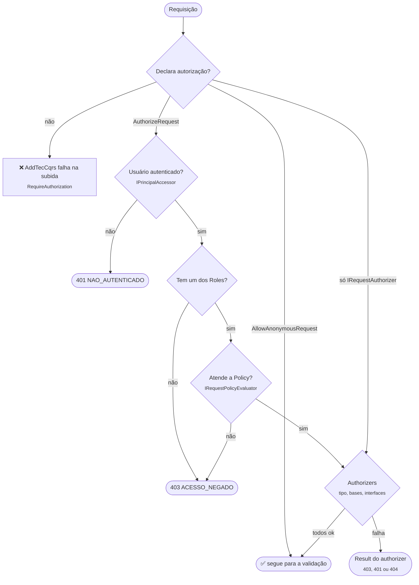

[🏠 TEC.Cqrs](../README.md) › [📚 Documentação](README.md) › 🔑 Autorização

# 🔑 Autorização

> Como declarar quem pode executar cada requisição (autenticação, papéis, policies e regras sobre o conteúdo) e garantir
> que a regra valha em qualquer ponto de entrada: API, job ou mensageria.

## 📑 Sumário

- [🎯 Visão geral](#-visão-geral)
- [🚀 Uso](#-uso)
  - [Atributos](#atributos)
  - [Requisições públicas](#requisições-públicas)
  - [Regras sobre o conteúdo com IRequestAuthorizer](#regras-sobre-o-conteúdo-com-irequestauthorizer)
  - [Authorizer para várias requisições](#authorizer-para-várias-requisições)
  - [De onde vem o usuário](#de-onde-vem-o-usuário)
  - [Policies fora do ASP.NET Core](#policies-fora-do-aspnet-core)
  - [Integração com o TEC.Security](#integração-com-o-tecsecurity)
- [⚙️ Opções](#️-opções)
- [❌ Erros](#-erros)
- [🛡️ Segurança](#️-segurança)
- [❓ Perguntas frequentes](#-perguntas-frequentes)

---

## 🎯 Visão geral



A autorização roda no pipeline, **antes da validação**: quem não tem acesso recebe 401/403 e não descobre as regras de
validação. Com `CqrsOptions.RequireAuthorization` (padrão), toda requisição precisa declarar como é autorizada; caso
contrário, o `AddTecCqrs` falha na subida listando as pendências.

| Tipo | Namespace | Papel |
|---|---|---|
| `AuthorizeRequestAttribute` | `TEC.Cqrs.Authorization` | Exige autenticação e, opcionalmente, `Roles` e/ou `Policy` |
| `AllowAnonymousRequestAttribute` | `TEC.Cqrs.Authorization` | Declara que a requisição é pública |
| `IRequestAuthorizer<TRequest>` | `TEC.Cqrs.Authorization` | Regra em código sobre o conteúdo da requisição |
| `IPrincipalAccessor` | `TEC.Cqrs.Authorization` | Fornece o `ClaimsPrincipal` atual |
| `IRequestPolicyEvaluator` | `TEC.Cqrs.Authorization` | Avalia as policies nomeadas (`IAuthorizationService` no ASP.NET Core) |

---

## 🚀 Uso

> [!TIP]
> Para exigir **permissões** (e não papéis), use `[RequirePermission("pedidos:aprovar")]`, com regras "todas" ou "qualquer uma": ver [🎫 Permissões](permissoes.md).

### Atributos

```csharp
using TEC.Cqrs.Abstractions;
using TEC.Cqrs.Authorization;

[AuthorizeRequest]                                  // só autenticação
public sealed record GetProfileQuery : IQuery<ProfileDto>;

[AuthorizeRequest(Roles = "Admin,Finance")]         // basta um dos papéis
public sealed record RefundPaymentCommand(Guid PaymentId) : ICommand;

[AuthorizeRequest(Policy = "CustomersWrite")]       // policy (recebe a requisição como recurso)
public sealed record CreateCustomerCommand(string Name, string Document) : ICommand<Guid>;

[AuthorizeRequest(Roles = "Manager")]
[AuthorizeRequest(Policy = "BusinessHours")]        // vários atributos: todos precisam ser atendidos
public sealed record ApproveCreditCommand(Guid ProposalId) : ICommand;
```

| Propriedade | Tipo | Regra |
|---|---|---|
| `Roles` | `string?` | Papéis separados por vírgula; basta o usuário ter **um** (`ClaimsPrincipal.IsInRole`). Informado, precisa ter ao menos um papel |
| `Policy` | `string?` | Nome da policy, avaliada pelo `IRequestPolicyEvaluator` com a requisição como recurso. Não pode ser vazia nem só espaços |

O atributo é herdado por classes derivadas (`Inherited = true`) e pode ser repetido (`AllowMultiple = true`).

### Requisições públicas

```csharp
[AllowAnonymousRequest]
public sealed record ListPublicPlansQuery : IQuery<IReadOnlyList<PlanDto>>;
```

`[AllowAnonymousRequest]` deixa explícito, no código, que a falta de proteção é intencional. Não pode ser combinado com
`[AuthorizeRequest]`.

### Regras sobre o conteúdo com IRequestAuthorizer

Para regras que dependem dos dados ("o pedido pertence ao cliente logado?"), implemente `IRequestAuthorizer<TRequest>`.
Ele é registrado pela varredura do `AddTecCqrs` (ou por `AddRequestAuthorizer`) e roda depois dos atributos:

```csharp
using TEC.Core.Common.Results;
using TEC.Cqrs.Authorization;

[AuthorizeRequest]
public sealed record GetOrderQuery(Guid OrderId) : IQuery<OrderDto>;

internal sealed class GetOrderAuthorizer(IPrincipalAccessor user, IOrderRepository orders)
    : IRequestAuthorizer<GetOrderQuery>
{
    public async Task<Result> AuthorizeAsync(GetOrderQuery query, CancellationToken cancellationToken)
    {
        string? customerId = user.Principal?.FindFirst("cliente_id")?.Value;
        if (customerId is not null && await orders.BelongsToAsync(query.OrderId, customerId, cancellationToken))
            return Result.Success();

        // 404 em vez de 403: não revela a quem não tem acesso que o pedido existe
        return Error.NotFound("PEDIDO_NAO_ENCONTRADO", "Pedido não encontrado.");
    }
}
```

- Retorne `Result.Success()` para autorizar, ou uma falha (`Error.Forbidden`, `Error.Unauthorized` ou `Error.NotFound`).
- Com vários authorizers para a mesma requisição, todos precisam autorizar; o primeiro que falhar interrompe.
- O authorizer roda **antes da validação**: trate valores nulos ou inválidos na requisição.
- Um authorizer sozinho (sem atributo) já conta como autorização declarada.

### Authorizer para várias requisições

Um authorizer de tipo base ou interface vale para todas as requisições que o implementam:

```csharp
public interface ICustomerOrderRequest : IBaseRequest
{
    Guid OrderId { get; }
}

[AuthorizeRequest]
public sealed record CancelOrderCommand(Guid OrderId) : ICommand, ICustomerOrderRequest;

internal sealed class CustomerOrderAuthorizer(IPrincipalAccessor user, IOrderRepository orders)
    : IRequestAuthorizer<ICustomerOrderRequest>
{
    public async Task<Result> AuthorizeAsync(ICustomerOrderRequest request, CancellationToken cancellationToken) =>
        await orders.BelongsToAsync(request.OrderId, user.Principal?.FindFirst("cliente_id")?.Value, cancellationToken)
            ? Result.Success()
            : Error.NotFound("PEDIDO_NAO_ENCONTRADO", "Pedido não encontrado.");
}

// Varredura ou, sem reflexão:
options.AddRequestAuthorizer<ICustomerOrderRequest, CustomerOrderAuthorizer>();
```

Ordem de execução: os do tipo exato, depois os das classes base, depois os das interfaces.

> [!WARNING]
> Authorizers de tipo base ou interface só são executados se registrados **pelo `AddTecCqrs`** (varredura ou
> `AddRequestAuthorizer`). Registrado direto no container antes do `AddTecCqrs`, a inicialização falha (ele nunca rodaria
> e a requisição ficaria desprotegida). Registros feitos no container **depois** do `AddTecCqrs` não são verificados.

### De onde vem o usuário

| Cenário | `IPrincipalAccessor` |
|---|---|
| API ASP.NET Core | `.AddAspNetCore()` registra o que lê `HttpContext.User` ([🌐 ASP.NET Core](aspnetcore.md)) |
| Worker, job, consumidor de fila | Registre o seu (identidade do sistema ou do usuário da mensagem) — veja [📮 Mediator](mediator.md#jobs-e-backgroundservice) |
| Nenhum registrado | Não há usuário: `[AuthorizeRequest]` retorna 401 |

```csharp
internal sealed class MessageUserAccessor(IMessageContext message) : IPrincipalAccessor
{
    public ClaimsPrincipal? Principal => message.User;   // usuário que originou a mensagem
}

services.AddScoped<IPrincipalAccessor, MessageUserAccessor>();
```

### Policies fora do ASP.NET Core

O núcleo não depende do ASP.NET Core. Num worker que usa policies, registre um `IRequestPolicyEvaluator`; sem ele, uma
requisição com `Policy` lança `InvalidOperationException` ao ser executada (fail closed). `Roles` não depende dele.

```csharp
using System.Security.Claims;
using Microsoft.AspNetCore.Authorization;   // pacote Microsoft.AspNetCore.Authorization
using TEC.Cqrs.Authorization;

internal sealed class PolicyEvaluator(IAuthorizationService authorization) : IRequestPolicyEvaluator
{
    public async Task<bool> AuthorizeAsync(ClaimsPrincipal user, object request, string policy, CancellationToken cancellationToken) =>
        (await authorization.AuthorizeAsync(user, request, policy)).Succeeded;
}

services.AddAuthorizationCore(o => o.AddPolicy("CustomersWrite", p => p.RequireRole("Sistema")));
services.AddScoped<IRequestPolicyEvaluator, PolicyEvaluator>();
```

### Integração com o TEC.Security

O [TEC.Security](https://github.com/tudoemcodigo/lib-tec-security) normaliza a identidade de qualquer provedor (Entra
ID, API key, login web, identidade de sistema). Nenhum dos dois pacotes referencia o outro: a ligação é o
`ClaimsPrincipal` entregue pelo `IPrincipalAccessor`.

| Cenário | O que fazer |
|---|---|
| API (só HTTP) | Nada além do `.AddAspNetCore()`: o `HttpContext.User` já é a identidade normalizada |
| Permissões | Uma policy por permissão (`AddAuthorization`) ou um `IRequestAuthorizer<T>` com `ISecurityUser.HasPermission(...)` |
| Worker sem ASP.NET Core | Registre o `SecurityPrincipalAccessor` abaixo e execute dentro de `ISecurityContext.RunAs(...)` |
| API com worker no mesmo processo | Registre o `SecurityPrincipalAccessor` **depois** do `.AddAspNetCore()`, com `services.Replace(...)` |

```csharp
using Microsoft.Extensions.DependencyInjection.Extensions;

// O ISecurityUser lê o principal do RunAs (worker) ou, sem ele, o HttpContext.User (requisição HTTP)
internal sealed class SecurityPrincipalAccessor(ISecurityUser user) : IPrincipalAccessor
{
    public ClaimsPrincipal? Principal => user.Principal;
}

builder.Services.AddTecSecurity(builder.Configuration, security => security.AddAspNetCore() /* provedores */);
builder.Services.AddTecCqrs(o => o.RegisterServicesFromAssemblyContaining<Program>()).AddAspNetCore();
builder.Services.Replace(ServiceDescriptor.Scoped<IPrincipalAccessor, SecurityPrincipalAccessor>()); // depois do AddAspNetCore
```

> [!WARNING]
> Sem o `Replace`, o accessor do `.AddAspNetCore()` lê só o `HttpContext.User`, que não existe num `BackgroundService`: os
> `Send`s protegidos do worker retornam 401, mesmo dentro de `RunAs`. **Não** use `ReplaceExistingPrincipalAccessor = true`
> para isso: ele faz o contrário (troca o seu accessor pelo do `HttpContext`).

---

## ⚙️ Opções

| Opção | Padrão | Descrição |
|---|---|---|
| `CqrsOptions.RequireAuthorization` | `true` | Toda requisição declara autorização (`[AuthorizeRequest]`, `IRequestAuthorizer` do tipo, de base, de interface ou genérico aberto, ou `[AllowAnonymousRequest]`). Verificado no `AddTecCqrs` e, para handlers registrados direto no container, no `Send` |
| `CqrsOptions.AddRequestAuthorizer<TRequest, TAuthorizer>()` | — | Registra um authorizer (tipo exato, base ou interface) sem reflexão |
| `CqrsAspNetCoreOptions.ReplaceExistingPrincipalAccessor` | `false` | Substitui um `IPrincipalAccessor` registrado antes do `AddAspNetCore` pelo do `HttpContext` |

> [!TIP]
> Desligar `RequireAuthorization` só faz sentido em aplicações sem nenhuma requisição protegida. Para listar as
> pendências sem derrubar a subida, use `CqrsDiagnostics.FindRequestsWithoutAuthorization` num teste
> ([📈 Observabilidade](observabilidade.md#verificações-para-testes-de-arquitetura)).

---

## ❌ Erros

| Código / exceção | HTTP | Quando | O que fazer |
|---|:---:|---|---|
| `NAO_AUTENTICADO` "Não autenticado." | 401 | `[AuthorizeRequest]` sem usuário autenticado | Autentique; em jobs, registre um `IPrincipalAccessor` |
| `ACESSO_NEGADO` "Você não tem permissão para realizar esta operação." | 403 | Sem nenhum dos `Roles` ou policy negada | Conceda o papel/permissão |
| Erros do authorizer | conforme o tipo | `IRequestAuthorizer` retornou falha | — |
| `InvalidOperationException` "N requisição(ões) sem autorização declarada" | — | Subida com `RequireAuthorization` | Declare a autorização das requisições listadas |
| `InvalidOperationException` "A requisição '...' não declara autorização" | — | `Send` de requisição cujo handler foi registrado direto no container, sem autorização | Idem |
| `InvalidOperationException` "possui [AllowAnonymousRequest] e [AuthorizeRequest]" | — | Marcações contraditórias | Use só um |
| `InvalidOperationException` "possui [AuthorizeRequest] com Policy em branco" / "com Roles sem nenhum papel" | — | `Policy = " "` ou `Roles = ","` | Informe o valor ou remova a propriedade |
| `InvalidOperationException` "O authorizer '...' de '...' foi registrado direto no container" | — | Authorizer de base/interface (ou de tipo desconhecido) no container antes do `AddTecCqrs` | Use `AddRequestAuthorizer` ou a varredura |
| `InvalidOperationException` "...usa a policy '...', mas nenhum IRequestPolicyEvaluator está registrado" | — | Policy sem avaliador | `.AddAspNetCore()` + `AddAuthorization`, ou registre o seu avaliador |
| `InvalidOperationException` "...mas o IAuthorizationService não está registrado" | — | `.AddAspNetCore()` sem `AddAuthorization` | Chame `services.AddAuthorization(...)` |
| `InvalidOperationException` "O authorizer '...' retornou null" | — | Authorizer retornou `null` | Retorne sempre um `Result` |
| `InvalidOperationException` "Já existe um IPrincipalAccessor registrado (...) antes do AddAspNetCore()" | — | Accessor registrado antes do `.AddAspNetCore()` | Remova, use `ReplaceExistingPrincipalAccessor` ou registre o seu depois com `Replace` |

---

## 🛡️ Segurança

> [!CAUTION]
> A autorização do endpoint (`.RequireAuthorization()`) protege só a rota HTTP. A do pipeline protege o **caso de uso**,
> inclusive quando chamado por um job, uma fila ou outro command. Use as duas camadas numa API.

- Fail closed: sem usuário → 401; policy sem avaliador → exceção; regra em branco → falha na subida.
- Prefira retornar `NotFound` a `Forbidden` em recursos de terceiros, para não revelar que existem.
- Os testes de carga verificam que, sob concorrência, um usuário nunca recebe dados de outro e que handlers protegidos
  nunca rodam para requisições negadas ([🧪 Testes](testes.md)).

---

## ❓ Perguntas frequentes

<details>
<summary>Command interno enviado por um handler passa de novo pela autorização?</summary>

Sim: todo `Send` passa pelo pipeline inteiro, com o mesmo `IPrincipalAccessor`. Se o command interno exige um papel que o
usuário não tem, o interno falha e a transação do externo é desfeita.

</details>

<details>
<summary>Onde ficam os nomes dos papéis no token?</summary>

O pipeline usa `ClaimsPrincipal.IsInRole`, que lê o `RoleClaimType` da identidade. Configure-o no esquema de autenticação
(ou use o TEC.Security, que normaliza os papéis).

</details>

---
⬅️ [🧱 Pipeline e behaviors](pipeline-behaviors.md) · [📚 Índice](README.md) · [🎫 Permissões](permissoes.md) ➡️
