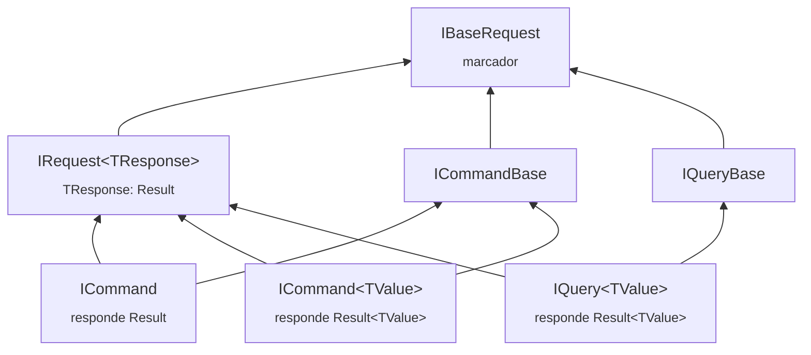

[🏠 TEC.Cqrs](../README.md) › [📚 Documentação](README.md) › 📨 Commands e queries

# 📨 Commands e queries

> Como declarar o que a aplicação faz (commands alteram estado, queries só leem), escrever o handler de cada requisição e
> registrá-los no `AddTecCqrs`.

## 📑 Sumário

- [🎯 Visão geral](#-visão-geral)
- [🚀 Uso](#-uso)
  - [Declarar requisições](#declarar-requisições)
  - [Escrever handlers](#escrever-handlers)
  - [Retornar falhas](#retornar-falhas)
  - [Registrar por varredura](#registrar-por-varredura)
  - [Registrar explicitamente](#registrar-explicitamente)
- [⚙️ Opções](#️-opções)
- [❌ Erros](#-erros)
- [🛡️ Segurança](#️-segurança)
- [❓ Perguntas frequentes](#-perguntas-frequentes)

---

## 🎯 Visão geral



Toda requisição responde com `Result` ou `Result<T>` do TEC.Core: assim o pipeline pode interromper o fluxo (acesso
negado, entrada inválida) com uma falha, sem lançar exceção.

| Requisição | Resposta | Handler | Transação | Validador obrigatório |
|---|---|---|---|---|
| `ICommand` | `Result` | `ICommandHandler<TCommand>` | Sim (com `IUnitOfWork`, sem `[SkipTransaction]`) | Sim (sem `[SkipValidation]`) |
| `ICommand<TValue>` | `Result<TValue>` | `ICommandHandler<TCommand, TValue>` | Sim | Sim |
| `IQuery<TValue>` | `Result<TValue>` | `IQueryHandler<TQuery, TValue>` | Nunca | Não |

Todos os tipos ficam no namespace `TEC.Cqrs.Abstractions` (pacote `TEC.Cqrs`). `IBaseRequest`, `IRequest<TResponse>`,
`ICommandBase` e `IQueryBase` são marcadores: **não os implemente diretamente**.

---

## 🚀 Uso

### Declarar requisições

Use `record` imutáveis, sem lógica, e declare a autorização (obrigatória por padrão, veja [🔑 Autorização](autorizacao.md)):

```csharp
using TEC.Cqrs.Abstractions;
using TEC.Cqrs.Authorization;

// Command que retorna o Id criado
[AuthorizeRequest(Policy = "CustomersWrite")]
public sealed record CreateCustomerCommand(string Name, string Document) : ICommand<Guid>;

// Command sem valor de retorno
[AuthorizeRequest(Roles = "Admin")]
public sealed record DeactivateCustomerCommand(Guid Id) : ICommand;

// Query (somente leitura)
[AuthorizeRequest]
public sealed record GetCustomerQuery(Guid Id) : IQuery<CustomerDto>;

public sealed record CustomerDto(Guid Id, string Name);
```

### Escrever handlers

Cada requisição tem **exatamente um** handler. Handlers podem ser `internal`, são registrados como `Scoped` e recebem
dependências pelo construtor:

```csharp
using TEC.Core.Common.Results;
using TEC.Cqrs.Abstractions;

internal sealed class CreateCustomerHandler(ICustomerRepository customers)
    : ICommandHandler<CreateCustomerCommand, Guid>
{
    public async Task<Result<Guid>> Handle(CreateCustomerCommand command, CancellationToken cancellationToken)
    {
        if (await customers.DocumentExistsAsync(command.Document, cancellationToken))
            return Error.Conflict("CLIENTE_DUPLICADO", "Já existe um cliente com este documento.");

        return await customers.AddAsync(command.Name, command.Document, cancellationToken); // Guid → Result<Guid>
    }
}

internal sealed class DeactivateCustomerHandler(ICustomerRepository customers) : ICommandHandler<DeactivateCustomerCommand>
{
    public async Task<Result> Handle(DeactivateCustomerCommand command, CancellationToken cancellationToken)
    {
        if (!await customers.DeactivateAsync(command.Id, cancellationToken))
            return Error.NotFound("CLIENTE_NAO_ENCONTRADO", "Cliente não encontrado.");

        return Result.Success();
    }
}

internal sealed class GetCustomerHandler(ICustomerRepository customers) : IQueryHandler<GetCustomerQuery, CustomerDto>
{
    public async Task<Result<CustomerDto>> Handle(GetCustomerQuery query, CancellationToken cancellationToken)
    {
        var customer = await customers.FindAsync(query.Id, cancellationToken);
        if (customer is null)
            return Error.NotFound("CLIENTE_NAO_ENCONTRADO", "Cliente não encontrado.");

        return new CustomerDto(customer.Id, customer.Name);
    }
}
```

> [!NOTE]
> `ICommandHandler<TCommand>`, `ICommandHandler<TCommand, TValue>` e `IQueryHandler<TQuery, TValue>` derivam de
> `IRequestHandler<TRequest, TResponse>`, cujo único membro é `Task<TResponse> Handle(TRequest request, CancellationToken cancellationToken)`.
> Nunca retorne `null`: o pipeline lança `InvalidOperationException` identificando o handler (e desfaz a transação).

### Retornar falhas

| Situação esperada | Retorne | HTTP |
|---|---|:---:|
| Recurso inexistente | `Error.NotFound("CODIGO", "mensagem")` | 404 |
| Duplicidade / conflito | `Error.Conflict(...)` | 409 |
| Regra de negócio violada | `Error.BusinessRule(...)` | 422 |
| Entrada inválida descoberta no handler | `Error.Validation("CODIGO", "mensagem", "campo")` | 400 |
| Serviço externo indisponível | `Error.ExternalService(...)` | 502 |

O handler também pode **lançar** uma `AppException` do TEC.Core (`NotFoundException`, `BusinessException`...): o behavior
de exceções a converte em `Result` de falha com os mesmos erros. Qualquer outra exceção (bug, banco fora do ar) é
propagada e vira 500 genérico no `UseTecExceptionHandler`. Detalhes em [🧱 Pipeline e behaviors](pipeline-behaviors.md).

### Registrar por varredura

```csharp
using TEC.Cqrs.DependencyInjection;

builder.Services.AddTecCqrs(options => options
    .RegisterServicesFromAssemblyContaining<Program>()          // handlers, authorizers, validadores e notification handlers
    .RegisterServicesFromAssembly(typeof(CustomerDto).Assembly)); // outro assembly da aplicação
```

A varredura usa reflexão: prática em apps com JIT, mas gera os avisos IL2026/IL3050 em trimming e Native AOT. Ela também
guarda **todas** as requisições encontradas (mesmo sem handler) para as verificações de autorização da inicialização.

### Registrar explicitamente

Sem reflexão, compatível com trimming e Native AOT:

```csharp
builder.Services.AddTecCqrs(options => options
    .AddCommandHandler<CreateCustomerCommand, Guid, CreateCustomerHandler>()   // command com valor
    .AddCommandHandler<DeactivateCustomerCommand, DeactivateCustomerHandler>() // command sem valor
    .AddQueryHandler<GetCustomerQuery, CustomerDto, GetCustomerHandler>());
```

As duas formas podem ser combinadas; o mesmo handler registrado de novo é ignorado. Todas as opções do registro estão em
[⚙️ Opções e registro](opcoes.md).

---

## ⚙️ Opções

| Método de `CqrsOptions` | Registra | AOT |
|---|---|:---:|
| `RegisterServicesFromAssembly(Assembly)` / `RegisterServicesFromAssemblyContaining<T>()` | Handlers, notification handlers, authorizers e validadores do assembly | ❌ |
| `AddCommandHandler<TCommand, THandler>()` | Handler de `ICommand` | ✅ |
| `AddCommandHandler<TCommand, TValue, THandler>()` | Handler de `ICommand<TValue>` | ✅ |
| `AddQueryHandler<TQuery, TValue, THandler>()` | Handler de `IQuery<TValue>` | ✅ |

| Atributo (requisição) | Efeito | Documentação |
|---|---|---|
| `[AuthorizeRequest]` / `[AllowAnonymousRequest]` | Declara a autorização | [🔑 Autorização](autorizacao.md) |
| `[SkipValidation]` | Dispensa o command de validador | [✅ Validação](validacao.md) |
| `[SkipTransaction]` | Executa o command sem abrir transação | [💾 Transação](transacao.md) |

---

## ❌ Erros

| Exceção | Quando | O que fazer |
|---|---|---|
| `InvalidOperationException` "deve implementar ICommand, ICommand<T> ou IQuery<T> (não IRequest<T> diretamente)" | Requisição implementa só `IRequest<T>` (escaparia da transação e da validação obrigatória) | Use `ICommand`, `ICommand<T>` ou `IQuery<T>` |
| `InvalidOperationException` "é ao mesmo tempo command e query" | Marcações contraditórias | Implemente só um dos dois |
| `InvalidOperationException` "possui mais de um handler" | Dois handlers para a mesma requisição (varredura, registro explícito ou direto no container) | Mantenha um handler por requisição |
| `InvalidOperationException` "foi registrado direto no container como Singleton/Transient" | Handler registrado à mão com tempo de vida diferente de `Scoped` | Remova o registro manual (o `AddTecCqrs` já registra) |
| `InvalidOperationException` "Nenhum handler registrado para '...'" | `Send` de requisição sem handler | Registre o handler no `AddTecCqrs` |
| `InvalidOperationException` "O handler de '...' (...) retornou null" | Handler retornou `null` | Retorne sempre um `Result` |
| `InvalidOperationException` "Nada foi registrado" | `AddTecCqrs` sem assembly nem handler | Informe ao menos um assembly ou handler |

As verificações de marcação acontecem no `AddTecCqrs`; para handlers registrados direto no container, no primeiro `Send`.

---

## 🛡️ Segurança

> [!WARNING]
> O pipeline nunca registra o **conteúdo** das requisições, mas registra o **nome do tipo** (logs, traces e métricas). Não
> use dados sensíveis em nomes de tipos nem em códigos de erro.

- Requisições são entrada não confiável: limite tamanhos e quantidades no validador (ex.: no máximo 100 itens por lote).
- Mensagens de `Error` vão para o cliente: escreva textos sem detalhes internos (nada de SQL, caminho, stack trace).

---

## ❓ Perguntas frequentes

<details>
<summary>Posso ter uma query que grava alguma coisa?</summary>

Não deveria: queries nunca participam de transação e não exigem validador. Se a operação altera estado, declare-a como
command.

</details>

<details>
<summary>Requisições podem ser <code>struct</code>?</summary>

Funcionam em JIT, mas não em Native AOT com behaviors próprios (o container fecha genéricos abertos só para tipos por
referência). Prefira `record` (classe).

</details>

<details>
<summary>Como chamo um command de dentro de outro?</summary>

Injete `ISender` no handler e chame `Send`: o command interno participa da transação do externo e, se falhar, desfaz tudo
([💾 Transação](transacao.md#commands-aninhados)).

</details>

---
⬅️ [📚 Índice](README.md) · [📮 Mediator](mediator.md) ➡️
