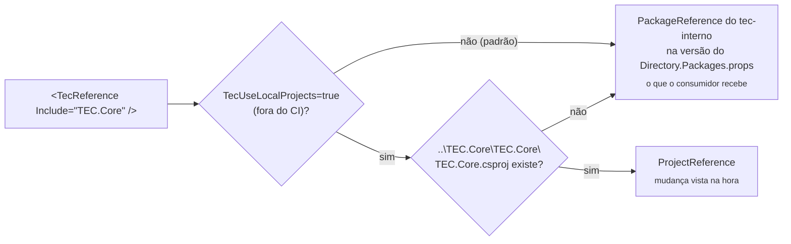

[🏠 TEC.Cqrs](../README.md) › [📚 Documentação](README.md) › 💻 Desenvolvimento local

# 💻 Desenvolvimento local

> Como compilar, testar e empacotar o TEC.Cqrs na sua máquina: por padrão com o TEC.Core do feed `tec-interno` (o que o
> consumidor recebe) e, sob demanda, com o repositório TEC.Core vizinho, sem publicar pacote.

## 📑 Sumário

- [🎯 Visão geral](#-visão-geral)
- [🚀 Uso](#-uso)
  - [Pré-requisitos](#pré-requisitos)
  - [Clonar lado a lado](#clonar-lado-a-lado)
  - [Compilar, testar e empacotar](#compilar-testar-e-empacotar)
  - [Lock files](#lock-files)
  - [Rodar os samples](#rodar-os-samples)
  - [Arquivos canônicos](#arquivos-canônicos)
  - [Contribuição](#contribuição)
- [⚙️ Opções](#️-opções)
- [❌ Erros](#-erros)
- [🛡️ Segurança](#️-segurança)
- [❓ Perguntas frequentes](#-perguntas-frequentes)

---

## 🎯 Visão geral

O `TEC.Cqrs` depende do `TEC.Core`, declarado no csproj por `<TecReference Include="TEC.Core" />` (nunca por
`PackageReference`). Os satélites (`TEC.Cqrs.AspNetCore` e `TEC.Cqrs.FluentValidation`) referenciam o núcleo por
`ProjectReference` dentro do próprio repositório. O `build/Tec.Build.targets` decide como resolver o `TecReference`:



| Modo | Quando | Referência | Lock file |
|---|---|---|---|
| Pacote | **Padrão**, na máquina e no CI (`CI=true` sempre usa pacote) | `PackageReference` na versão publicada declarada no `Directory.Packages.props` do feed `tec-interno` | `packages.lock.json` (versionado) |
| Local | Sob demanda: `-p:TecUseLocalProjects=true` fora do CI, com o repositório vizinho presente (sem ele, continua pacote) | `ProjectReference` para `..\TEC.Core\TEC.Core\TEC.Core.csproj` | `packages.local.lock.json` (fora do git) |

> [!IMPORTANT]
> Como o padrão é o pacote, compilar o TEC.Cqrs exige **leitura do feed `tec-interno`** na máquina (credencial
> configurada uma vez; veja [Pré-requisitos](#pré-requisitos)). O modo local serve para alterar o TEC.Core e testar a
> mudança aqui sem publicar pacote.

> [!TIP]
> **Versão do TEC.* consumido:** fica no `Directory.Packages.props` deste repositório
> (`<PackageVersion Include="TEC.Core" Version="0.0.1" />`); o csproj mantém só `<TecReference Include="TEC.Core" />`,
> sem versão. Para usar outra versão publicada, altere esse `PackageVersion` (o Dependabot abre o PR) e regenere os
> `packages.lock.json` ([Lock files](#lock-files)). Os componentes evoluem de forma independente: o TEC.Core pode ficar
> em `0.0.1` enquanto o TEC.Cqrs sobe a própria `<Version>`.

---

## 🚀 Uso

### Pré-requisitos

| Item | Detalhe |
|---|---|
| SDK | .NET 10 (`global.json`: `10.0.100`, `rollForward: latestFeature`) e o runtime 8.0 para rodar os testes em `net8.0` |
| Feed `tec-interno` | Leitura obrigatória no modo pacote, o padrão (PAT classic com `read:packages`; o GitHub Packages exige token mesmo para pacote público) |
| Docker, Azure CLI | Não são necessários: o TEC.Cqrs não tem testes de integração externa |

```bash
# Credencial do feed (uma vez por máquina, fora do repositório; no Linux/macOS acrescente --store-password-in-clear-text)
dotnet nuget update source tec-interno -u <usuario-github> -p <PAT>
# ou, se a origem ainda não existir no NuGet.Config do usuário:
dotnet nuget add source https://nuget.pkg.github.com/tudoemcodigo/index.json -n tec-interno -u <usuario-github> -p <PAT>
```

### Clonar lado a lado

```text
D:\Projetos\Componentes\
├── tec-workflows\   CI/CD e arquivos canônicos
├── TEC.Core\        ⟵ dependência do TEC.Cqrs
├── TEC.Cqrs\        este repositório
└── ...              TEC.Vault, TEC.Security, TEC.Observability, TEC.ORM
```

Só é necessário para o modo local. A raiz dos componentes é a pasta acima do repositório (`TecComponentsRoot`); com o
`TEC.Core` ali e `-p:TecUseLocalProjects=true`, tudo compila junto e uma mudança no Core aparece no Cqrs na hora:

```bash
dotnet build TEC.Cqrs.slnx -p:TecUseLocalProjects=true
dotnet test --project TEC.Cqrs.Tests -p:TecUseLocalProjects=true
```

### Compilar, testar e empacotar

```bash
dotnet build TEC.Cqrs.slnx -c Release
dotnet test --project TEC.Cqrs.Tests -c Release
dotnet test --project TEC.Cqrs.LoadTests -c Release -f net10.0 --treenode-filter "/*/*/*/*[Category=Carga-CI]"
dotnet pack TEC.Cqrs.slnx -c Release -o ./pacotes      # só os 3 projetos de pacote
```

O `dotnet pack` gera `TEC.Cqrs`, `TEC.Cqrs.AspNetCore` e `TEC.Cqrs.FluentValidation` **com a mesma versão**
(`Directory.Build.props`), cada um com o `README.md` da própria pasta, `lib/net8.0`, `lib/net10.0` e a documentação XML.
Samples e projetos de teste não são empacotados.

> [!IMPORTANT]
> Nos pacotes **todo aviso é erro** (analisadores CA/IDE, nullable, XML doc, IL de AOT/trimming). Rode o build em Release
> antes do PR. Categorias e carga: [🧪 Testes](testes.md).

> [!NOTE]
> O núcleo expõe os internos aos satélites (`InternalsVisibleTo`), inclusive o polyfill `System.Threading.Lock` do
> `net8.0` (`build/Polyfills`). Por isso os satélites removem a cópia local do polyfill
> (`<Compile Remove="$(TecRepoRoot)build/Polyfills/Lock.cs" />`) e usam a do núcleo — e é por isso também que os três
> pacotes precisam ser usados na mesma versão.

### Lock files

O `packages.lock.json` versionado de cada projeto é sempre o do **modo pacote**, o padrão (o CI restaura com
`--locked-mode`). No modo local (`-p:TecUseLocalProjects=true`) o NuGet usa `packages.local.lock.json`, ignorado pelo
git. Depois de mudar uma dependência, regenere o lock versionado:

```bash
dotnet restore TEC.Cqrs.slnx --force-evaluate
```

> [!WARNING]
> Regenerar o lock versionado (e compilar no modo padrão) exige que as versões TEC.* referenciadas **já estejam publicadas** no feed (ordem: Core →
> Vault → Cqrs → Security → Observability → ORM). Enquanto o `TEC.Core` 0.0.1 não estiver no feed, esse restore falha.

### Rodar os samples

```bash
dotnet run -c Release --project samples/TEC.Cqrs.SampleApi -f net10.0 -- --urls http://localhost:5000
dotnet run -c Release --project samples/TEC.Cqrs.LoadGenerator -f net10.0 -- --url http://localhost:5000 --duracao 30
```

Endpoints, cenários e opções: [🧰 Samples](../samples/README.md).

### Arquivos canônicos

`build/`, `Directory.Build.targets`, `.editorconfig`, `nuget.config`, `.gitignore`, `.gitattributes`, `global.json`,
`LICENSE`, `Images/Logo.png`, `.github/dependabot.yml` e `.github/zizmor.yml` vêm do
[tec-workflows](https://github.com/tudoemcodigo/tec-workflows) e **não são editados aqui**: altere no tec-workflows e
sincronize com `scripts/sync-template.sh TEC.Cqrs`. O job *Convenções* do CI falha se uma cópia divergir. O que é deste
repositório: `Directory.Build.props` (`TecComponent` e `Version`), `Directory.Packages.props` e os csproj.

### Contribuição

1. Crie uma branch a partir da `main` (push direto é bloqueado).
2. Código: identificadores em inglês; comentários, XML docs, mensagens e documentação em português.
3. Teste novo para todo comportamento novo ou corrigido; segurança com teste que prove o controle (inclusive o caminho
   negado e o inválido).
4. Atualize `docs/`, os READMEs dos pacotes afetados e o [CHANGELOG](../CHANGELOG.md).
5. Abra o PR: o check obrigatório é **`ci / ci-ok`**.

---

## ⚙️ Opções

| Propriedade MSBuild | Padrão | Descrição |
|---|---|---|
| `TecUseLocalProjects` | `false` (sempre `false` com `CI=true`) | `true` liga a troca de `TecReference` por `ProjectReference` quando o repositório vizinho existe |
| `TecComponentsRoot` | Pasta acima do repositório | Onde procurar os repositórios vizinhos (`<raiz>\TEC.Core\TEC.Core\TEC.Core.csproj`) |
| `PackageVersion` dos TEC.* (`Directory.Packages.props`) | `0.0.1` | Versão publicada de cada TEC.* consumido no modo pacote (o Dependabot atualiza) |
| `Version` (`Directory.Build.props`) | `0.0.1` | Versão única dos 3 pacotes deste repositório; base das prévias do CI (`<Version>-preview.N` a cada push na `main`). Suba depois de publicar `X.Y.Z` |

---

## ❌ Erros

| Erro | Quando ocorre | O que fazer |
|---|---|---|
| `NU1100 Unable to resolve 'TEC.Core'` | Modo pacote sem a origem `tec-interno` (ou com outro nome) | Adicione a origem com o nome exato `tec-interno` (ou use o modo local com o `TEC.Core` clonado ao lado) |
| `401`/`403` no restore | PAT sem `read:packages` ou expirado | Gere outro PAT classic e refaça o `dotnet nuget update source tec-interno` |
| `NU1004` no restore | Lock file desatualizado | Regenere com `dotnet restore TEC.Cqrs.slnx --force-evaluate` |
| `NU1901`–`NU1904` | Vulnerabilidade conhecida em dependência (inclusive transitiva) | Atualize o pacote no `Directory.Packages.props` e regenere os locks |
| `CS0436` (tipo `Lock` duplicado) num satélite | Polyfill compilado de novo no satélite | Mantenha o `<Compile Remove=".../Lock.cs" />` do csproj do satélite |
| `dotnet test` roda 0 testes (código 5) | `-nologo` no Microsoft.Testing.Platform | Remova `-nologo` |

---

## 🛡️ Segurança

> [!WARNING]
> Nunca coloque o PAT do feed no `nuget.config` do repositório: ele fica só no NuGet.Config do usuário (no Windows,
> criptografado).

- `packageSourceMapping`: `TEC.*` só do `tec-interno`, o resto só do nuget.org (contra *dependency confusion*).
- `packages.local.lock.json` fica fora do git.

---

## ❓ Perguntas frequentes

<details>
<summary>Mudei o TEC.Core e o TEC.Cqrs não viu a mudança.</summary>

Por padrão o TEC.Cqrs usa o pacote publicado do TEC.Core. Compile com `-p:TecUseLocalProjects=true`, confira se o
`TEC.Core` está em `..\TEC.Core\TEC.Core\TEC.Core.csproj` em relação a este repositório e se a variável `CI` não está
definida como `true` no seu terminal (no CI a opção é ignorada).

</details>

<details>
<summary>Preciso commitar o <code>packages.local.lock.json</code>?</summary>

Não. Só o `packages.lock.json` (modo pacote) vai para o git.

</details>

---
⬅️ [🧪 Testes](testes.md) · [📚 Índice](README.md)
