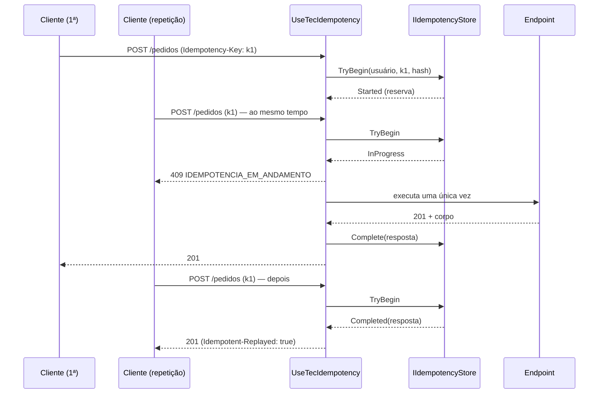

[🏠 TEC.Cqrs](../README.md) › [📚 Documentação](README.md) › Idempotência

# 🔁 Idempotência

> Repetir um `POST` com o mesmo `Idempotency-Key` devolve a resposta original sem criar de novo, mesmo com requisições simultâneas.

## 📑 Sumário

- [🎯 Visão geral](#-visão-geral)
- [🚀 Uso](#-uso)
  - [Registrar](#registrar)
  - [Marcar endpoints](#marcar-endpoints)
  - [Escolher o store](#escolher-o-store)
  - [Store próprio](#store-próprio)
- [⚙️ Opções](#️-opções)
- [❌ Erros](#-erros)
- [🛡️ Segurança](#️-segurança)
- [❓ Perguntas frequentes](#-perguntas-frequentes)

---

## 🎯 Visão geral

| Tipo | Pacote | Para que serve |
|---|---|---|
| `IIdempotencyStore` | `TEC.Cqrs` (`TEC.Cqrs.Idempotency`) | Reserva a chave, guarda e devolve a resposta |
| `InMemoryIdempotencyStore` / `AddInMemoryIdempotencyStore()` | `TEC.Cqrs` | Store em memória (uma instância, testes) |
| `EfIdempotencyStore<TContext>` / `AddTecOrmIdempotency<TContext>()` | `TEC.ORM.SqlServer` | Store no banco (várias instâncias) |
| `.AddIdempotency()` / `IdempotencyOptions` | `TEC.Cqrs.AspNetCore` (`TEC.Cqrs.AspNetCore.Idempotency`) | Configuração |
| `app.UseTecIdempotency()` | `TEC.Cqrs.AspNetCore` | Middleware |
| `.WithIdempotency()` / `[Idempotent]` | `TEC.Cqrs.AspNetCore` | Marca o endpoint |



Regras:

| Situação | Resposta |
|---|---|
| Chave nova | Executa; guarda a resposta **2xx** (com `Location`, `ETag`...) |
| Mesma chave e mesmo conteúdo, concluída | Devolve a resposta guardada + `Idempotent-Replayed: true` (não executa) |
| Mesma chave, outra execução em andamento | **409** `IDEMPOTENCIA_EM_ANDAMENTO` (tente de novo em instantes) |
| Mesma chave com outro conteúdo (método, caminho, query ou corpo) | **422** `IDEMPOTENCY_KEY_REUTILIZADA` |
| Resposta não 2xx ou exceção | Não guarda e **libera** a chave (o cliente pode tentar de novo) |
| Requisição sem usuário identificado | Executa **sem** idempotência (não há escopo seguro) |

A chave vale **por usuário** (`tec_uid`, `oid`, `NameIdentifier` ou `sub`): a mesma chave de outro usuário não devolve a resposta de ninguém.

---

## 🚀 Uso

### Registrar

```csharp
builder.Services.AddTecCqrs(o => o.RegisterServicesFromAssemblyContaining<Program>())
    .AddAspNetCore()
    .AddIdempotency(o => o.Retention = TimeSpan.FromHours(24));

builder.Services.AddTecOrmIdempotency<AppDbContext>();   // ou AddInMemoryIdempotencyStore()

var app = builder.Build();
app.UseTecExceptionHandler();
app.UseAuthentication();
app.UseAuthorization();
app.UseTecIdempotency();   // depois da autenticação: o escopo é o usuário
```

### Marcar endpoints

```csharp
app.MapPost("/pedidos", (CriarPedidoCommand c, ISender s, CancellationToken ct) =>
        s.Send(c, ct).ToCreatedHttpResult(id => $"/pedidos/{id}"))
   .WithIdempotency();                 // cabeçalho opcional

app.MapPost("/pagamentos", ...).WithIdempotency(keyRequired: true);   // sem cabeçalho: 400

// Controllers
[HttpPost, Idempotent(KeyRequired = true)]
public Task<IActionResult> Pagar(PagarCommand command) => ...;
```

Também funciona em grupos: `app.MapGroup("/api").WithIdempotency()`.

### Escolher o store

| Store | Quando usar |
|---|---|
| `AddInMemoryIdempotencyStore()` | Testes, desenvolvimento, uma única instância. Limite de entradas (`MaxEntries`, padrão 10.000) |
| `AddTecOrmIdempotency<TContext>()` (TEC.ORM) | Produção com várias instâncias: reserva atômica no banco, limpeza periódica |

### Store próprio

Implemente `IIdempotencyStore` (ex.: Redis com `SET NX PX`). Contrato:

- `TryBeginAsync` é **atômico** por chave: só uma chamada recebe `Started`; reserva expirada (`LockTimeout`) pode ser assumida;
- `CompleteAsync`/`AbandonAsync` só valem com o `LockId` vigente (devolvem `false` caso contrário);
- resposta concluída expira em `Retention`.

---

## ⚙️ Opções

`IdempotencyOptions`, validadas na inicialização (`ValidateOnStart`):

| Opção | Padrão | Descrição |
|---|---|---|
| `HeaderName` | `Idempotency-Key` | Cabeçalho da chave |
| `ReplayedHeaderName` | `Idempotent-Replayed` | Cabeçalho das respostas repetidas |
| `MaxKeyLength` | 100 | Tamanho máximo da chave (até 200) |
| `MaxRequestBodyBytes` | 1 MiB | Corpo maior: **413** sem executar |
| `MaxResponseBodyBytes` | 1 MiB | Resposta maior é enviada, mas não guardada (chave liberada, aviso em log) |
| `Retention` | 24 h | Tempo de guarda da resposta |
| `LockTimeout` | 2 min | Prazo da reserva (maior que o tempo máximo de uma requisição) |
| `StoredResponseHeaders` | `Location`, `ETag`, `Content-Location`, `Last-Modified` | Cabeçalhos repetidos |
| `UserIdClaimTypes` | `tec_uid`, `oid` (URI e curto), `NameIdentifier`, `sub` | Claims do escopo, em ordem |

## ❌ Erros

| Código | HTTP | Quando ocorre | O que fazer |
|---|---|---|---|
| `IDEMPOTENCY_KEY_OBRIGATORIA` | 400 | Endpoint com `keyRequired` sem o cabeçalho | Envie a chave (ex.: um GUID por operação) |
| `IDEMPOTENCY_KEY_INVALIDA` | 400 | Vários valores, longa demais ou com caracteres de controle | Envie um único valor curto |
| `IDEMPOTENCIA_CORPO_EXCEDE_LIMITE` | 413 | Corpo maior que `MaxRequestBodyBytes` | Aumente o limite ou reduza o corpo |
| `IDEMPOTENCIA_EM_ANDAMENTO` | 409 | Outra requisição com a chave ainda executa | Tente de novo depois de alguns segundos |
| `IDEMPOTENCY_KEY_REUTILIZADA` | 422 | Mesma chave com outro conteúdo | Gere uma chave nova por operação |
| `InvalidOperationException` | — | `UseTecIdempotency` sem `AddIdempotency` ou sem `IIdempotencyStore`; `AddIdempotency` duas vezes | Corrija o registro |

## 🛡️ Segurança

> [!WARNING]
> Registre o `UseTecIdempotency` **depois** de `UseAuthentication`. Antes, nenhuma requisição teria usuário e a idempotência seria ignorada.

> [!WARNING]
> A resposta guardada é devolvida a quem repetir a chave **do mesmo usuário**. Não marque como idempotentes endpoints cuja resposta muda conforme permissões que podem ser revogadas no intervalo de `Retention` sem considerar esse efeito.

- A chave e o corpo nunca vão para o log.
- Limites de corpo (requisição e resposta) evitam uso do store como depósito de dados.
- O hash inclui método, caminho, query e corpo (SHA-256).

## ❓ Perguntas frequentes

<details>
<summary><b>E se o processo cair no meio da execução?</b></summary>

A reserva expira em `LockTimeout`; depois disso, a próxima requisição com a chave executa. Se a primeira tentar concluir depois, `CompleteAsync` devolve `false` e um aviso é registrado (não sobrescreve).
</details>

<details>
<summary><b>Isto substitui a idempotência dos consumidores de fila?</b></summary>

Não. Para mensagens, use o Inbox do TEC.Messaging (deduplicação por `MessageId` na mesma transação do efeito).
</details>

---

⬅️ [🌐 ASP.NET Core](aspnetcore.md) · [📚 Índice](README.md) · [📈 Observabilidade](observabilidade.md) ➡️
