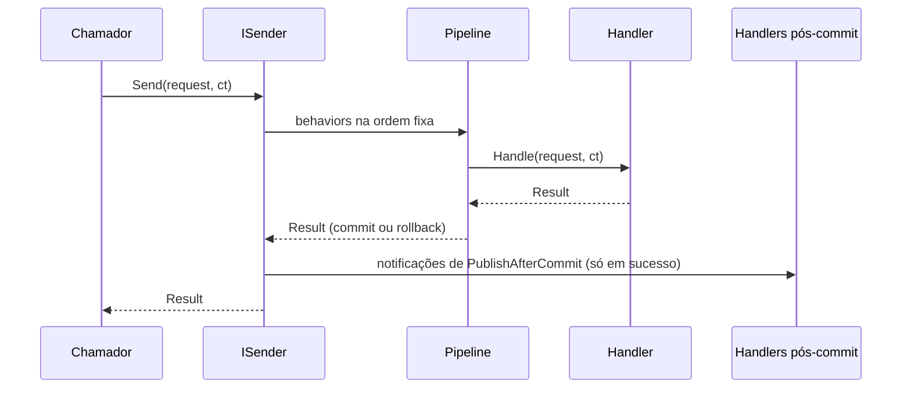

[🏠 TEC.Cqrs](../README.md) › [📚 Documentação](README.md) › 📮 Mediator

# 📮 Mediator

> Como enviar commands e queries e publicar notificações com `ISender`, `IPublisher` e `IMediator`, inclusive em jobs,
> workers e `BackgroundService`.

## 📑 Sumário

- [🎯 Visão geral](#-visão-geral)
- [🚀 Uso](#-uso)
  - [Enviar](#enviar)
  - [Publicar](#publicar)
  - [Jobs e BackgroundService](#jobs-e-backgroundservice)
  - [Processamento em paralelo](#processamento-em-paralelo)
- [⚙️ Opções](#️-opções)
- [❌ Erros](#-erros)
- [🛡️ Segurança](#️-segurança)
- [❓ Perguntas frequentes](#-perguntas-frequentes)

---

## 🎯 Visão geral



| Interface | Membros | Use quando |
|---|---|---|
| `ISender` | `Task<TResponse> Send<TResponse>(IRequest<TResponse> request, CancellationToken cancellationToken = default)` | Enviar commands e queries |
| `IPublisher` | `Task Publish<TNotification>(TNotification notification, CancellationToken cancellationToken = default)` e `void PublishAfterCommit<TNotification>(TNotification notification)` | Publicar notificações |
| `IMediator` | `ISender` + `IPublisher` | Precisa dos dois (prefira injetar só o que usa) |

Os três ficam em `TEC.Cqrs.Abstractions`, são registrados pelo `AddTecCqrs` como **`Scoped`** e apontam para a mesma
instância dentro do escopo. A implementação é interna; o executor de cada requisição é escolhido num `FrozenDictionary`
montado no registro, sem reflexão por chamada.

---

## 🚀 Uso

### Enviar

```csharp
app.MapGet("/clientes/{id:guid}", async (Guid id, ISender sender, CancellationToken ct) =>
{
    Result<CustomerDto> result = await sender.Send(new GetCustomerQuery(id), ct);
    return result.ToHttpResult();
});
```

Falhas esperadas (autorização, validação, `Result` de falha do handler, `AppException` convertida) chegam como `Result`
de falha, **sem exceção**. Exceções só saem para erros de programação (handler ausente, configuração), falhas não
tratadas do handler e cancelamento.

### Publicar

```csharp
internal sealed class CreateCustomerHandler(ICustomerRepository customers, IPublisher publisher)
    : ICommandHandler<CreateCustomerCommand, Guid>
{
    public async Task<Result<Guid>> Handle(CreateCustomerCommand command, CancellationToken cancellationToken)
    {
        var id = await customers.AddAsync(command.Name, command.Document, cancellationToken);

        await publisher.Publish(new CustomerAuditEvent(id), cancellationToken); // agora, dentro da transação
        publisher.PublishAfterCommit(new CustomerCreatedEvent(id));             // só depois do commit
        return id;
    }
}
```

`Publish` roda os handlers na hora (uma exceção desfaz o command); `PublishAfterCommit` enfileira e publica depois do
commit, descartando em falha. Escolha e regras em [📣 Notificações](notificacoes.md).

### Jobs e BackgroundService

Fora de uma requisição HTTP não há escopo nem usuário. Crie **um escopo por execução** e informe a identidade:

```csharp
using System.Security.Claims;
using TEC.Cqrs.Abstractions;
using TEC.Cqrs.Authorization;

// Identidade do processo, usada pela autorização do pipeline
internal sealed class SystemPrincipalAccessor : IPrincipalAccessor
{
    private static readonly ClaimsPrincipal System = new(new ClaimsIdentity(
        [new Claim(ClaimTypes.Name, "faturamento-job"), new Claim(ClaimTypes.Role, "Sistema")],
        authenticationType: "Sistema", ClaimTypes.Name, ClaimTypes.Role));

    public ClaimsPrincipal? Principal => System;
}

internal sealed class BillingWorker(IServiceScopeFactory scopes, TimeProvider time) : BackgroundService
{
    protected override async Task ExecuteAsync(CancellationToken stoppingToken)
    {
        using var timer = new PeriodicTimer(TimeSpan.FromMinutes(5), time);
        while (await timer.WaitForNextTickAsync(stoppingToken))
        {
            await using var scope = scopes.CreateAsyncScope();               // um escopo por execução
            var sender = scope.ServiceProvider.GetRequiredService<ISender>();

            var result = await sender.Send(new CloseInvoicesCommand(), stoppingToken);
            // trate result.IsFailure (log, alerta) sem derrubar o worker
        }
    }
}

// Worker puro (sem ASP.NET Core):
builder.Services.AddScoped<IPrincipalAccessor, SystemPrincipalAccessor>();
builder.Services.AddTecCqrs(options => options.RegisterServicesFromAssemblyContaining<Program>());
builder.Services.AddHostedService<BillingWorker>();
```

```csharp
[AuthorizeRequest(Roles = "Sistema"), SkipValidation]   // sem entrada do usuário
public sealed record CloseInvoicesCommand : ICommand;
```

> [!WARNING]
> Nunca injete `ISender`/`IMediator` no construtor de um `BackgroundService` ou de outro singleton: ele capturaria um
> único escopo (e o mesmo `IUnitOfWork`/`DbContext`) para o processo inteiro. Use `IServiceScopeFactory`.

> [!IMPORTANT]
> Numa **API com worker no mesmo processo**, o `.AddAspNetCore()` registra o accessor do `HttpContext.User`, que não
> existe no worker: os `Send`s protegidos do worker retornam 401. Veja a receita com o TEC.Security em
> [🔑 Autorização](autorizacao.md#integração-com-o-tecsecurity).

### Processamento em paralelo

Um escopo tem um único `IUnitOfWork`: commands com transação enviados em paralelo **no mesmo escopo** são rejeitados.
Para paralelizar, crie um escopo por item:

```csharp
await Parallel.ForEachAsync(invoiceIds, new ParallelOptions { MaxDegreeOfParallelism = 8, CancellationToken = ct },
    async (id, token) =>
    {
        await using var scope = scopes.CreateAsyncScope();
        var sender = scope.ServiceProvider.GetRequiredService<ISender>();
        await sender.Send(new IssueInvoiceCommand(id), token);
    });
```

Queries (sem transação) podem rodar em paralelo no mesmo escopo, desde que as dependências delas aceitem uso simultâneo
(um `DbContext` do EF Core **não** aceita).

---

## ⚙️ Opções

| Serviço registrado pelo `AddTecCqrs` | Tempo de vida |
|---|---|
| `IMediator`, `ISender`, `IPublisher` | `Scoped` (mesma instância no escopo) |
| Handlers, behaviors, authorizers, validadores, notification handlers | `Scoped` |
| `CqrsOptions` e o registro interno | `Singleton` (congelados) |

As opções do pipeline (lentidão, autorização e validação obrigatórias, detalhes de exceção nos traces) estão em
[⚙️ Opções e registro](opcoes.md).

---

## ❌ Erros

| Exceção / código | Quando | O que fazer |
|---|---|---|
| `InvalidOperationException` "Nenhum handler registrado para '...'" | `Send` de requisição sem handler (em AOT, também handler registrado direto no container) | Registre o handler no `AddTecCqrs` |
| `InvalidOperationException` "PublishAfterCommit só pode ser chamado durante a execução de um command/query" | `PublishAfterCommit` fora de um `Send` | Use `Publish` |
| `InvalidOperationException` "...enviado em paralelo a outro command com transação no mesmo escopo" | `Task.WhenAll` no mesmo escopo, ou `ISender` resolvido fora de um escopo (singleton) | Um escopo por operação |
| `OperationCanceledException` | O `CancellationToken` do chamador foi cancelado | Esperado (log em Debug, `cqrs.outcome = canceled`) |
| `NAO_AUTENTICADO` (401) num job | Nenhum `IPrincipalAccessor` com usuário | Registre a identidade do job |
| `ArgumentNullException` | `Send(null)`, `Publish(null)` ou `PublishAfterCommit(null)` | Passe a requisição/notificação |

---

## 🛡️ Segurança

> [!CAUTION]
> Com `ValidateScopes` desligado (padrão fora de Development), resolver o `ISender` do provider raiz compartilha o
> `IUnitOfWork` entre todas as requisições e usuários. Sempre crie escopos; o pipeline detecta parte desses casos e rejeita
> `Send`s concorrentes com transação.

- A identidade de sistema deve ter só os papéis de que o job precisa; não reaproveite o papel `Admin`.
- Prefira `[AuthorizeRequest(Roles = "Sistema")]` a `[AllowAnonymousRequest]` em requisições disparadas por jobs: elas
  continuam protegidas se alguém as expuser num endpoint.

---

## ❓ Perguntas frequentes

<details>
<summary>Posso injetar <code>ISender</code> num controller ou endpoint?</summary>

Sim: o ASP.NET Core cria um escopo por requisição HTTP, e o `ISender` resolvido ali é o desse escopo.

</details>

<details>
<summary>O <code>Send</code> é thread-safe?</summary>

Instâncias diferentes em escopos diferentes, sim (os testes de carga rodam milhares de escopos em paralelo). No mesmo
escopo, só queries podem rodar ao mesmo tempo; commands com transação são rejeitados.

</details>

---
⬅️ [📨 Commands e queries](commands-e-queries.md) · [📚 Índice](README.md) · [🧱 Pipeline e behaviors](pipeline-behaviors.md) ➡️
