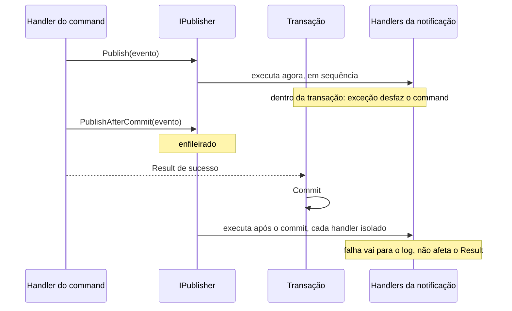

[🏠 TEC.Cqrs](../README.md) › [📚 Documentação](README.md) › 📣 Notificações

# 📣 Notificações

> Como publicar eventos para zero ou vários handlers, escolhendo entre efeito atômico com o command (`Publish`) e efeito
> externo só depois do commit (`PublishAfterCommit`).

## 📑 Sumário

- [🎯 Visão geral](#-visão-geral)
- [🚀 Uso](#-uso)
  - [Declarar e tratar](#declarar-e-tratar)
  - [Publish ou PublishAfterCommit](#publish-ou-publishaftercommit)
  - [Quando a notificação pós-commit é publicada](#quando-a-notificação-pós-commit-é-publicada)
  - [Handlers polimórficos e ordem](#handlers-polimórficos-e-ordem)
- [⚙️ Opções](#️-opções)
- [❌ Erros](#-erros)
- [🛡️ Segurança](#️-segurança)
- [❓ Perguntas frequentes](#-perguntas-frequentes)

---

## 🎯 Visão geral



| Tipo | Namespace | Papel |
|---|---|---|
| `INotification` | `TEC.Cqrs.Abstractions` | Marcador da notificação (evento) |
| `INotificationHandler<TNotification>` | `TEC.Cqrs.Abstractions` | `Task Handle(TNotification notification, CancellationToken cancellationToken)` |
| `IPublisher` | `TEC.Cqrs.Abstractions` | `Publish` e `PublishAfterCommit` |

---

## 🚀 Uso

### Declarar e tratar

```csharp
using TEC.Cqrs.Abstractions;

public sealed record CustomerCreatedEvent(Guid CustomerId) : INotification;

internal sealed class SendWelcomeEmailHandler(IEmailSender email) : INotificationHandler<CustomerCreatedEvent>
{
    public Task Handle(CustomerCreatedEvent notification, CancellationToken cancellationToken) =>
        email.SendWelcomeAsync(notification.CustomerId, cancellationToken);
}

// Varredura do AddTecCqrs ou, sem reflexão:
options.AddNotificationHandler<CustomerCreatedEvent, SendWelcomeEmailHandler>();
```

Uma notificação pode ter zero, um ou vários handlers (todos `Scoped`). Sem handlers, publicar não faz nada.

### Publish ou PublishAfterCommit

| | `Publish` | `PublishAfterCommit` |
|---|---|---|
| Quando roda | Na hora, aguardado pelo handler | Depois do commit, antes do retorno do `Send` |
| Dentro de um command | **Dentro** da transação | Fora (a transação já foi confirmada) |
| Exceção em um handler | Interrompe a publicação e é propagada (desfaz o command) | Vai para o log (eventos 1008/1009); os demais handlers continuam |
| Command falha ou desfaz | O efeito já aconteceu (e é desfeito junto, se for no mesmo banco) | Notificação **descartada** |
| Cancelamento | Usa o `CancellationToken` informado | Não é cancelado (a operação já foi confirmada) |
| Use para | Efeitos que precisam ser atômicos com o command (ex.: gravar numa tabela de outbox) | Efeitos externos (e-mail, integração, cache) |
| Pode ser chamado | Em qualquer lugar | Só durante um `Send` (handler, behavior, authorizer ou validador) |

```csharp
await publisher.Publish(new CustomerAuditEvent(id), cancellationToken); // atômico com o command
publisher.PublishAfterCommit(new CustomerCreatedEvent(id));             // só se o command confirmar
```

> [!IMPORTANT]
> `PublishAfterCommit` é de **melhor esforço**: se o processo cair entre o commit e a publicação, o evento se perde. Para
> garantia de entrega, grave um registro de outbox com `Publish` (na mesma transação) e despache-o por um worker.

### Quando a notificação pós-commit é publicada

| Situação | Publicação |
|---|---|
| Command que abriu a própria transação | Logo após o commit dele |
| Command aninhado (dentro da transação de outro) | Sobe para o command externo e sai após o commit **dele**; descartada se ele desfizer |
| Sem transação (query, `[SkipTransaction]`, sem `IUnitOfWork`) | Quando a requisição mais externa termina com sucesso |
| Command interno que abre a própria transação porque o externo não abriu | Logo após o próprio commit, mesmo que o externo falhe depois |
| Requisição mais externa dentro de uma transação aberta **fora** do pipeline | Descartada, com `InvalidOperationException` (o pipeline não sabe quando essa transação será confirmada) |
| Falha (`Result` de falha ou exceção) | Descartada |

Um handler pós-commit pode chamar `PublishAfterCommit` de novo: isso gera uma nova rodada, até **10 rodadas** por
requisição. Ao exceder (ciclo A → B → A), as notificações restantes são descartadas com log de erro (evento 1016); o
chamador não recebe exceção.

### Handlers polimórficos e ordem

Um handler de tipo base ou interface recebe as notificações concretas que o implementam:

```csharp
public interface ICustomerEvent : INotification { Guid CustomerId { get; } }

public sealed record CustomerDeactivatedEvent(Guid CustomerId) : ICustomerEvent;

internal sealed class CustomerCacheInvalidator(ICache cache) : INotificationHandler<ICustomerEvent>
{
    public Task Handle(ICustomerEvent notification, CancellationToken cancellationToken) =>
        cache.RemoveAsync($"cliente:{notification.CustomerId}", cancellationToken);
}
```

Ordem determinística de execução:

1. Handlers do tipo exato da notificação; depois os das classes base (da mais próxima para a mais distante); por fim os
   das interfaces (por nome completo).
2. Dentro de cada tipo, a ordem de registro: assemblies na ordem informada ao `AddTecCqrs` e, em cada assembly, os
   handlers em ordem alfabética do nome completo.
3. Cada classe de handler roda **uma única vez** por publicação, pelo tipo mais específico que ela trata.

`Publish` usa o tipo **real** da notificação para encontrar os handlers (publicar um `ICustomerEvent` que é um
`CustomerDeactivatedEvent` chega aos handlers dos dois).

> [!WARNING]
> Handlers de tipo base ou interface só são encontrados se registrados pelo `AddTecCqrs` (varredura ou
> `AddNotificationHandler`). Registrados direto no container, apenas os do tipo exato usado no `Publish` são executados.

---

## ⚙️ Opções

| Método de `CqrsOptions` | Descrição |
|---|---|
| `AddNotificationHandler<TNotification, THandler>()` | Registra um handler sem reflexão; `TNotification` pode ser tipo base ou interface |
| `RegisterServicesFromAssembly(...)` | Registra os notification handlers do assembly (com os demais tipos) |

Não há opção de execução paralela: os handlers rodam em sequência, no mesmo escopo da requisição.

---

## ❌ Erros

| Exceção / evento | Quando | O que fazer |
|---|---|---|
| `InvalidOperationException` "PublishAfterCommit só pode ser chamado durante a execução de um command/query" | Fora de um `Send` | Use `Publish` |
| `InvalidOperationException` "...chamou PublishAfterCommit (...), mas roda dentro de uma transação aberta fora do pipeline" | `BeginTransactionAsync` manual antes do `Send` | Deixe o pipeline controlar a transação, ou use `Publish` depois do seu commit |
| Exceção do handler (com `Publish`) | Handler lançou | Propagada para quem publicou; dentro de um command, desfaz a transação |
| Log 1008 "Handler ... falhou ao processar a notificação ... publicada após o commit" | Handler pós-commit lançou | Corrija o handler; a operação já foi confirmada |
| Log 1009 "Falha ao criar os handlers (...) da notificação ..." | Dependência ausente ou erro no construtor do handler pós-commit | Registre a dependência |
| Log 1016 "Publicação pós-commit de ... interrompida após 10 rodadas" | Ciclo de `PublishAfterCommit` entre handlers | Quebre o ciclo |

---

## 🛡️ Segurança

> [!WARNING]
> O conteúdo da notificação nunca vai para o log nem para os traces (só o nome do tipo), mas os **seus** handlers podem
> enviá-lo a sistemas externos: não coloque segredos nem dados pessoais desnecessários no evento.

- Handlers pós-commit rodam sem `CancellationToken` do cliente: limite o tempo deles (timeout próprio) para não segurar a
  resposta.
- Publicar em fila externa a partir de `PublishAfterCommit` é aceitável para eventos não críticos; para os críticos, outbox.

---

## ❓ Perguntas frequentes

<details>
<summary>O <code>Send</code> espera os handlers pós-commit?</summary>

Sim: eles rodam depois da resposta do pipeline e antes do retorno do `Send`. Trabalhos longos devem ser enfileirados (ex.:
gravar numa fila) em vez de executados no handler.

</details>

<details>
<summary>Uma falha no handler pós-commit muda o <code>Result</code>?</summary>

Não. A transação já foi confirmada; a falha é registrada (evento 1008) e contada em `tec.cqrs.notifications` com
`cqrs.outcome = exception`.

</details>

---
⬅️ [✅ Validação](validacao.md) · [📚 Índice](README.md) · [💾 Transação](transacao.md) ➡️
