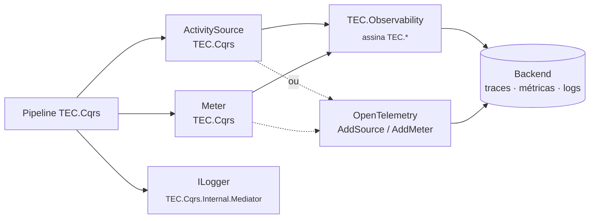

[🏠 TEC.Cqrs](../README.md) › [📚 Documentação](README.md) › 📈 Observabilidade

# 📈 Observabilidade

> O que o pipeline emite (traces, métricas e logs), como exportar com ou sem o TEC.Observability e como usar
> `CqrsDiagnostics` em testes de arquitetura.

## 📑 Sumário

- [🎯 Visão geral](#-visão-geral)
- [🚀 Uso](#-uso)
  - [Exportar com o TEC.Observability](#exportar-com-o-tecobservability)
  - [Exportar com OpenTelemetry direto](#exportar-com-opentelemetry-direto)
  - [Traces](#traces)
  - [Métricas](#métricas)
  - [Logs](#logs)
  - [Verificações para testes de arquitetura](#verificações-para-testes-de-arquitetura)
- [⚙️ Opções](#️-opções)
- [❌ Erros](#-erros)
- [🛡️ Segurança](#️-segurança)
- [❓ Perguntas frequentes](#-perguntas-frequentes)

---

## 🎯 Visão geral



O TEC.Cqrs usa só a BCL (`System.Diagnostics.ActivitySource` e `System.Diagnostics.Metrics.Meter`): **não depende** do
TEC.Observability nem do OpenTelemetry. Quem exporta apenas assina os nomes. Os nomes e atributos estão em constantes de
`CqrsDiagnostics` (namespace `TEC.Cqrs.Diagnostics`).

| Sinal | Nome | Constante |
|---|---|---|
| Traces | `TEC.Cqrs` | `CqrsDiagnostics.ActivitySourceName` |
| Métricas | `TEC.Cqrs` | `CqrsDiagnostics.MeterName` |
| Logs | categoria `TEC.Cqrs.Internal.Mediator` (pipeline) e `TEC.Cqrs.AspNetCore.*` (HTTP) | — |

> [!NOTE]
> O conteúdo das requisições e notificações **nunca** é registrado em nenhum sinal: só o nome do tipo, o resultado, a
> duração e os códigos de erro.

---

## 🚀 Uso

### Exportar com o TEC.Observability

```csharp
builder.Services.AddTecObservability(builder.Configuration);   // já assina TEC.* (traces e métricas)
```

Nada mais a configurar: o prefixo `TEC.*` inclui o `TEC.Cqrs`.

### Exportar com OpenTelemetry direto

```csharp
using TEC.Cqrs.Diagnostics;

builder.Services.AddOpenTelemetry()
    .WithTracing(t => t.AddSource(CqrsDiagnostics.ActivitySourceName))
    .WithMetrics(m => m.AddMeter(CqrsDiagnostics.MeterName));
```

### Traces

Cada requisição gera uma `Activity` com o nome curto do tipo (ex.: `CreateCustomerCommand`); commands aninhados viram
spans filhos.

| Atributo | Valor |
|---|---|
| `cqrs.request` | Nome completo do tipo da requisição |
| `cqrs.kind` | `command`, `query` ou `request` |
| `cqrs.outcome` | `success`, `failure` (`Result` de falha), `exception` ou `canceled` |
| `cqrs.success` | `true`/`false` |
| `cqrs.error_code` | Código do erro relatado (o interno, se houver) |
| `error.type` | `ErrorType` da falha (ex.: `Validation`, `NotFound`) ou nome completo do tipo da exceção |
| `cqrs.canceled` | `true` quando cancelado pelo token do chamador (sem marcar erro) |

A `Activity` recebe status `Error` em falha interna (`Failure`/`ExternalService`) e em exceção. Em exceção, o evento
`exception` leva só `exception.type`; mensagem e stack trace apenas com `RecordExceptionDetailsInTraces`.

Cada publicação de notificação gera uma `Activity` com o nome curto da notificação e os atributos `cqrs.notification`,
`cqrs.kind = notification`, `cqrs.after_commit` e `cqrs.outcome` (`success`, `exception` ou `canceled`).

### Métricas

| Instrumento | Tipo | Unidade | Atributos |
|---|---|---|---|
| `tec.cqrs.requests` (`RequestsMetricName`) | Contador | `{request}` | `cqrs.request`, `cqrs.kind`, `cqrs.outcome`, `error.type` (em falha/exceção) |
| `tec.cqrs.request.duration` (`RequestDurationMetricName`) | Histograma | `s` | Os mesmos do contador |
| `tec.cqrs.notifications` (`NotificationsMetricName`) | Contador | `{notification}` | `cqrs.notification`, `cqrs.outcome`, `error.type` (em exceção) |
| `tec.cqrs.notification.duration` (`NotificationDurationMetricName`) | Histograma | `s` | Os mesmos do contador |

O `Meter` é criado pelo `IMeterFactory` do container (quando registrado) com a versão do pacote. As métricas só são
calculadas quando há um ouvinte.

### Logs

Todos com `LoggerMessage` gerado em compilação:

| Evento | Nível | Mensagem |
|:-:|---|---|
| 1000 | Debug | `Processando {RequestKind} {RequestName}.` |
| 1001 | Information | `{RequestKind} {RequestName} concluído com sucesso em {ElapsedMilliseconds} ms.` |
| 1002 | Information | `{RequestKind} {RequestName} retornou falha {ErrorType} ({ErrorCodes}) em {ElapsedMilliseconds} ms.` |
| 1003 | Error | `... retornou falha interna {ErrorType} ({ErrorCodes}) ...` (com a exceção convertida, se houver) |
| 1004 | Error | `{RequestKind} {RequestName} lançou exceção não tratada após {ElapsedMilliseconds} ms.` |
| 1005 | Debug | `{RequestKind} {RequestName} cancelado após {ElapsedMilliseconds} ms.` |
| 1006 | Warning | `{RequestKind} {RequestName} lento: {ElapsedMilliseconds} ms (limite: {ThresholdMilliseconds} ms).` |
| 1007 | Error | `Falha ao desfazer a transação de {RequestName}.` |
| 1008 | Error | Handler falhou ao processar notificação publicada após o commit |
| 1009 | Error | Falha ao criar os handlers de notificação publicada após o commit |
| 1010 | Warning | `Transação de {RequestName} desfeita: um command interno falhou.` |
| 1011 | Warning | `Location` descartado (categoria `TEC.Cqrs.AspNetCore.ResultHttpExtensions`) |
| 1012–1015 | Error/Debug/Warning | Tratamento de exceções no .NET 8 (categoria `TEC.Cqrs.AspNetCore.ExceptionHandler`) |
| 1016 | Error | Publicação pós-commit interrompida após 10 rodadas |

Cada falha gera **um único** registro: a exceção convertida (`AppException` ou mapper) é anexada ao log da falha interna,
e uma exceção não tratada é registrada só na requisição mais interna em que ocorreu (nem as externas nem o
`UseTecExceptionHandler` a registram de novo).

### Verificações para testes de arquitetura

Métodos de `CqrsDiagnostics` (usam reflexão: só em testes):

| Método | Retorna |
|---|---|
| `FindRequestsWithoutHandler(services, assemblies)` | Requisições dos assemblies sem handler registrado |
| `FindCommandsWithoutValidator(services, assemblies)` | Commands sem validador e sem `[SkipValidation]` (os que falhariam com `RequireValidatorForCommands`) |
| `FindRequestsWithoutAuthorization(services, assemblies)` | Requisições sem `[AuthorizeRequest]`, authorizer ou `[AllowAnonymousRequest]` |
| `IsExceptionLogged(exception)` | Se a exceção já foi registrada pelo pipeline |

```csharp
using Microsoft.Extensions.DependencyInjection;
using TEC.Cqrs.DependencyInjection;
using TEC.Cqrs.Diagnostics;

public class ArchitectureTests
{
    [Test]
    public async Task Every_request_has_handler_validator_and_authorization()
    {
        var services = new ServiceCollection();
        services.AddTecCqrs(o => o.RegisterServicesFromAssemblyContaining<Program>()).AddFluentValidation();
        var assembly = typeof(Program).Assembly;

        await Assert.That(CqrsDiagnostics.FindRequestsWithoutHandler(services, assembly)).IsEmpty();
        await Assert.That(CqrsDiagnostics.FindCommandsWithoutValidator(services, assembly)).IsEmpty();
        await Assert.That(CqrsDiagnostics.FindRequestsWithoutAuthorization(services, assembly)).IsEmpty();
    }
}
```

---

## ⚙️ Opções

| Opção (`CqrsOptions`) | Padrão | Descrição |
|---|---|---|
| `SlowRequestThreshold` | 500 ms | Limite do evento 1006; `null` desliga. Mede transação + handler |
| `RecordExceptionDetailsInTraces` | `false` | Inclui `exception.message` e `exception.stacktrace` no evento `exception` dos traces |

---

## ❌ Erros

| Sintoma | Causa | O que fazer |
|---|---|---|
| Nenhum span `TEC.Cqrs` no backend | Fonte não assinada | `AddSource(CqrsDiagnostics.ActivitySourceName)` ou TEC.Observability |
| Exceção registrada duas vezes | Tratamento global próprio sem `IsExceptionLogged` | Use `UseTecExceptionHandler` ou verifique `CqrsDiagnostics.IsExceptionLogged` |
| `IsExceptionLogged` sempre `false` | Nível `Error` desligado para `TEC.Cqrs.Internal.Mediator` | Esperado: a exceção só é marcada se o log foi escrito |

---

## 🛡️ Segurança

> [!WARNING]
> Mensagens de exceção (drivers de banco, HTTP, serialização) podem conter dados pessoais, connection strings ou tokens,
> e o backend de traces costuma ter acesso mais amplo que os logs. Ligue `RecordExceptionDetailsInTraces` só se ele tiver o
> mesmo controle de acesso dos logs.

- O log do pipeline recebe a exceção completa nos dois modos; proteja o destino dos logs.
- Nomes de tipo e códigos de erro aparecem em todos os sinais: não use dados sensíveis neles.

---

## ❓ Perguntas frequentes

<details>
<summary>Por que a duração do evento 1006 é menor que a do span?</summary>

O behavior de performance mede só o que vem depois dele (transação e handler). O span e a métrica, do `LoggingBehavior`,
medem o pipeline inteiro (autorização, validação e behaviors próprios inclusos).

</details>

<details>
<summary>O TEC.Cqrs precisa do TEC.Observability?</summary>

Não. Ele só emite pela BCL; o TEC.Observability (ou qualquer configuração de OpenTelemetry) assina.

</details>

---
⬅️ [🌐 ASP.NET Core](aspnetcore.md) · [📚 Índice](README.md) · [⚙️ Opções e registro](opcoes.md) ➡️
