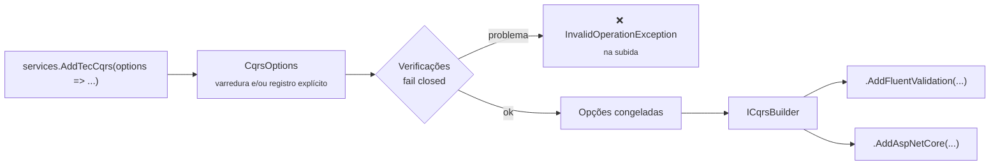

[🏠 TEC.Cqrs](../README.md) › [📚 Documentação](README.md) › ⚙️ Opções e registro

# ⚙️ Opções e registro

> Tudo o que o `AddTecCqrs` registra e verifica, as opções de `CqrsOptions`, o `ICqrsBuilder` e as opções dos pacotes
> satélite, num só lugar.

## 📑 Sumário

- [🎯 Visão geral](#-visão-geral)
- [🚀 Uso](#-uso)
  - [AddTecCqrs](#addteccqrs)
  - [ICqrsBuilder e os satélites](#icqrsbuilder-e-os-satélites)
  - [O que o AddTecCqrs registra](#o-que-o-addteccqrs-registra)
  - [Verificações na inicialização](#verificações-na-inicialização)
- [⚙️ Opções](#️-opções)
  - [CqrsOptions](#cqrsoptions)
  - [CqrsFluentValidationOptions](#cqrsfluentvalidationoptions)
  - [CqrsAspNetCoreOptions](#cqrsaspnetcoreoptions)
- [❌ Erros](#-erros)
- [🛡️ Segurança](#️-segurança)
- [❓ Perguntas frequentes](#-perguntas-frequentes)

---

## 🎯 Visão geral



---

## 🚀 Uso

### AddTecCqrs

`ServiceCollectionExtensions.AddTecCqrs(this IServiceCollection services, Action<CqrsOptions> configure)` (namespace
`TEC.Cqrs.DependencyInjection`) registra tudo e devolve um `ICqrsBuilder`. Deve ser chamado **uma única vez**.

```csharp
using TEC.Cqrs.DependencyInjection;

// Varredura (JIT)
builder.Services.AddTecCqrs(options => options
        .RegisterServicesFromAssemblyContaining<Program>()
        .AddBehavior(typeof(AuditBehavior<,>)))
    .AddFluentValidation()
    .AddAspNetCore();

// Registro explícito (Native AOT / trimming)
builder.Services.AddTecCqrs(options =>
    {
        options.AddCommandHandler<CreateCustomerCommand, Guid, CreateCustomerHandler>()
               .AddQueryHandler<GetCustomerQuery, CustomerDto, GetCustomerHandler>()
               .AddNotificationHandler<CustomerCreatedEvent, SendWelcomeEmailHandler>();
        options.SlowRequestThreshold = TimeSpan.FromSeconds(1);
    })
    .AddFluentValidation(fv => fv.AddValidator<CreateCustomerCommand, CreateCustomerValidator>())
    .AddAspNetCore(http => http.JsonTypeInfoResolver = AppJsonContext.Default);
```

As opções são **congeladas** ao final do `AddTecCqrs`: alterar uma propriedade ou registrar algo depois (por exemplo, na
instância obtida do container) lança `InvalidOperationException`. A configuração validada na subida é a mesma usada em
execução.

### ICqrsBuilder e os satélites

| Membro de `ICqrsBuilder` | Descrição |
|---|---|
| `IServiceCollection Services` | O container em configuração |
| `CqrsOptions Options` | As opções já validadas e congeladas (somente leitura) |

Extensões que o usam:

| Extensão | Pacote | Documentação |
|---|---|---|
| `AddFluentValidation()` / `AddFluentValidation(Action<CqrsFluentValidationOptions>)` | `TEC.Cqrs.FluentValidation` | [✅ Validação](validacao.md) |
| `AddAspNetCore(Action<CqrsAspNetCoreOptions>? configure = null)` | `TEC.Cqrs.AspNetCore` | [🌐 ASP.NET Core](aspnetcore.md) |

> [!IMPORTANT]
> Os satélites usam tipos internos do núcleo (`InternalsVisibleTo`). Instale **todos os `TEC.Cqrs.*` na mesma versão**.

### O que o AddTecCqrs registra

| Serviço | Tempo de vida |
|---|---|
| `IMediator`, `ISender`, `IPublisher` | `Scoped` |
| Behaviors (`IPipelineBehavior<,>`): Logging, Exceções, Autorização, Validação, próprios, Performance, Transação | `Scoped`, nessa ordem |
| Handlers, notification handlers, authorizers, validadores | `Scoped` |
| `CqrsOptions` e o registro interno (handlers em `FrozenDictionary`) | `Singleton` |
| Métricas (`Meter` `TEC.Cqrs`) | `Singleton` |

Não registra `IUnitOfWork`, `IPrincipalAccessor` nem `IRequestPolicyEvaluator`: são da aplicação (ou dos satélites).

### Verificações na inicialização

| Situação | Resultado |
|---|---|
| Nada registrado (nenhum assembly nem handler) | Falha |
| `AddTecCqrs` chamado de novo | Falha |
| `IPipelineBehavior` registrado no container **antes** do `AddTecCqrs` | Falha (rodaria antes do log, da autorização e da validação) |
| Requisição sem marcador de command/query, ou command e query ao mesmo tempo | Falha |
| `[AllowAnonymousRequest]` junto com `[AuthorizeRequest]`; `Roles`/`Policy` em branco | Falha |
| Mais de um handler para a mesma requisição | Falha |
| Handler registrado à mão com tempo de vida diferente de `Scoped` | Falha |
| Authorizer de tipo base/interface (ou de tipo desconhecido) registrado direto no container | Falha |
| Validador de tipo que não é requisição concreta conhecida | Falha |
| Requisição sem autorização declarada (com `RequireAuthorization`) | Falha, listando até 20 requisições |
| Tipo do assembly que não carrega (varredura) | Falha |

---

## ⚙️ Opções

### CqrsOptions

| Membro | Padrão | Descrição |
|---|---|---|
| `SlowRequestThreshold` (`TimeSpan?`) | 500 ms | Aviso de lentidão (evento 1006). `null` desliga; zero ou negativo lança `ArgumentOutOfRangeException` |
| `RequireValidatorForCommands` (`bool`) | `true` | Command sem validador nem `[SkipValidation]` lança `InvalidOperationException` ao ser executado |
| `RequireAuthorization` (`bool`) | `true` | Toda requisição declara autorização; verificado na subida e no `Send` |
| `RecordExceptionDetailsInTraces` (`bool`) | `false` | Mensagem e stack trace das exceções nos traces |
| `Assemblies` (`IReadOnlyList<Assembly>`) | vazio | Assemblies informados à varredura (usados também pelo `AddFluentValidation()`) |
| `RegisterServicesFromAssembly(Assembly)` | — | Varre o assembly (reflexão); o mesmo assembly de novo é ignorado |
| `RegisterServicesFromAssemblyContaining<T>()` | — | Idem, pelo assembly de `T` |
| `AddCommandHandler<TCommand, THandler>()` | — | Handler de `ICommand` (AOT) |
| `AddCommandHandler<TCommand, TValue, THandler>()` | — | Handler de `ICommand<TValue>` (AOT) |
| `AddQueryHandler<TQuery, TValue, THandler>()` | — | Handler de `IQuery<TValue>` (AOT) |
| `AddNotificationHandler<TNotification, THandler>()` | — | Notification handler; tipo exato, base ou interface (AOT) |
| `AddRequestAuthorizer<TRequest, TAuthorizer>()` | — | Authorizer; tipo exato, base ou interface (AOT) |
| `AddRequestValidator<TRequest, TValidator>()` | — | `IRequestValidator<T>` do tipo exato (AOT) |
| `AddBehavior(Type)` | — | Behavior próprio (genérico aberto), depois da validação e antes da performance/transação |

Todos os métodos retornam a própria `CqrsOptions` (encadeáveis).

### CqrsFluentValidationOptions

| Membro | Padrão | Descrição |
|---|---|---|
| `CamelCaseValidationFields` (`bool`) | `true` | Campo dos erros em camelCase (`Endereco.Cep` → `endereco.cep`) |
| `AddValidator<TRequest, TValidator>()` | — | Validator do FluentValidation para o tipo exato (AOT) |
| `RegisterValidatorsFromAssembly(Assembly)` / `RegisterValidatorsFromAssemblyContaining<T>()` | — | Varredura (reflexão) |

Congeladas ao final do `AddFluentValidation`.

### CqrsAspNetCoreOptions

| Membro | Padrão | Descrição |
|---|---|---|
| `JsonTypeInfoResolver` (`IJsonTypeInfoResolver?`) | `null` | Metadados JSON das respostas (obrigatório com trimming/AOT) |
| `ReplaceExistingPrincipalAccessor` (`bool`) | `false` | Troca um `IPrincipalAccessor` registrado antes pelo do `HttpContext` |

---

## ❌ Erros

| Exceção | Quando | O que fazer |
|---|---|---|
| `InvalidOperationException` "Nada foi registrado..." | `AddTecCqrs` vazio | Informe um assembly ou registre handlers |
| `InvalidOperationException` "AddTecCqrs já foi chamado..." | Segunda chamada | Configure tudo numa chamada |
| `InvalidOperationException` "As opções do TEC.Cqrs não podem ser alteradas depois do AddTecCqrs..." | Alteração após o registro | Configure dentro do `AddTecCqrs(options => ...)` |
| `InvalidOperationException` "As opções do TEC.Cqrs.FluentValidation não podem ser alteradas depois do AddFluentValidation..." | Idem, no satélite | Configure dentro do `AddFluentValidation(...)` |
| `ArgumentOutOfRangeException` "O limite deve ser maior que zero (ou null para desativar)." | `SlowRequestThreshold` ≤ 0 | Use um valor positivo ou `null` |
| `ArgumentNullException` | `services`, `configure` ou `assembly` nulos | — |

Os demais erros de inicialização estão nos temas: [📨 Commands e queries](commands-e-queries.md#-erros),
[🔑 Autorização](autorizacao.md#-erros), [✅ Validação](validacao.md#-erros), [🧱 Pipeline](pipeline-behaviors.md#-erros).

---

## 🛡️ Segurança

> [!WARNING]
> Desligar `RequireAuthorization` ou `RequireValidatorForCommands` troca o *fail closed* por *fail open*: uma requisição
> nova esquecida passa a rodar sem proteção ou sem validação. Se precisar, use `CqrsDiagnostics.Find*` num teste para manter
> o controle.

---

## ❓ Perguntas frequentes

<details>
<summary>Posso chamar <code>AddTecCqrs</code> em vários módulos?</summary>

Não: uma única chamada. Cada módulo pode expor um método que recebe a `CqrsOptions` e registra os seus handlers
(`options.RegisterServicesFromAssembly(...)`), chamado de dentro do `AddTecCqrs`.

</details>

<details>
<summary>Varredura e registro explícito juntos funcionam?</summary>

Sim. O mesmo handler registrado pelas duas formas é aceito uma vez; handlers diferentes para a mesma requisição falham.

</details>

---
⬅️ [📈 Observabilidade](observabilidade.md) · [📚 Índice](README.md) · [⚡ Native AOT](aot.md) ➡️
