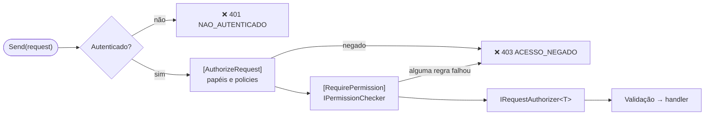

[🏠 TEC.Cqrs](../README.md) › [📚 Documentação](README.md) › Permissões

# 🎫 Permissões

> Declara na própria requisição quais permissões ela exige, com regras "todas" ou "qualquer uma", verificadas no pipeline em qualquer ponto de entrada (API, jobs, filas).

## 📑 Sumário

- [🎯 Visão geral](#-visão-geral)
- [🚀 Uso](#-uso)
  - [Declarar permissões](#declarar-permissões)
  - [Todas × qualquer uma](#todas--qualquer-uma)
  - [De onde vêm as permissões](#de-onde-vêm-as-permissões)
  - [Teste de arquitetura](#teste-de-arquitetura)
- [⚙️ Opções](#️-opções)
- [❌ Erros](#-erros)
- [🛡️ Segurança](#️-segurança)
- [❓ Perguntas frequentes](#-perguntas-frequentes)

---

## 🎯 Visão geral

| Tipo | Namespace | Para que serve |
|---|---|---|
| `[RequirePermission(params string[])]` | `TEC.Cqrs.Authorization` | Regra de permissões da requisição (`Mode = All` ou `Any`) |
| `PermissionMatch` | `TEC.Cqrs.Authorization` | `All` (padrão) ou `Any` |
| `IPermissionChecker` | `TEC.Cqrs.Authorization` | Responde se o usuário tem a permissão |
| `ClaimPermissionChecker` | `TEC.Cqrs.Authorization` | Implementação padrão: claims `tec_perm` (configurável) |
| `CqrsDiagnostics.FindRequestsWithoutPermission` | `TEC.Cqrs.Diagnostics` | Lista requisições sem `[RequirePermission]` |



`[RequirePermission]` **implica autenticação** e conta como autorização declarada (`CqrsOptions.RequireAuthorization`): não precisa de `[AuthorizeRequest]` junto. Pode ser combinado com ele (papéis, policies) e com `IRequestAuthorizer<T>`; todas as regras precisam passar.

---

## 🚀 Uso

### Declarar permissões

```csharp
using TEC.Cqrs.Authorization;

[RequirePermission("pedidos:aprovar")]
public sealed record AprovarPedidoCommand(Guid PedidoId) : ICommand;

// Várias permissões na mesma regra: precisa de todas
[RequirePermission("pedidos:ler", "clientes:ler")]
public sealed record ObterPedidoComClienteQuery(Guid PedidoId) : IQuery<PedidoDto>;
```

### Todas × qualquer uma

Cada atributo é **uma regra**; todas as regras precisam ser atendidas. `Mode` define a combinação dentro da regra:

```csharp
// Auditor da IA OU quem vê relatórios
[RequirePermission("ia:auditar", "relatorios:ver", Mode = PermissionMatch.Any)]
public sealed record MetricasIaQuery(DateOnly De, DateOnly Ate) : IQuery<MetricasDto>;

// ("a" E "b") E ("c" OU "d")
[RequirePermission("a", "b")]
[RequirePermission("c", "d", Mode = PermissionMatch.Any)]
public sealed record OperacaoSensivelCommand : ICommand;
```

> [!NOTE]
> O nome da propriedade é `Mode` (e não `Match`) porque `Attribute.Match(object)` já existe na classe base.

### De onde vêm as permissões

O `AddTecCqrs` registra o `ClaimPermissionChecker`: o usuário tem a permissão se tiver um claim do tipo `CqrsOptions.PermissionClaimType` (padrão `tec_perm`, o mesmo que o **TEC.Security** emite) com o valor exato (ordinal, sensível a maiúsculas).

Para outra fonte (cadastro de papéis × permissões, cache, serviço externo), registre a sua implementação **depois** do `AddTecCqrs`:

```csharp
internal sealed class PermissoesDoUsuario(ISecurityUser usuario) : IPermissionChecker
{
    public ValueTask<bool> HasPermissionAsync(ClaimsPrincipal principal, string permission, CancellationToken cancellationToken) =>
        ValueTask.FromResult(usuario.HasPermission(permission));
}

builder.Services.AddTecCqrs(o => o.RegisterServicesFromAssemblyContaining<Program>());
builder.Services.AddScoped<IPermissionChecker, PermissoesDoUsuario>(); // o último registro vale
```

O usuário (`ClaimsPrincipal`) vem do `IPrincipalAccessor`, como no `[AuthorizeRequest]` (ver [🔑 Autorização](autorizacao.md#de-onde-vem-o-usuário)).

### Teste de arquitetura

Quando a política é "toda requisição declara as permissões exigidas":

```csharp
[Test]
public async Task Toda_requisicao_declara_permissoes()
{
    var semPermissao = CqrsDiagnostics.FindRequestsWithoutPermission(typeof(AbrirPedidoCommand).Assembly)
        .Except([typeof(ObterUsuarioAtualQuery)]); // exceções conscientes

    await Assert.That(semPermissao).IsEmpty();
}
```

Requisições com `[AllowAnonymousRequest]` não entram na lista.

---

## ⚙️ Opções

| Opção | Padrão | Descrição |
|---|---|---|
| `CqrsOptions.PermissionClaimType` | `tec_perm` (`CqrsOptions.DefaultPermissionClaimType`) | Tipo de claim lido pelo `ClaimPermissionChecker`. Vazio lança `ArgumentException` |
| `RequirePermissionAttribute.Mode` | `PermissionMatch.All` | `All`: todas as permissões da regra; `Any`: qualquer uma |

## ❌ Erros

| Código / exceção | Quando ocorre | O que fazer |
|---|---|---|
| `NAO_AUTENTICADO` (401) | Sem usuário ou usuário não autenticado | Autentique a requisição (ou, em jobs, registre um `IPrincipalAccessor` com a identidade do sistema) |
| `ACESSO_NEGADO` (403) | Alguma regra não foi atendida | Conceda a permissão ao usuário/papel |
| `InvalidOperationException` na inicialização | `[RequirePermission]` sem permissões, com permissão em branco, `Mode` inválido ou junto com `[AllowAnonymousRequest]` | Corrija o atributo |

## 🛡️ Segurança

> [!WARNING]
> **Fail closed.** Uma exceção do seu `IPermissionChecker` sobe pelo pipeline: a requisição não executa. Não devolva `true` em caso de erro (ex.: cadastro de permissões fora do ar).

> [!WARNING]
> Permissões são comparadas de forma **ordinal**: `Pedidos:Aprovar` ≠ `pedidos:aprovar`. Padronize em minúsculas e mantenha um catálogo de constantes com teste de que toda permissão declarada existe.

- A verificação acontece **antes da validação**: quem não tem acesso não descobre as regras de validação.
- Os nomes das permissões não são registrados em log nas falhas (apenas o código `ACESSO_NEGADO`).

## ❓ Perguntas frequentes

<details>
<summary><b>Preciso de <code>[AuthorizeRequest]</code> junto?</b></summary>

Não. `[RequirePermission]` já exige autenticação. Use `[AuthorizeRequest]` junto só para somar papéis (`Roles`) ou policies.
</details>

<details>
<summary><b>E regras que dependem do conteúdo (ex.: "só o dono do pedido")?</b></summary>

Use um `IRequestAuthorizer<T>` (ver [🔑 Autorização](autorizacao.md#regras-sobre-o-conteúdo-com-irequestauthorizer)). Ele roda depois das permissões.
</details>

---

⬅️ [🔑 Autorização](autorizacao.md) · [📚 Índice](README.md) · [✅ Validação](validacao.md) ➡️
