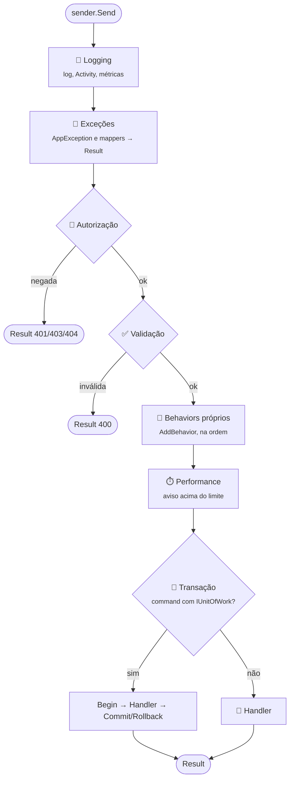

[🏠 TEC.Cqrs](../README.md) › [📚 Documentação](README.md) › 🧱 Pipeline e behaviors

# 🧱 Pipeline e behaviors

> O que acontece entre o `Send` e o handler: as etapas fixas do pipeline, em que ordem rodam, como acrescentar um
> behavior próprio e como converter exceções de outras bibliotecas em `Result`.

## 📑 Sumário

- [🎯 Visão geral](#-visão-geral)
- [🚀 Uso](#-uso)
  - [Behaviors padrão](#behaviors-padrão)
  - [Behavior próprio](#behavior-próprio)
  - [Converter exceções com IExceptionErrorMapper](#converter-exceções-com-iexceptionerrormapper)
  - [Exceções no handler](#exceções-no-handler)
- [⚙️ Opções](#️-opções)
- [❌ Erros](#-erros)
- [🛡️ Segurança](#️-segurança)
- [❓ Perguntas frequentes](#-perguntas-frequentes)

---

## 🎯 Visão geral



A ordem é fixa e vem do `AddTecCqrs` (o primeiro registrado é o mais externo):

**Logging → Exceções → Autorização → Validação → behaviors próprios → Performance → Transação → Handler**

| Por que nessa ordem | |
|---|---|
| Logging primeiro | Mede e registra tudo, inclusive negações e exceções |
| Exceções antes da autorização | Uma `AppException` lançada por um authorizer ou validador também vira `Result` |
| Autorização antes da validação | Quem não tem acesso não recebe os detalhes das regras de validação |
| Transação por último | Só o handler e o commit ficam dentro da transação; autorização e validação não seguram conexão |

---

## 🚀 Uso

### Behaviors padrão

| Behavior | Faz | Não faz |
|---|---|---|
| **Logging** | Uma `Activity` e métricas por requisição; log de início (Debug), sucesso/falha (Information) e falha interna/exceção (Error), **um único registro por falha** | Nunca registra o conteúdo da requisição |
| **Exceções** | Converte `AppException` (TEC.Core) e as exceções reconhecidas por um `IExceptionErrorMapper` em `Result` de falha | Não trata outras exceções: elas seguem para o tratamento global (500) |
| **Autorização** | `[AuthorizeRequest]` (autenticação, papéis, policy) e depois os `IRequestAuthorizer<T>` do tipo, das classes base e das interfaces | Não roda o resto do pipeline se negar |
| **Validação** | Executa todos os `IRequestValidator<T>` e soma os erros; exige validador em commands (padrão) | Não aloca nada quando a requisição é válida |
| **Performance** | Aviso (evento 1006) quando passa de `SlowRequestThreshold` (padrão 500 ms) | Mede só transação + handler (não inclui autorização, validação nem notificações) |
| **Transação** | Abre, confirma ou desfaz a transação do `IUnitOfWork` em commands | Ignorado em queries, `[SkipTransaction]` ou sem `IUnitOfWork` |

Detalhes: [🔑 Autorização](autorizacao.md) · [✅ Validação](validacao.md) · [💾 Transação](transacao.md) ·
[📈 Observabilidade](observabilidade.md).

### Behavior próprio

Implemente `IPipelineBehavior<TRequest, TResponse>` (namespace `TEC.Cqrs.Abstractions`) como genérico aberto e registre
com `AddBehavior`. Ele roda **depois** da autorização e da validação e **antes** da medição de performance e da transação:

```csharp
using TEC.Core.Common.Results;
using TEC.Cqrs.Abstractions;

internal sealed class AuditBehavior<TRequest, TResponse>(IAuditLog audit) : IPipelineBehavior<TRequest, TResponse>
    where TRequest : IRequest<TResponse>
    where TResponse : Result
{
    public async Task<TResponse> Handle(TRequest request, RequestHandlerDelegate<TResponse> next, CancellationToken cancellationToken)
    {
        var response = await next(cancellationToken);
        await audit.RecordAsync(typeof(TRequest).Name, response.IsSuccess, cancellationToken); // sem o conteúdo
        return response;
    }
}

builder.Services.AddTecCqrs(options => options
    .RegisterServicesFromAssemblyContaining<Program>()
    .AddBehavior(typeof(AuditBehavior<,>)));
```

- Behaviors próprios rodam na ordem em que foram adicionados; o mesmo tipo adicionado de novo é ignorado.
- Para interromper sem exceção, retorne uma falha. Quando `TResponse` é conhecido (ex.: behavior só para commands sem
  valor), `(TResponse)(object)Result.Failure(...)` funciona; em geral, prefira lançar uma `AppException`, que o behavior
  de exceções converte para o `TResponse` correto.
- Um behavior registrado direto no container **depois** do `AddTecCqrs` roda dentro da transação, logo antes do handler;
  registrado **antes**, a inicialização falha (ele rodaria antes do log, da autorização e da validação).

`RequestHandlerDelegate<TResponse>` é `delegate Task<TResponse> RequestHandlerDelegate<TResponse>(CancellationToken cancellationToken)`.

### Converter exceções com IExceptionErrorMapper

Para que uma exceção de outra biblioteca vire `Result` (no pipeline) e resposta HTTP (no `UseTecExceptionHandler`),
registre um `IExceptionErrorMapper` (namespace `TEC.Cqrs.Abstractions`) como singleton:

```csharp
using System.Diagnostics.CodeAnalysis;
using Microsoft.Extensions.DependencyInjection.Extensions;
using TEC.Core.Common.Results;
using TEC.Cqrs.Abstractions;

internal sealed class DbConcurrencyMapper : IExceptionErrorMapper
{
    public bool TryMap(Exception exception, [NotNullWhen(true)] out IReadOnlyList<Error>? errors)
    {
        if (exception is DbUpdateConcurrencyException)
        {
            errors = [Error.Conflict("REGISTRO_ALTERADO", "O registro foi alterado por outro usuário. Recarregue e tente de novo.")];
            return true;
        }

        errors = null;
        return false;
    }
}

builder.Services.TryAddEnumerable(ServiceDescriptor.Singleton<IExceptionErrorMapper, DbConcurrencyMapper>());
```

O primeiro mapper que reconhecer a exceção decide os erros. `AppException` já é convertida sem mapper. O pacote
`TEC.Cqrs.FluentValidation` registra um mapper para a `FluentValidation.ValidationException`.

### Exceções no handler

| O handler... | O pipeline | O chamador recebe |
|---|---|---|
| Retorna `Result` de falha | Registra (Information ou Error se interna) e desfaz a transação | O `Result` |
| Lança `AppException` (`NotFoundException`, `BusinessException`...) | Converte em `Result` com os erros da exceção; anexa a exceção ao log se o erro for interno | `Result` de falha |
| Lança exceção reconhecida por um mapper | Idem | `Result` de falha |
| Lança outra exceção | Registra **uma vez** (evento 1004), desfaz a transação e propaga | A exceção (vira 500 no `UseTecExceptionHandler`) |
| É cancelado pelo token do chamador | Registra em Debug, sem marcar erro | `OperationCanceledException` |

---

## ⚙️ Opções

| Opção | Padrão | Efeito no pipeline |
|---|---|---|
| `CqrsOptions.AddBehavior(Type)` | — | Acrescenta um behavior próprio (genérico aberto com dois parâmetros) |
| `CqrsOptions.SlowRequestThreshold` | 500 ms | Limite do aviso de lentidão; `null` desliga |
| `CqrsOptions.RequireAuthorization` | `true` | Toda requisição precisa declarar autorização |
| `CqrsOptions.RequireValidatorForCommands` | `true` | Todo command precisa de validador ou `[SkipValidation]` |
| `CqrsOptions.RecordExceptionDetailsInTraces` | `false` | Mensagem e stack trace das exceções nos traces |

---

## ❌ Erros

| Exceção | Quando | O que fazer |
|---|---|---|
| `ArgumentException` "Informe um tipo genérico aberto (ex.: typeof(MeuBehavior<,>))..." | `AddBehavior` com tipo fechado, abstrato ou que não implementa `IPipelineBehavior<,>` | Passe `typeof(MeuBehavior<,>)` |
| `InvalidOperationException` "O behavior '...' foi registrado no container antes do AddTecCqrs" | `services.AddScoped(typeof(IPipelineBehavior<,>), ...)` antes do `AddTecCqrs` | Use `AddBehavior` (ou registre depois do `AddTecCqrs`) |
| `InvalidOperationException` "O pipeline de '...' retornou null: um behavior retornou null" | Behavior próprio retornou `null` | Retorne sempre o resultado de `next` ou uma falha |
| `InvalidOperationException` "O tipo de resposta '...' não é suportado" | Resposta que não é `Result`/`Result<T>` | Use `Result` ou `Result<T>` |

---

## 🛡️ Segurança

> [!WARNING]
> Um behavior próprio vê a requisição **já autorizada e validada**, mas não deve registrá-la em log: ela pode conter dados
> pessoais. Registre só o tipo e o resultado, como o `LoggingBehavior`.

- Mensagens de um `IExceptionErrorMapper` vão para o cliente: nunca copie `exception.Message`.
- Erros internos (`Failure`, `ExternalService`) nunca têm a mensagem exposta na resposta HTTP (500/502 genéricos).

---

## ❓ Perguntas frequentes

<details>
<summary>Consigo rodar um behavior antes da autorização?</summary>

Não pelo `AddBehavior`, de propósito: código antes da autorização receberia requisições de quem não tem acesso. Para
efeitos transversais na borda (rate limit, correlação), use middleware HTTP.

</details>

<details>
<summary>O pipeline aloca por requisição?</summary>

O mínimo: o executor vem de um `FrozenDictionary`, os behaviors são usados direto do array devolvido pelo container (sem
cópia por `Send`) e a validação só aloca a lista de erros quando há erro. O orçamento de alocação por `Send` é verificado
no teste `AllocationsPerSend_StayWithinBudget` ([🧪 Testes](testes.md)).

</details>

---
⬅️ [📮 Mediator](mediator.md) · [📚 Índice](README.md) · [🔑 Autorização](autorizacao.md) ➡️
