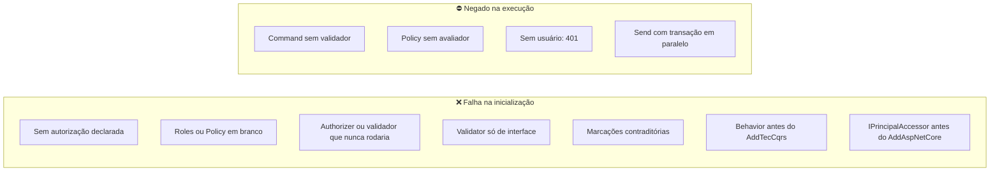

[🏠 TEC.Cqrs](../README.md) › [📚 Documentação](README.md) › 🛡️ Segurança

# 🛡️ Segurança

> O que o TEC.Cqrs garante por padrão (negar na dúvida, não vazar dados, falhar na subida em vez de em produção) e o que
> continua sendo responsabilidade da aplicação.

## 📑 Sumário

- [🎯 Visão geral](#-visão-geral)
- [🚀 Uso](#-uso)
  - [Garantias e responsabilidades](#garantias-e-responsabilidades)
  - [Modelo de ameaças](#modelo-de-ameaças)
  - [Dados sensíveis](#dados-sensíveis)
  - [Cadeia de suprimentos](#cadeia-de-suprimentos)
  - [Checklist de revisão](#checklist-de-revisão)
- [⚙️ Opções](#️-opções)
- [❌ Erros](#-erros)
- [🛡️ Segurança](#️-segurança-1)
- [❓ Perguntas frequentes](#-perguntas-frequentes)

---

## 🎯 Visão geral

| Princípio | Como se aplica |
|---|---|
| **Zero Trust** | Toda requisição é autorizada no pipeline, venha de onde vier (API, job, fila, outro handler) |
| **Fail closed** | Falta de autorização declarada, de validador, de avaliador de policy ou de usuário resulta em negação ou erro, nunca em execução livre |
| **Falhar cedo** | Configurações perigosas derrubam a inicialização |
| **Menor exposição** | Nenhum conteúdo de requisição em logs; nenhum detalhe interno em respostas 500/502 nem nos traces (padrão) |
| **Defesa em profundidade** | O pipeline complementa (não substitui) a autorização dos endpoints |



---

## 🚀 Uso

### Garantias e responsabilidades

| O componente garante | Responsabilidade da aplicação |
|---|---|
| Autorização antes da validação: quem não tem acesso não recebe detalhes das regras | Manter também a autorização dos endpoints |
| `RequireAuthorization` (padrão): requisição sem declaração derruba a subida | Usar `[AllowAnonymousRequest]` só em requisições realmente públicas |
| `Roles`/`Policy` em branco derrubam a subida (não degradam para "qualquer autenticado") | Nomear corretamente papéis e policies |
| Authorizers e validadores que nunca seriam executados derrubam a subida | Registrar authorizers de tipo base/interface **pelo** `AddTecCqrs` (registros posteriores não são verificados) |
| Validador obrigatório em commands, mesmo sem pacote de validação | Usar `[SkipValidation]` só em commands sem dados do usuário |
| Policy sem avaliador lança exceção (não autoriza) | Registrar `.AddAspNetCore()` + `AddAuthorization`, ou um avaliador próprio |
| Sem `IPrincipalAccessor`, não há usuário (401) | Em jobs, fornecer uma identidade de sistema explícita |
| O conteúdo de requisições e notificações nunca vai para log, trace ou métrica | Não colocar dados sensíveis em nomes de tipos ou códigos de erro |
| Respostas 500/502 sem mensagem nem detalhes; basta **um** erro interno na lista para ocultar todos | Não incluir dados internos em erros expostos (`Validation`, `NotFound`, `Conflict`...) |
| `BadHttpRequestException` vira 4xx com mensagem genérica | — |
| Traces só com `exception.type` (padrão) | Ligar `RecordExceptionDetailsInTraces` só se o backend de traces tiver o controle de acesso dos logs |
| `Location` aceita só caminho relativo seguro | Montar a URL com valores do servidor |
| Commit e rollback não são cancelados pela desconexão do cliente | — |
| Falha de command aninhado desfaz a transação inteira | Não tratar a falha do interno como sucesso parcial |
| `Send`s paralelos no mesmo escopo não compartilham transação; commands internos em paralelo são rejeitados | Um escopo por operação paralela |
| `IPrincipalAccessor` registrado antes do `.AddAspNetCore()` derruba a subida (a autorização HTTP não usa outro usuário em silêncio) | Escolher explicitamente: `ReplaceExistingPrincipalAccessor` ou `services.Replace(...)` depois |
| Ciclo de `PublishAfterCommit` interrompido após 10 rodadas (log 1016) | Não publicar em ciclo |
| O valor tentado (`AttemptedValue`) nunca é copiado para o erro de validação | Usar `.WithMessage(...)` fixo em campos sensíveis |

### Modelo de ameaças

| Ameaça | Mitigação no componente |
|---|---|
| Acesso a requisição protegida por caminho alternativo (job, fila, handler interno) | Autorização no pipeline, em todo `Send` |
| Requisição nova publicada sem regra de acesso | `RequireAuthorization` derruba a subida |
| Enumeração de recursos (descobrir se um id existe) | Authorizer pode responder `NotFound` em vez de `Forbidden` |
| Vazamento de dados em logs | Conteúdo nunca registrado; só tipos e códigos |
| Vazamento em respostas de erro | 500/502 genéricos; `BadHttpRequestException` genérica |
| Vazamento em traces (connection strings, tokens em mensagens de exceção) | `RecordExceptionDetailsInTraces = false` por padrão |
| Eco de valores sensíveis em mensagens de validação | Orientação de `WithMessage` fixo; `AttemptedValue` nunca copiado |
| Redirecionamento aberto / injeção de cabeçalho via `Location` | Só caminhos relativos; caracteres de controle descartam o cabeçalho |
| Confirmação parcial de dados | Rollback total em falha de command aninhado |
| Mistura de estado entre requisições concorrentes | Estado por fluxo assíncrono; transação paralela rejeitada; provado sob carga (`Carga-CI`) |
| Behavior executado antes da autorização | Behavior registrado antes do `AddTecCqrs` derruba a subida |
| Handler `Singleton` capturando `DbContext`/usuário de um escopo | Handler registrado à mão com tempo de vida diferente de `Scoped` derruba a subida |
| Laço infinito de notificações pós-commit (negação de serviço) | Limite de 10 rodadas por requisição |
| *Dependency confusion* | `packageSourceMapping`: `TEC.*` só do feed interno |

### Dados sensíveis

```csharp
// ✅ mensagem fixa, sem eco do valor
RuleFor(c => c.Password).MinimumLength(12).WithErrorCode("SENHA_CURTA").WithMessage("A senha deve ter ao menos 12 caracteres.");

// ❌ ecoa o valor recebido na resposta HTTP 400
RuleFor(c => c.Token).Matches("^[A-Z0-9]{32}$").WithMessage("Token '{PropertyValue}' inválido.");

// ❌ expõe detalhe interno num erro visível ao cliente
return Error.Conflict("FALHA_BANCO", ex.Message);

// ✅ erro interno: a resposta é genérica e o detalhe fica no log
return Error.Failure("FALHA_BANCO", "Falha ao gravar o cliente.");
```

### Cadeia de suprimentos

| Controle | Aplicação |
|---|---|
| Analisadores como erro | Todo aviso é erro nos pacotes (CA, IDE, IL de AOT, nullable, XML doc) |
| Auditoria de vulnerabilidades | `NuGetAudit` (inclusive transitivas); `NU1901`–`NU1904` quebram o build |
| Dependências travadas | `packages.lock.json` versionado; restore `--locked-mode` no CI |
| Origem dos pacotes | `packageSourceMapping`: `TEC.*` nunca do nuget.org |
| SAST | CodeQL `security-extended` em todo PR (no CI central); alerta ≥ 7,0 bloqueia |
| Pipeline | Actions fixadas por SHA, menor privilégio, `persist-credentials: false` ([⚙️ CI/CD](../.github/workflows/README.md)) |

### Checklist de revisão

- [ ] Toda requisição nova tem `[AuthorizeRequest]`, `IRequestAuthorizer` ou `[AllowAnonymousRequest]` justificado.
- [ ] Authorizers de recurso respondem `NotFound` quando revelar a existência for um risco.
- [ ] Commands com `[SkipValidation]` realmente não recebem dados do usuário.
- [ ] Regras de campos sensíveis usam `WithMessage(...)` fixo.
- [ ] Nenhum `Error` exposto ao cliente contém `exception.Message`.
- [ ] `RecordExceptionDetailsInTraces` continua `false` (ou o backend de traces tem o mesmo controle dos logs).
- [ ] Jobs usam uma identidade de sistema explícita e com o mínimo de papéis.
- [ ] `IUnitOfWork` e `DbContext` registrados como `Scoped`.
- [ ] Testes de arquitetura com `CqrsDiagnostics` no CI da aplicação.
- [ ] Todos os pacotes `TEC.Cqrs.*` na mesma versão.

---

## ⚙️ Opções

| Opção | Padrão seguro | Efeito de mudar |
|---|---|---|
| `CqrsOptions.RequireAuthorization` | `true` | `false`: requisição sem declaração roda sem verificação |
| `CqrsOptions.RequireValidatorForCommands` | `true` | `false`: command sem validador roda sem validar |
| `CqrsOptions.RecordExceptionDetailsInTraces` | `false` | `true`: mensagens e stack traces nos traces |
| `CqrsAspNetCoreOptions.ReplaceExistingPrincipalAccessor` | `false` | `true`: troca um accessor registrado antes pelo do `HttpContext` |

---

## ❌ Erros

| Situação de segurança | Resultado |
|---|---|
| Usuário ausente | 401 `NAO_AUTENTICADO` |
| Sem papel / policy reprovada | 403 `ACESSO_NEGADO` |
| Recurso de outro usuário (authorizer) | O erro escolhido pelo authorizer (ex.: 404) |
| Declaração ausente ou inválida | `InvalidOperationException` na inicialização |
| Avaliador de policy ausente | `InvalidOperationException` na execução |
| Exceção não tratada | 500 genérico com `traceId`, registrada uma vez |

---

## 🛡️ Segurança

> [!CAUTION]
> Vulnerabilidades: não abra *issue* pública. Escreva para [roberto@roberto.inf.br](mailto:roberto@roberto.inf.br) com os
> passos para reproduzir; a correção sai numa versão nova dos três pacotes ao mesmo tempo.

---

## ❓ Perguntas frequentes

<details>
<summary>Preciso da autorização no endpoint se o pipeline já autoriza?</summary>

É recomendado: a do endpoint barra mais cedo (antes de desserializar o corpo, por exemplo) e a do pipeline garante a
regra em qualquer entrada. As duas juntas são defesa em profundidade.

</details>

<details>
<summary>O pipeline protege contra abuso de recursos (DoS)?</summary>

Ele não limita taxa. Use o rate limiter do ASP.NET Core, limite o corpo no Kestrel e imponha limites (tamanho, quantidade,
paginação) nos validadores. Os testes de segurança sob carga verificam que entradas hostis e enormes viram 4xx sem derrubar
o servidor ([🧪 Testes](testes.md)).

</details>

---
⬅️ [⚡ Native AOT](aot.md) · [📚 Índice](README.md) · [🧪 Testes](testes.md) ➡️
