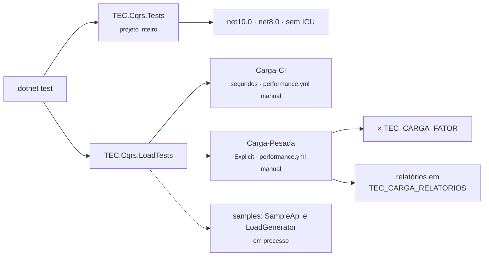

[🏠 TEC.Cqrs](../README.md) › [📚 Documentação](README.md) › 🧪 Testes

# 🧪 Testes

> Como o TEC.Cqrs é testado (suítes, categorias, carga e segurança sob carga), como rodar tudo localmente com as
> variáveis `TEC_CARGA_*` e como testar a arquitetura da sua aplicação.

## 📑 Sumário

- [🎯 Visão geral](#-visão-geral)
- [🚀 Uso](#-uso)
  - [Rodar localmente](#rodar-localmente)
  - [Suítes unitárias](#suítes-unitárias)
  - [Carga, performance e segurança sob carga](#carga-performance-e-segurança-sob-carga)
  - [Relatórios de carga](#relatórios-de-carga)
  - [No CI](#no-ci)
  - [Testando a sua aplicação](#testando-a-sua-aplicação)
- [⚙️ Opções](#️-opções)
- [❌ Erros](#-erros)
- [🛡️ Segurança](#️-segurança)
- [❓ Perguntas frequentes](#-perguntas-frequentes)

---

## 🎯 Visão geral



| Projeto | Categoria | Conteúdo | Quantidade |
|---|---|---|---:|
| `TEC.Cqrs.Tests` | *(sem categoria)* | Mediator, pipeline, transação, segurança, robustez, regressão, observabilidade, HTTP e divisão dos pacotes | 209 (`net10.0`) · 216 (`net8.0`) |
| `TEC.Cqrs.LoadTests` | `Carga-CI` | Concorrência, alocação por `Send`, segurança sob carga e fumaça HTTP na API de exemplo | 13 |
| `TEC.Cqrs.LoadTests` | `Carga-Pesada` | Vazão, volume, soak e carga sustentada na API de exemplo (`[Explicit]`) | 7 (~4–5 min com fator 1) |

- Framework: **TUnit** sobre o Microsoft.Testing.Platform (`global.json` → `"test": { "runner": "Microsoft.Testing.Platform" }`).
  Os dois projetos são `Exe`, `net8.0` e `net10.0`, `IsPackable=false`.
- O `net8.0` roda alguns testes a mais: o middleware de exceções próprio do .NET 8 (no .NET 10 o
  `UseTecExceptionHandler` usa o do ASP.NET Core).
- **Não há testes de integração externa** (categoria `Integracao`) nem variáveis `TEC_TESTES_*`: o TEC.Cqrs não acessa
  rede, banco nem cofre. O `IUnitOfWork` dos testes é em memória.
- As categorias de carga ficam na classe `TestCategories` (`LoadCi = "Carga-CI"`, `LoadHeavy = "Carga-Pesada"`). Testes
  que medem tempo, memória ou vazão usam `[NotInParallel(LoadSettings.MeasurementKey)]` (`"load-measurement"`) e rodam um
  de cada vez; isso não é uma categoria.

---

## 🚀 Uso

### Rodar localmente

```bash
# Unitários (os dois alvos), como no CI
dotnet test --project TEC.Cqrs.Tests -c Release

# Um alvo só
dotnet test --project TEC.Cqrs.Tests -c Release -f net8.0

# Sem ICU (como em containers mínimos)
DOTNET_SYSTEM_GLOBALIZATION_INVARIANT=1 dotnet test --project TEC.Cqrs.Tests -c Release -f net10.0

# Carga rápida (como no job rapida do performance.yml)
dotnet test --project TEC.Cqrs.LoadTests -c Release -f net10.0 --treenode-filter "/*/*/*/*[Category=Carga-CI]"

# Carga pesada, rodada curta (10% das durações e volumes), com relatórios
TEC_CARGA_FATOR=0.1 TEC_CARGA_RELATORIOS=./relatorios \
  dotnet test --project TEC.Cqrs.LoadTests -c Release -f net10.0 --treenode-filter "/*/*/*/*[Category=Carga-Pesada]"
```

> [!WARNING]
> Não use `-nologo` com o `dotnet test` deste repositório: no Microsoft.Testing.Platform ele faz o comando rodar **0
> testes** (código de saída 5).

> [!TIP]
> Os testes `Carga-Pesada` têm `[Explicit]`: só rodam quando selecionados pelo filtro de categoria. Rode-os em **Release**
> e com a máquina livre; os números de um notebook com outras cargas não são comparáveis aos do CI.

### Suítes unitárias

| Arquivo | Testes de |
|---|---|
| `MediatorTests.cs` | `Send` e `Publish`, validação que interrompe o pipeline, conversão de `AppException`, behaviors próprios, erros de registro |
| `TransactionTests.cs` | Commit/rollback, falha no commit, query e `[SkipTransaction]` sem transação, command aninhado, sem `IUnitOfWork` |
| `SecurityTests.cs` | Autorização (atributos, authorizers, policies), validação obrigatória, verificações de inicialização, vazamento de dados |
| `HardeningTests.cs` | Commands internos em paralelo, ciclo de `PublishAfterCommit`, transação aberta fora do pipeline, behaviors antes/depois do `AddTecCqrs`, regras assíncronas, `IPrincipalAccessor` × `AddAspNetCore` |
| `RobustnessTests.cs` | `[SkipTransaction]` aninhado, transação perdida, registros keyed, authorizers genéricos abertos, handler `Singleton`, `ISender` do provider raiz |
| `RegressionTests.cs` | Erros sem duplicidade, handlers de interface, opções congeladas, um log por exceção, cancelamento, tipos que não carregam |
| `ObservabilityTests.cs` | `Activity`, métricas, nomes `TEC.Cqrs` com o prefixo assinado pelo TEC.Observability |
| `HttpResultTests.cs` | `ToHttpResult`, `ToCreatedHttpResult`, `Location`, paginação |
| `ExceptionHandlerMiddlewareTests.cs` | Middleware de exceções do .NET 8 |
| `PackageSplitTests.cs` | Registro explícito (caminho AOT), satélites, `JsonTypeInfoResolver` |

### Carga, performance e segurança sob carga

| Teste | Categoria | O que prova |
|---|---|---|
| `ConcurrencyTests` (6 testes) | `Carga-CI` | Usuários concorrentes nunca se misturam; commits e notificações pós-commit batem em escopos paralelos; corrida do primeiro uso do registro; lotes que falham desfazem tudo; queries paralelas no mesmo escopo; exceções não vazam entre escopos |
| `PipelinePerformanceTests.AllocationsPerSend_StayWithinBudget` | `Carga-CI` | Orçamento de alocação por `Send` |
| `SecurityLoadTests` (5 testes) | `Carga-CI` | Sob carga HTTP: sem vazamento entre usuários, handlers protegidos nunca rodam para não autenticados/sem permissão, regras de validação não reveladas a quem não tem acesso, erros internos sem detalhes, entradas malformadas/enormes/hostis viram 4xx e o servidor segue saudável |
| `SampleApiLoadTests.SmokeLoad_AllScenarios_WithoutErrors` | `Carga-CI` | Todos os cenários do gerador de carga contra a API de exemplo, sem erro |
| `PipelinePerformanceTests.Throughput_ScalesWithWorkers` | `Carga-Pesada` | A vazão cresce com o número de workers (sem trava global no caminho quente) |
| `SampleApiLoadTests.SustainedLoad_ErrorRateAndLatencyWithinLimits` | `Carga-Pesada` | Carga HTTP sustentada com taxa de erro e latência dentro dos limites |
| `SampleApiLoadTests.WriteHeavyLoad_TransactionsAndNestedCommands_StayConsistent` | `Carga-Pesada` | Só escrita: transações e commands aninhados consistentes |
| `SoakTests.MixedWorkload_MemoryHandlesAndThroughputStayStable` | `Carga-Pesada` | Longa duração sem vazamento de memória/handles nem queda de vazão |
| `VolumeTests.MillionsOfSends_ScopePerRequest_RetainedMemoryStaysConstant` | `Carga-Pesada` | Milhões de `Send`s com memória retida constante |
| `VolumeTests.NestedCommands_LongSequenceInOneTransaction_ScalesLinearly` | `Carga-Pesada` | Muitos commands internos numa transação escalam linearmente |
| `VolumeTests.AfterCommit_LargeNotificationBatch_AllDeliveredAndReleased` | `Carga-Pesada` | Lote grande de notificações pós-commit entregue e liberado |

Os testes HTTP sobem a [API de exemplo](../samples/README.md) em processo e usam o `LoadRunner` do gerador de carga.

### Relatórios de carga

Com `TEC_CARGA_RELATORIOS` definida, cada suíte grava um Markdown na pasta (recriado a cada execução); o CI publica no
resumo da execução. Sem a variável, as seções vão só para a saída do teste.

| Arquivo | Suíte |
|---|---|
| `api.md` | Carga HTTP na API de exemplo |
| `performance.md` | Performance do pipeline (alocação e vazão) |
| `soak.md` | Soak (longa duração) |
| `volume.md` | Volume |
| `security.md` | Segurança sob carga |

### No CI

| Workflow | Testes |
|---|---|
| `ci.yml` (PR, push na `main`, semanal) | `TEC.Cqrs.Tests` inteiro em `net10.0` (com cobertura), `net8.0` e `net10.0` sem ICU |
| `release.yml` | O mesmo (portão da publicação), sem carga |
| `performance.yml` (só manual) | Input `suite`: `pesadas` (padrão, `Carga-Pesada` com o fator escolhido), `rapida` (`Carga-CI`) ou `todas` |

Os testes de carga não rodam no PR nem na publicação: tempo de parede em runner compartilhado é ruidoso e não pode
bloquear PR nem versão.

Detalhes em [⚙️ CI/CD](../.github/workflows/README.md).

### Testando a sua aplicação

**Testes de arquitetura** com `CqrsDiagnostics` (pegam handler, validador ou autorização esquecidos antes de produção):

```csharp
[Test]
public async Task Every_command_has_validator()
{
    var services = new ServiceCollection();
    services.AddTecCqrs(o => o.RegisterServicesFromAssemblyContaining<Program>()).AddFluentValidation();

    await Assert.That(CqrsDiagnostics.FindCommandsWithoutValidator(services, typeof(Program).Assembly)).IsEmpty();
}
```

Os três métodos estão em [📈 Observabilidade](observabilidade.md#verificações-para-testes-de-arquitetura). Note que o
próprio `AddTecCqrs` já falha se faltar autorização declarada: um teste que só monta o container já cobre esse caso.

**Teste de um handler pelo pipeline** (autorização, validação e transação incluídas):

```csharp
var services = new ServiceCollection();
services.AddLogging();
services.AddSingleton<IPrincipalAccessor>(new FixedPrincipalAccessor(adminUser));   // usuário do teste
services.AddScoped<IUnitOfWork, FakeUnitOfWork>();
services.AddScoped<ICustomerRepository, InMemoryCustomerRepository>();
services.AddTecCqrs(o => o.AddCommandHandler<CreateCustomerCommand, Guid, CreateCustomerHandler>())
    .AddFluentValidation(fv => fv.AddValidator<CreateCustomerCommand, CreateCustomerValidator>());

await using var provider = services.BuildServiceProvider(new ServiceProviderOptions { ValidateScopes = true });
await using var scope = provider.CreateAsyncScope();
var result = await scope.ServiceProvider.GetRequiredService<ISender>()
    .Send(new CreateCustomerCommand("Maria", "12345678909"));

await Assert.That(result.IsSuccess).IsTrue();
```

`FixedPrincipalAccessor`, `FakeUnitOfWork` e os demais são classes do seu projeto de testes.

---

## ⚙️ Opções

Variáveis de ambiente dos testes de carga (`LoadSettings`). Cada variável específica define a **base**;
`TEC_CARGA_FATOR` multiplica todas as durações e volumes dos testes pesados de uma vez.

| Variável | Padrão | Descrição |
|---|---|---|
| `TEC_CARGA_FATOR` | `1` | Fator único (número invariante > 0, ex.: `0.1`, `2.5`); inválido ou ausente = 1 |
| `TEC_CARGA_ENVIOS` | `2000000` | `Send`s do teste de volume (× fator, mínimo 1.000) |
| `TEC_CARGA_COMMANDS_INTERNOS` | `50000` | Commands internos numa única transação (× fator, mínimo 1.000) |
| `TEC_CARGA_NOTIFICACOES` | `100000` | Notificações pós-commit de um único command (× fator, mínimo 1.000) |
| `TEC_CARGA_SOAK_SEGUNDOS` | `120` | Duração do soak (× fator) |
| `TEC_CARGA_API_SEGUNDOS` | `60` | Carga sustentada na API (× fator); a carga só de escrita usa essa base limitada a 30 s |
| `TEC_CARGA_API_CONCORRENCIA` | `64` | Requisições simultâneas na carga pesada da API (**não** multiplicado pelo fator) |
| `TEC_CARGA_RELATORIOS` | — | Pasta dos relatórios Markdown por suíte |

A medição de vazão do pipeline usa 10 s × fator. Durações nunca ficam abaixo de 1 s.

---

## ❌ Erros

| Sintoma | Causa | O que fazer |
|---|---|---|
| `dotnet test` roda 0 testes (código 5) | `-nologo` no Microsoft.Testing.Platform | Remova `-nologo` |
| Testes pesados não rodam | `[Explicit]` sem filtro de categoria | Use `--treenode-filter "/*/*/*/*[Category=Carga-Pesada]"` |
| Soak falha com "o soak precisa de amostras suficientes" | Duração curta demais (fator muito baixo) | Aumente `TEC_CARGA_SOAK_SEGUNDOS` ou `TEC_CARGA_FATOR` |
| Vazão não escala | Máquina com menos de 4 núcleos ou ocupada | A verificação de escala só vale com 4+ núcleos; rode com a máquina livre |

---

## 🛡️ Segurança

> [!NOTE]
> A autenticação da API de exemplo (cabeçalhos `X-Usuario`/`X-Papeis`) existe só para simular muitos usuários nos testes.
> Ela nunca deve ser usada fora da máquina de testes ([🧰 Samples](../samples/README.md)).

- Os testes de segurança provam os controles do pipeline: negação antes da validação, ausência de vazamento entre
  usuários, erros internos sem detalhes, entrada hostil sem derrubar o servidor.

---

## ❓ Perguntas frequentes

<details>
<summary>Por que não há <code>[Category]</code> nos unitários?</summary>

O CI roda o projeto `TEC.Cqrs.Tests` inteiro na matriz: todos são rápidos e não dependem de ambiente. A carga fica num
projeto separado (`TEC.Cqrs.LoadTests`), selecionada por categoria.

</details>

<details>
<summary>Quanto tempo levam os pesados?</summary>

Cerca de 4–5 minutos com `TEC_CARGA_FATOR=1`. Com `0.1`, menos de um minuto (útil para conferir antes do PR); no
`performance.yml`, o fator é um input manual.

</details>

---
⬅️ [🛡️ Segurança](seguranca.md) · [📚 Índice](README.md) · [💻 Desenvolvimento local](desenvolvimento.md) ➡️
