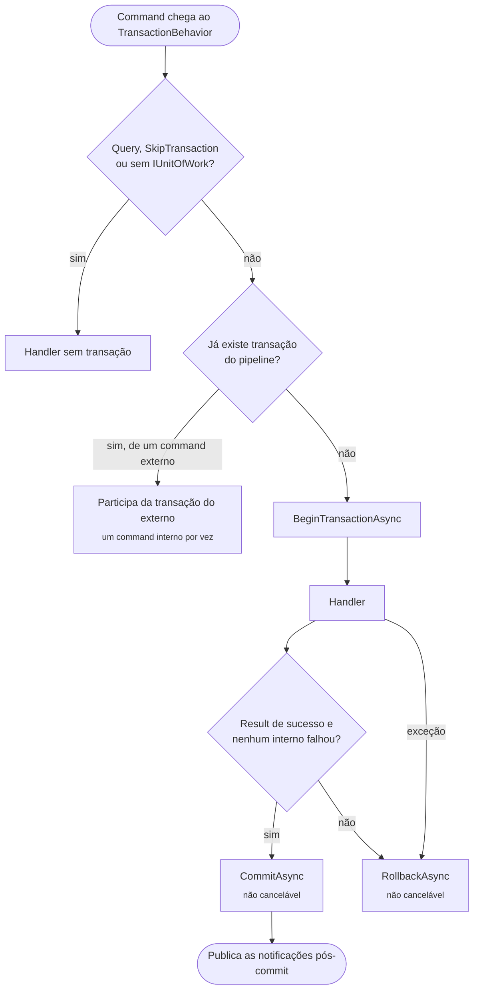
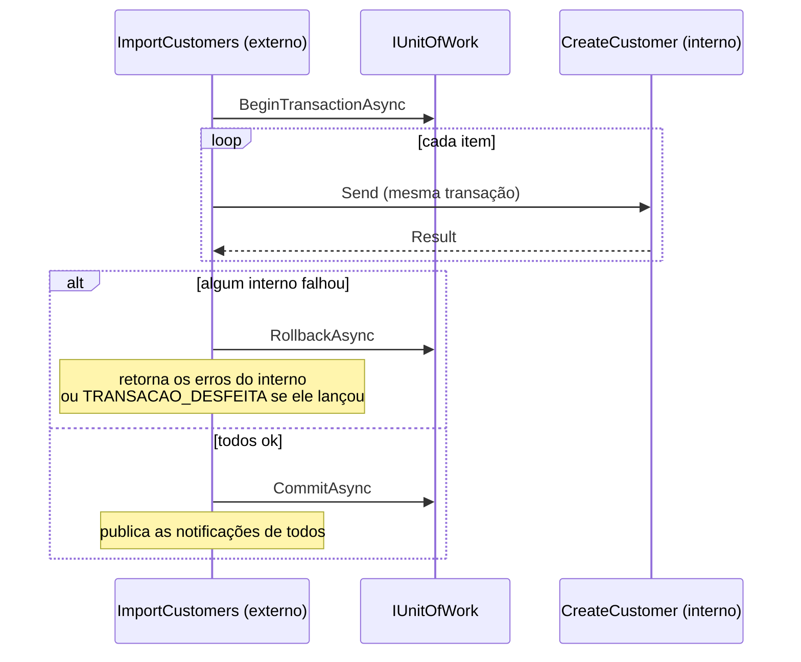

[🏠 TEC.Cqrs](../README.md) › [📚 Documentação](README.md) › 💾 Transação

# 💾 Transação

> Como cada command roda numa transação do seu `IUnitOfWork`, com commit só em sucesso, rollback em qualquer falha e
> commands aninhados que desfazem tudo se um deles falhar.

## 📑 Sumário

- [🎯 Visão geral](#-visão-geral)
- [🚀 Uso](#-uso)
  - [Implementar o IUnitOfWork](#implementar-o-iunitofwork)
  - [Commands aninhados](#commands-aninhados)
  - [Command sem transação](#command-sem-transação)
  - [Transação aberta fora do pipeline](#transação-aberta-fora-do-pipeline)
  - [Concorrência no escopo](#concorrência-no-escopo)
- [⚙️ Opções](#️-opções)
- [❌ Erros](#-erros)
- [🛡️ Segurança](#️-segurança)
- [❓ Perguntas frequentes](#-perguntas-frequentes)

---

## 🎯 Visão geral



| Situação | Transação |
|---|---|
| Command com `IUnitOfWork` registrado | Abre, confirma em sucesso, desfaz em falha ou exceção |
| Query | Nunca |
| Command com `[SkipTransaction]` | Não abre (mas, dentro de outro command, segue a regra dos aninhados) |
| Nenhum `IUnitOfWork` registrado | Commands rodam sem transação |
| Command enviado de dentro de outro command | Participa da transação do externo |
| Transação já aberta fora do pipeline | Participa dela (sem abrir nem confirmar) |

O commit e o rollback usam `CancellationToken.None`: interromper no meio deixaria o resultado ambíguo se o cliente
desconectar. Uma falha no rollback é registrada (evento 1007) sem substituir o erro original.

---

## 🚀 Uso

### Implementar o IUnitOfWork

`IUnitOfWork` (namespace `TEC.Cqrs.Persistence`) é implementado na infraestrutura e registrado como **`Scoped`**:

| Membro | Descrição |
|---|---|
| `bool HasActiveTransaction { get; }` | Se já existe transação aberta no escopo |
| `Task BeginTransactionAsync(CancellationToken cancellationToken)` | Abre a transação |
| `Task CommitAsync(CancellationToken cancellationToken)` | Persiste as alterações pendentes e confirma |
| `Task RollbackAsync(CancellationToken cancellationToken)` | Desfaz |

Com EF Core:

```csharp
using Microsoft.EntityFrameworkCore;
using TEC.Cqrs.Persistence;

internal sealed class EfUnitOfWork(AppDbContext db) : IUnitOfWork
{
    public bool HasActiveTransaction => db.Database.CurrentTransaction is not null;

    public Task BeginTransactionAsync(CancellationToken cancellationToken) =>
        db.Database.BeginTransactionAsync(cancellationToken);

    public async Task CommitAsync(CancellationToken cancellationToken)
    {
        await db.SaveChangesAsync(cancellationToken);
        await db.Database.CommitTransactionAsync(cancellationToken);
    }

    public Task RollbackAsync(CancellationToken cancellationToken) =>
        db.Database.RollbackTransactionAsync(cancellationToken);
}

builder.Services.AddScoped<IUnitOfWork, EfUnitOfWork>();
```

> [!TIP]
> O [TEC.ORM](https://github.com/tudoemcodigo/lib-tec-orm) traz uma implementação pronta de `IUnitOfWork`.

### Commands aninhados

Um handler pode enviar outros commands. Eles participam da transação do externo e, **se qualquer um falhar** (`Result` de
falha ou exceção), o command externo desfaz a transação inteira e retorna falha, **mesmo que o handler externo tenha
tratado o erro**:

```csharp
internal sealed class ImportCustomersHandler(ISender sender) : ICommandHandler<ImportCustomersCommand, int>
{
    public async Task<Result<int>> Handle(ImportCustomersCommand command, CancellationToken cancellationToken)
    {
        int created = 0;
        foreach (var item in command.Items)
        {
            var result = await sender.Send(new CreateCustomerCommand(item.Name, item.Document), cancellationToken);
            if (result.IsFailure)
                return result.ToFailure<int>();   // nada é gravado: o externo desfaz tudo
            created++;
        }

        return created;
    }
}
```



| O command interno... | O command externo |
|---|---|
| Retorna falha e o externo a propaga | Desfaz e retorna essa falha |
| Retorna falha e o externo a **ignora** e retorna sucesso | Desfaz assim mesmo e retorna os erros do interno (log 1010) |
| Lança exceção e o externo a **captura** | Desfaz e retorna `TRANSACAO_DESFEITA` (`Failure`, HTTP 500) |
| Lança exceção não tratada | Desfaz e propaga a exceção |

Vale também para o command interno com `[SkipTransaction]`. Falhas de **queries** internas não desfazem a transação.
As notificações pós-commit dos internos sobem para o externo e só saem depois do commit dele.

### Command sem transação

```csharp
using TEC.Cqrs.Persistence;

[AuthorizeRequest(Roles = "Sistema"), SkipTransaction]
public sealed record SendWelcomeEmailCommand(Guid CustomerId) : ICommand;
```

Use em commands que só chamam serviços externos ou controlam a própria transação. Enviado de dentro de outro command,
continua sujeito à regra dos aninhados e roda um interno por vez (usa o mesmo `IUnitOfWork`).

### Transação aberta fora do pipeline

Se o `IUnitOfWork.HasActiveTransaction` já for `true` no primeiro `Send` (você abriu a transação manualmente), o command
participa dela sem abrir nem confirmar: quem abriu confirma. Nesse caso, `PublishAfterCommit` na requisição mais externa
é rejeitado (as notificações são descartadas com `InvalidOperationException`), porque o pipeline não sabe quando a sua
transação será confirmada. Prefira deixar o pipeline controlar a transação: um command externo que envia os demais.

### Concorrência no escopo

O pipeline usa **uma transação por escopo**. Por isso:

- Commands com transação enviados em paralelo no mesmo escopo (`Task.WhenAll`) são rejeitados.
- Commands internos enviados em paralelo dentro do handler externo também são rejeitados (e a transação do externo é
  desfeita). Em sequência, inclusive command dentro de command interno, são permitidos.
- Para paralelizar, use um escopo por operação ([📮 Mediator](mediator.md#processamento-em-paralelo)).

---

## ⚙️ Opções

| Item | Padrão | Descrição |
|---|---|---|
| `IUnitOfWork` registrado | nenhum | Sem ele, commands rodam sem transação |
| `[SkipTransaction]` (`TEC.Cqrs.Persistence`) | — | Command sem transação própria |
| Commit/rollback | `CancellationToken.None` | Não são cancelados pela desconexão do cliente |

---

## ❌ Erros

| Código / exceção | Quando | O que fazer |
|---|---|---|
| Erros do command interno | Interno falhou (mesmo se o externo tratou) | Esperado: a transação foi desfeita |
| `TRANSACAO_DESFEITA` "Um command interno falhou e a transação foi desfeita." (HTTP 500) | Interno lançou exceção capturada pelo externo | Corrija a causa (veja o log do interno) |
| `InvalidOperationException` "...foi enviado em paralelo a outro command com transação no mesmo escopo" | `Task.WhenAll` no mesmo escopo ou `ISender` resolvido fora de escopo (singleton, `BackgroundService`) | Aguarde cada `Send` ou use um escopo por operação |
| `InvalidOperationException` "...foi enviado em paralelo a outro command interno na mesma transação" | `Task.WhenAll` no handler externo | Envie os internos em sequência |
| `InvalidOperationException` "...o IUnitOfWork informa HasActiveTransaction = false" | Transação encerrada fora do pipeline (commit/rollback manual, deadlock) ou `IUnitOfWork` não `Scoped` | Não encerre a transação no handler; registre o `IUnitOfWork` como `Scoped` |
| `InvalidOperationException` "O handler de '...' retornou null." | Handler retornou `null` | Transação desfeita; retorne sempre um `Result` |
| Log 1007 "Falha ao desfazer a transação de ..." | O rollback lançou | Verifique a conexão; o erro original é mantido |

---

## 🛡️ Segurança

> [!CAUTION]
> Registrar o `IUnitOfWork` (ou o `DbContext`) como `Singleton` compartilharia a transação entre requisições e usuários.
> Use sempre `Scoped`; handlers registrados à mão com outro tempo de vida derrubam a subida.

- Gravações parciais nunca são confirmadas: um interno que falha marca a transação como *rollback-only*.
- Não faça chamadas externas irreversíveis (e-mail, pagamento) dentro da transação: use `PublishAfterCommit` ou outbox.

---

## ❓ Perguntas frequentes

<details>
<summary>Posso ter vários bancos na mesma transação?</summary>

O pipeline só conhece um `IUnitOfWork` por escopo. Para mais de um banco, a sua implementação precisa coordená-los (ou use
outbox e consistência eventual).

</details>

<details>
<summary>O commit acontece se o cliente HTTP desconectar no meio?</summary>

Se o handler já terminou com sucesso, sim: o commit não usa o token da requisição. Se a desconexão cancelar o handler
antes, a `OperationCanceledException` desfaz a transação.

</details>

---
⬅️ [📣 Notificações](notificacoes.md) · [📚 Índice](README.md) · [🌐 ASP.NET Core](aspnetcore.md) ➡️
