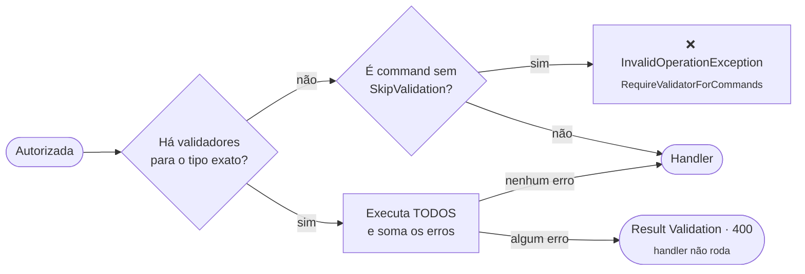

[🏠 TEC.Cqrs](../README.md) › [📚 Documentação](README.md) › ✅ Validação

# ✅ Validação

> Como garantir que nenhum command rode com entrada não validada: validação obrigatória, validadores próprios
> (`IRequestValidator<T>`) e o pacote `TEC.Cqrs.FluentValidation`.

## 📑 Sumário

- [🎯 Visão geral](#-visão-geral)
- [🚀 Uso](#-uso)
  - [Com FluentValidation](#com-fluentvalidation)
  - [Registro explícito (AOT)](#registro-explícito-aot)
  - [Validador próprio sem FluentValidation](#validador-próprio-sem-fluentvalidation)
  - [Dispensar a validação](#dispensar-a-validação)
  - [Regras compartilhadas entre requisições](#regras-compartilhadas-entre-requisições)
  - [Formato dos erros](#formato-dos-erros)
- [⚙️ Opções](#️-opções)
- [❌ Erros](#-erros)
- [🛡️ Segurança](#️-segurança)
- [❓ Perguntas frequentes](#-perguntas-frequentes)

---

## 🎯 Visão geral



- O behavior de validação roda **depois da autorização** e antes dos behaviors próprios e da transação.
- A abstração é do núcleo: `IRequestValidator<TRequest>` (namespace `TEC.Cqrs.Validation`), com um único método
  `Task<Result> ValidateAsync(TRequest request, CancellationToken cancellationToken)`. O pacote
  `TEC.Cqrs.FluentValidation` a implementa para os `AbstractValidator<T>`.
- Vale apenas para o **tipo exato** da requisição. Todos os validadores da requisição rodam e os erros são somados; com a
  requisição válida, nada é alocado.
- Com `RequireValidatorForCommands` (padrão), **todo command** precisa de validador ou de `[SkipValidation]`, mesmo sem
  nenhum pacote de validação registrado: esquecer o `.AddFluentValidation()` não desliga a validação em silêncio.

---

## 🚀 Uso

### Com FluentValidation

```bash
dotnet add package TEC.Cqrs.FluentValidation --version 0.0.1   # mesma versão do TEC.Cqrs
```

```csharp
using FluentValidation;
using TEC.Cqrs.DependencyInjection;

internal sealed class CreateCustomerValidator : AbstractValidator<CreateCustomerCommand>
{
    public CreateCustomerValidator()
    {
        RuleFor(c => c.Name)
            .NotEmpty().WithErrorCode("NOME_OBRIGATORIO").WithMessage("Nome é obrigatório.")
            .MaximumLength(100).WithErrorCode("NOME_LONGO").WithMessage("O nome deve ter no máximo 100 caracteres.");
        RuleFor(c => c.Document)
            .Length(11).WithErrorCode("DOCUMENTO_INVALIDO").WithMessage("Documento inválido.");
    }
}

builder.Services.AddTecCqrs(options => options.RegisterServicesFromAssemblyContaining<Program>())
    .AddFluentValidation();   // validators dos mesmos assemblies do AddTecCqrs
```

O `.AddFluentValidation()` sem argumentos procura validators nos assemblies informados ao `AddTecCqrs`
(`CqrsOptions.Assemblies`). Regras assíncronas (`MustAsync`) funcionam; cada validator recebe o próprio contexto.

### Registro explícito (AOT)

```csharp
builder.Services
    .AddTecCqrs(options => options.AddCommandHandler<CreateCustomerCommand, Guid, CreateCustomerHandler>())
    .AddFluentValidation(fv => fv
        .AddValidator<CreateCustomerCommand, CreateCustomerValidator>()
        .RegisterValidatorsFromAssemblyContaining<Program>());   // (opcional) varredura, só em JIT
```

### Validador próprio sem FluentValidation

```csharp
using TEC.Core.Common.Results;
using TEC.Cqrs.Validation;

internal sealed class DeactivateCustomerValidator : IRequestValidator<DeactivateCustomerCommand>
{
    public Task<Result> ValidateAsync(DeactivateCustomerCommand command, CancellationToken cancellationToken) =>
        Task.FromResult(command.Id == Guid.Empty
            ? Result.Failure(Error.Validation("CLIENTE_OBRIGATORIO", "Informe o cliente.", "id"))
            : Result.Success());
}

// Varredura do AddTecCqrs ou, sem reflexão:
options.AddRequestValidator<DeactivateCustomerCommand, DeactivateCustomerValidator>();
```

### Dispensar a validação

```csharp
using TEC.Cqrs.Validation;

[AuthorizeRequest(Roles = "Sistema"), SkipValidation]   // sem dados de entrada vindos do usuário
public sealed record ProcessQueueCommand : ICommand;
```

Use `[SkipValidation]` só em commands sem entrada ou cuja entrada não vem do usuário. Queries não exigem validador, mas
podem ter (ex.: limitar `pageSize`).

### Regras compartilhadas entre requisições

Validators de tipo base ou interface (`AbstractValidator<IHasDocument>`) **não** são executados pelo pipeline.
Reaproveite as regras com `Include` num validator do tipo exato:

```csharp
public interface IHasDocument { string Document { get; } }

internal sealed class DocumentRules : AbstractValidator<IHasDocument>
{
    public DocumentRules() => RuleFor(x => x.Document).Length(11).WithMessage("Documento inválido.");
}

internal sealed class UpdateCustomerValidator : AbstractValidator<UpdateCustomerCommand>
{
    public UpdateCustomerValidator() => Include(new DocumentRules());
}
```

Se uma requisição **só** tiver validator de tipo base ou interface, o `.AddFluentValidation()` falha na subida apontando o
`Include` a fazer.

### Formato dos erros

Cada falha vira um `Error.Validation(code, message, field)`:

| Origem | Valor |
|---|---|
| `code` | `.WithErrorCode(...)`; sem ele, o código padrão do FluentValidation (ex.: `NotEmptyValidator`); vazio, `VALIDACAO` |
| `message` | A mensagem da regra, sem alteração; vazia, `Valor inválido.` |
| `field` | O `PropertyName` em camelCase por segmento (`Endereco.Cep` → `endereco.cep`, `Itens[0].Quantidade` → `itens[0].quantidade`) |

```json
{
  "success": false,
  "statusCode": 400,
  "message": "Um ou mais erros de validação ocorreram.",
  "errors": [
    { "code": "NOME_OBRIGATORIO", "message": "Nome é obrigatório.", "field": "name" },
    { "code": "DOCUMENTO_INVALIDO", "message": "Documento inválido.", "field": "document" }
  ],
  "timestamp": "2026-10-07T12:00:00+00:00",
  "traceId": "4bf92f3577b34da6a3ce929d0e0e4736"
}
```

Uma `FluentValidation.ValidationException` lançada no handler (`ValidateAndThrow`) também vira falha de validação, no
pipeline e no `UseTecExceptionHandler`.

---

## ⚙️ Opções

| Opção | Padrão | Descrição |
|---|---|---|
| `CqrsOptions.RequireValidatorForCommands` | `true` | Command sem validador lança `InvalidOperationException` ao ser executado |
| `CqrsOptions.AddRequestValidator<TRequest, TValidator>()` | — | Registra um `IRequestValidator<T>` sem reflexão (tipo **exato** de uma requisição com handler) |
| `CqrsFluentValidationOptions.CamelCaseValidationFields` | `true` | Campo dos erros em camelCase, igual ao JSON da API |
| `CqrsFluentValidationOptions.AddValidator<TRequest, TValidator>()` | — | Registra um validator do FluentValidation (AOT) |
| `CqrsFluentValidationOptions.RegisterValidatorsFromAssembly(Assembly)` / `...Containing<T>()` | — | Varredura de validators (reflexão) |

As opções do `AddFluentValidation` são congeladas ao final da chamada; o método só pode ser chamado uma vez.

---

## ❌ Erros

| Código / exceção | HTTP | Quando | O que fazer |
|---|:---:|---|---|
| Erros `Validation` dos validadores | 400 | Entrada inválida | Corrija a entrada |
| `InvalidOperationException` "O command '...' não possui validator" | — | Command sem validador nem `[SkipValidation]` | Crie o validador ou marque `[SkipValidation]` |
| `InvalidOperationException` "O validador '...' valida '...', que não é uma requisição concreta conhecida" | — | `IRequestValidator` de tipo base, interface ou requisição sem handler | Um validador por requisição concreta, com o handler registrado |
| `InvalidOperationException` "A requisição '...' não possui validator próprio, mas '...' valida '...' (tipo base ou interface)" | — | Só validator de base/interface | Crie o validator do tipo exato com `Include` |
| `InvalidOperationException` "AddFluentValidation já foi chamado" | — | Segunda chamada | Configure tudo numa chamada |
| `InvalidOperationException` "O validador '...' retornou null" | — | `IRequestValidator` retornou `null` | Retorne sempre um `Result` |

---

## 🛡️ Segurança

> [!CAUTION]
> As mensagens de validação vão para o cliente como vieram da regra. Os placeholders `{PropertyValue}` e
> `{ComparisonValue}` ecoam o valor recebido: em campos sensíveis (senha, token, documento), use `WithMessage` com texto
> fixo. O valor tentado (`AttemptedValue`) nunca é copiado para o erro.

- Valide limites (tamanho de texto, quantidade de itens, faixa de páginas) para conter abuso de recursos.
- Como a autorização vem antes, quem não tem acesso recebe 401/403 e nunca vê as regras de validação.
- Com `InvariantGlobalization`, as mensagens padrão do FluentValidation saem em inglês: defina `WithMessage` em todas as regras.

---

## ❓ Perguntas frequentes

<details>
<summary>Posso validar regras de negócio que dependem do banco no validator?</summary>

Pode (regras assíncronas), mas o validator roda antes da transação. Regras que dependem do estado atual com consistência
(ex.: "o saldo é suficiente") ficam melhor no handler, retornando `Error.BusinessRule`.

</details>

<details>
<summary>Como detectar commands sem validador antes de produção?</summary>

Num teste: `CqrsDiagnostics.FindCommandsWithoutValidator(services, typeof(Program).Assembly)` deve ser vazio
([📈 Observabilidade](observabilidade.md#verificações-para-testes-de-arquitetura)).

</details>

---
⬅️ [🎫 Permissões](permissoes.md) · [📚 Índice](README.md) · [📣 Notificações](notificacoes.md) ➡️
