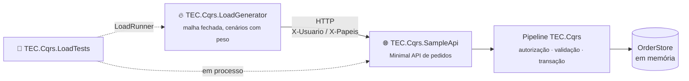

[🏠 TEC.Cqrs](../README.md) › [📚 Documentação](../docs/README.md) › 🧰 Samples

# 🧰 Samples

> Dois projetos de apoio, fora dos pacotes (`IsPackable = false`): uma API de pedidos com os usos típicos do TEC.Cqrs e um
> gerador de carga HTTP próprio, sem licença nem binário externo. Os testes de carga (`TEC.Cqrs.LoadTests`) usam os dois
> em processo.

## 📑 Sumário

- [🎯 Visão geral](#-visão-geral)
- [🌐 TEC.Cqrs.SampleApi](#-teccqrssampleapi)
- [🔥 TEC.Cqrs.LoadGenerator](#-teccqrsloadgenerator)
- [🛡️ Segurança](#️-segurança)

---

## 🎯 Visão geral



| Projeto | O que é |
|---|---|
| `TEC.Cqrs.SampleApi` | Minimal API de pedidos: commands e queries com `[AuthorizeRequest]` (policy, papel e dono do recurso), FluentValidation e `IRequestValidator`, transação em memória (`InMemoryUnitOfWork`), commands aninhados, `PublishAfterCommit` e `UseTecExceptionHandler` |
| `TEC.Cqrs.LoadGenerator` | Gerador em malha fechada: cada worker envia uma requisição, espera a resposta e envia a próxima; relatório com RPS, erros e latências (p50/p95/p99) por cenário |

Os identificadores do código estão em inglês (`Order`, `OrderStore`, `CreateOrderCommand`...); o que é visível na rede e
na configuração continua em português (rotas `/pedidos`, cabeçalhos `X-Usuario`/`X-Papeis`, claim `cliente_id`, chaves
`Exemplo:*`, query `pagina`/`tamanho`, JSON `descricao`/`valor`/`itens` e códigos de erro).

---

## 🌐 TEC.Cqrs.SampleApi

```bash
dotnet run -c Release --project samples/TEC.Cqrs.SampleApi -f net10.0 -- --urls http://localhost:5000
```

| Endpoint | Requisição | Autorização |
|---|---|---|
| `GET /saude` | `GetHealthQuery` | Pública (`[AllowAnonymousRequest]`) |
| `POST /pedidos` | `CreateOrderCommand` (201 + `Location`; publica `OrderCreatedEvent` após o commit) | Policy `PedidosEscrita` (papel `Cliente` ou `Admin`) |
| `POST /pedidos/importacao` | `ImportOrdersCommand` (um `CreateOrderCommand` interno por item, na mesma transação; até 100 itens) | Policy `PedidosEscrita` |
| `GET /pedidos/{id}` | `GetOrderQuery` | Autenticado + dono do pedido (`GetOrderAuthorizer`: outro cliente recebe 404) |
| `GET /pedidos?pagina=&tamanho=` | `ListOrdersQuery` (paginada; `tamanho` de 1 a 100) | Autenticado (só os próprios pedidos) |
| `POST /pedidos/{id}/estorno` | `RefundOrderCommand` | Papel `Admin` |
| `POST /diagnostico/falha` | `SimulateFailureCommand` (500 sem detalhes) | Autenticado (`[SkipValidation]`) |

| Configuração | Padrão | Efeito |
|---|---|---|
| `Exemplo:Clientes` | `100` | Clientes `cliente-0` a `cliente-99` (`SampleOptions.Customers`) |
| `Exemplo:PedidosPorCliente` | `20` | Pedidos iniciais por cliente, com ids determinísticos (`SampleData.OrderId(cliente, pedido)`), conhecidos pelo gerador (`SampleOptions.OrdersPerCustomer`) |
| `Exemplo:MaxPedidosPorCliente` | `1000` | Pedidos criados mantidos por cliente, além dos iniciais; os mais antigos saem primeiro (`SampleOptions.MaxOrdersPerCustomer`) |

As chaves podem vir do `appsettings`, de variáveis de ambiente (`Exemplo__Clientes=500`) ou da linha de comando
(`--Exemplo:Clientes 500`). O corpo das requisições é limitado a 64 KB.

```http
POST /pedidos
X-Usuario: cliente-7
X-Papeis: Cliente
Content-Type: application/json

{ "descricao": "Teclado", "valor": 199.90 }
```

O registro do domínio fica em `SampleApiApp.AddOrders(services, options)` (sem a parte HTTP), reaproveitado pelos testes de
carga em processo. Os endpoints não usam `.RequireAuthorization()` de propósito, para exercitar a autorização do pipeline.
Em uma API real, use as duas camadas.

---

## 🔥 TEC.Cqrs.LoadGenerator

```bash
dotnet run -c Release --project samples/TEC.Cqrs.LoadGenerator -f net10.0 -- --url http://localhost:5000 --duracao 60 --concorrencia 64
```

| Opção | Padrão | Descrição |
|---|---|---|
| `--url <endereço>` | — | API de exemplo. Obrigatório |
| `--duracao <s>` | `30` | Segundos medidos |
| `--aquecimento <s>` | `5` | Segundos de aquecimento, fora das estatísticas |
| `--concorrencia <n>` | `32` | Requisições simultâneas |
| `--cenarios <lista>` | mistura padrão | Cenários e pesos, ex.: `obter,criar:50,erro-interno:1` |
| `--semente <n>` | `2026` | Semente dos sorteios (execuções reproduzíveis) |
| `--max-erro <fração>` | `0.01` | Taxa de erro máxima para sair com código 0 |
| `--max-p95 <ms>` | — | Latência p95 máxima para sair com código 0 |
| `--json <arquivo>` | — | Grava o relatório em JSON |
| `--ajuda` | — | Mostra o uso e os cenários disponíveis (com o peso de cada um) e sai com código `0` |

Códigos de saída: `0` dentro dos limites (ou `--ajuda`), `1` limite violado (ou nenhuma requisição concluída), `2`
argumentos inválidos ou `--url` ausente.

| Cenário | Peso | Status esperado | O que exercita |
|---|---:|:---:|---|
| `saude` | 5 | 200 | Requisição pública |
| `obter` | 30 | 200 | Query com autorização por dono do recurso |
| `listar` | 15 | 200 | Query paginada |
| `criar` | 15 | 201 | Command com policy, validação, transação e evento pós-commit |
| `importar` | 5 | 200 | 10 commands internos na mesma transação |
| `importar-invalido` | 3 | 400 | Último item inválido: tudo desfeito, nenhum evento |
| `erro-validacao` | 5 | 400 | Erros por campo |
| `acesso-alheio` | 10 | 404 | Pedido de outro cliente |
| `nao-autenticado` | 5 | 401 | Sem usuário |
| `sem-papel` | 3 | 403 | Usuário sem o papel da policy |
| `estorno-negado` | 2 | 403 | Cliente tentando a operação de `Admin` |
| `estorno` | 2 | 200 | `Admin` |
| `erro-interno` | 0 | 500 | Exceção no handler (desligado por padrão; gera log de erro) |

Nos cenários de falha, a resposta esperada é o próprio status de erro: um 200 neles conta como erro, porque seria uma
falha de segurança.

---

## 🛡️ Segurança

> [!CAUTION]
> A autenticação da API é **só de exemplo** (`SampleAuthentication`): o usuário vem do cabeçalho `X-Usuario` e os papéis de
> `X-Papeis` (`Cliente`, `Admin`), para simular muitos usuários sem um provedor de identidade. Qualquer cliente se declara
> quem quiser: nunca use em produção nem exponha a API fora da máquina. Em uma API real, use JWT/OIDC ou o TEC.Security.

O usuário é restrito a letras minúsculas, dígitos e hífen (até 64 caracteres) e papéis desconhecidos são recusados, para
que a própria API de exemplo não seja um alvo fácil nos testes de segurança sob carga.

---
[🏠 TEC.Cqrs](../README.md) · [📚 Documentação](../docs/README.md) · [🧪 Testes](../docs/testes.md)
